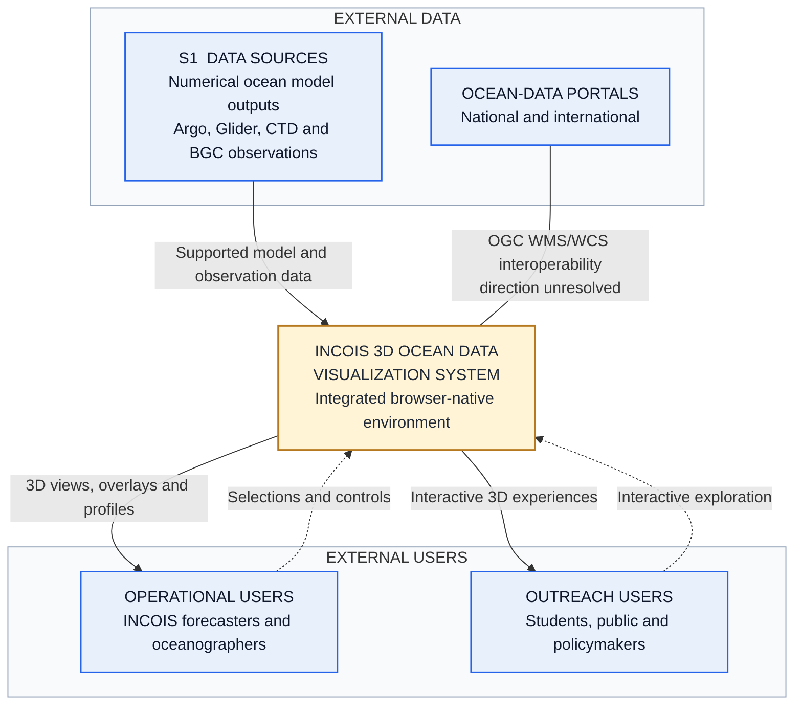
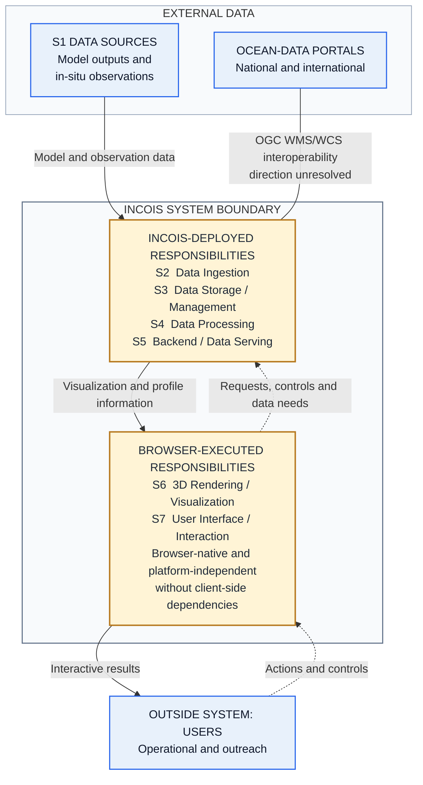
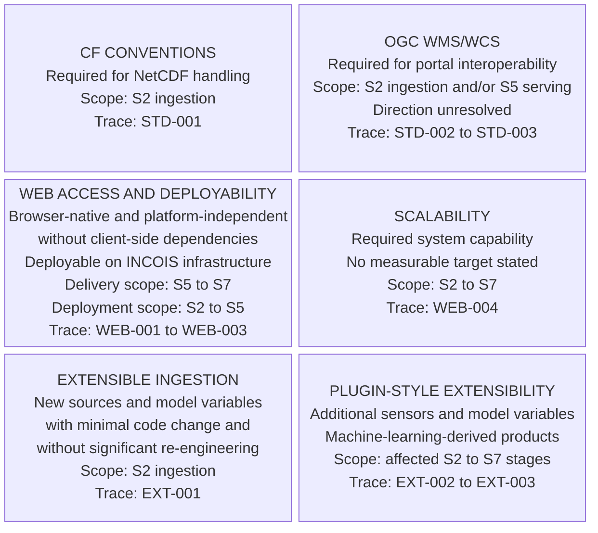
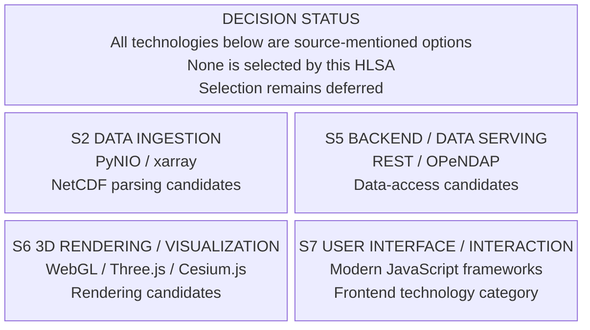

## High-Level System Architecture (HLSA)

INCOIS 3D Ocean Data Visualization System

Problem Statement ID: 26067  
Problem Statement Title: Develop a web-based interactive 3D visualization platform that integrates numerical ocean model outputs and in-situ observations.  
Requirements Authority: SRS_Technical_Requirements_Mapping.txt  
Document Status: Working Draft

This document defines high-level system responsibilities, boundaries, and information movement. It does not select technologies or prescribe implementation design.

Diagram convention: blue represents external participants, information, and input segments; amber represents stated responsibility segments; grey dashed boxes represent inferred responsibilities; lavender identifies browser-executed stages; green represents outputs and outcomes; rose dashed boxes represent source-mentioned technology options; and undirected lines represent interoperability whose direction is unresolved.

### 1. System Context

Answers: Who interacts with the system, what information enters it, and what crosses its external boundary?

SRS basis: DIR-001 to DIR-007; MOI-001 to MOI-003; WEB-001; STD-003.

### 2. System Boundary

Answers: What remains external, what belongs to the INCOIS-deployed platform, and what executes in the browser?

Boundary note: This is a logical responsibility boundary, not a selected host, service, container, or deployment topology. Browser-executed responsibilities remain part of the system.

SRS basis: DIR-001 to DIR-007; ING-001 to ING-002; BDA-001; WEB-001 to WEB-003; STD-002 to STD-003.

### 3. Responsibility Pipeline

Answers: Which stage owns each high-level responsibility, and what must it hand onward?

```mermaid
%%{init: {"flowchart": {"wrappingWidth": 300, "rankSpacing": 30, "nodeSpacing": 16}, "themeVariables": {"fontSize": "14px"}}}%%
flowchart TB
    subgraph G1["S1 DATA SOURCES"]
        direction TB
        S1I["INPUT<br/>Existing numerical model outputs<br/>and in-situ observations"]:::input
        S1R["RESPONSIBILITY<br/>Represent the external source boundary<br/>for supported ocean datasets<br/>TRACE: DIR-001 to DIR-007"]:::responsibility
        S1O["OUTPUT<br/>NetCDF and ASCII/delimited data<br/>with source-supplied context"]:::output
        S1I --> S1R --> S1O
    end

    subgraph G2["S2 DATA INGESTION"]
        direction TB
        S2I["INPUT<br/>NetCDF and ASCII/delimited<br/>model and observation data"]:::input
        S2R["RESPONSIBILITY<br/>Accept and automatically parse<br/>the supported formats<br/>TRACE: DIR-007; ING-001 to ING-002<br/>STD-001; EXT-001 ingestion aspect"]:::responsibility
        S2O["OUTPUT<br/>Parsed model and observation data"]:::output
        S2I --> S2R --> S2O
    end

    subgraph G3["S3 DATA STORAGE / MANAGEMENT"]
        direction TB
        S3I["INPUT<br/>Parsed model and observation data"]:::input
        S3R["RESPONSIBILITY<br/>Keep ingested information available<br/>to downstream responsibilities<br/>TRACE STATUS: Architectural inference<br/>No direct SRS storage requirement<br/>No storage model or technology selected"]:::inferred
        S3O["OUTPUT<br/>Model and observation information<br/>available downstream"]:::output
        S3I --> S3R --> S3O
    end

    subgraph G4["S4 DATA PROCESSING"]
        direction TB
        S4I["INPUT<br/>Available model and<br/>observation information"]:::input
        S4R["RESPONSIBILITY<br/>Provide the preparation boundary<br/>needed by required views and profiles<br/>TRACE STATUS: Architectural inference<br/>No standalone SRS processing requirement<br/>No function or algorithm selected"]:::inferred
        S4O["OUTPUT<br/>Information prepared for data serving"]:::output
        S4I --> S4R --> S4O
    end

    subgraph G5["S5 BACKEND / DATA SERVING"]
        direction TB
        S5I["INPUT<br/>Prepared model and<br/>observation information"]:::input
        S5R["RESPONSIBILITY<br/>Provide lightweight API-based access<br/>for the web platform<br/>TRACE: BDA-001"]:::responsibility
        S5O["OUTPUT<br/>Browser-accessible model, marker,<br/>and selected-profile information"]:::output
        S5I --> S5R --> S5O
    end

    subgraph G6["S6 3D RENDERING / VISUALIZATION"]
        direction TB
        S6I["INPUT<br/>Served model-field and<br/>observation-marker information"]:::input
        S6R["RESPONSIBILITY<br/>Render the required 3D model views<br/>and geospatial observation overlay<br/>TRACE: MVR-001 to MVR-006<br/>IDO-001; MOI-001"]:::responsibility
        S6O["OUTPUT<br/>Combined interactive 3D model<br/>and observation view"]:::output
        S6I --> S6R --> S6O
    end

    subgraph G7["S7 USER INTERFACE / INTERACTION"]
        direction TB
        S7I["INPUT<br/>Combined 3D view from S6,<br/>selected-profile information from S5,<br/>and user selections or controls"]:::input
        S7R["RESPONSIBILITY<br/>Present controls, instrument selection,<br/>profile chart and unified experience<br/>TRACE: IDO-002 to IDO-003<br/>UIC-001 to UIC-007<br/>MOI-002 to MOI-003<br/>WEB-001 to WEB-002"]:::responsibility
        S7O["OUTPUT<br/>Browser-native interactive visualization<br/>with instrument profile"]:::output
        S7I --> S7R --> S7O
    end

    S1O -->|"Supported source data"| S2I
    S2O -->|"Parsed data"| S3I
    S3O -->|"Available data"| S4I
    S4O -->|"Prepared information"| S5I
    S5O -->|"Model and marker information"| S6I
    S5O -.->|"Selected-profile information"| S7I
    S6O -->|"Combined 3D view"| S7I

    classDef input fill:#E8F1FB,stroke:#2563EB,color:#0F172A,stroke-width:1.3px;
    classDef responsibility fill:#FFF4D6,stroke:#B7791F,color:#1F2937,stroke-width:1.3px;
    classDef inferred fill:#F3F4F6,stroke:#6B7280,color:#111827,stroke-width:1.3px,stroke-dasharray:5 3;
    classDef output fill:#ECFDF5,stroke:#059669,color:#0F172A,stroke-width:1.3px;

    style G1 fill:#F8FAFC,stroke:#2563EB,stroke-width:1.5px
    style G2 fill:#FFFBEB,stroke:#B7791F,stroke-width:1.5px
    style G3 fill:#F8FAFC,stroke:#6B7280,stroke-width:1.5px,stroke-dasharray:5 3
    style G4 fill:#F8FAFC,stroke:#6B7280,stroke-width:1.5px,stroke-dasharray:5 3
    style G5 fill:#FFFBEB,stroke:#B7791F,stroke-width:1.5px
    style G6 fill:#FAF5FF,stroke:#7E22CE,stroke-width:1.5px
    style G7 fill:#FAF5FF,stroke:#7E22CE,stroke-width:1.5px
```

Architecture note: Direct trace labels identify SRS responsibilities. S3 and S4 are explicitly marked as inferred enabling boundaries because the SRS defines no standalone storage or processing design. Detailed information states appear in View 4.

SRS basis: DIR-001 to DIR-007; ING-001 to ING-002; BDA-001; MVR-001 to MVR-006; IDO-001 to IDO-003; UIC-001 to UIC-007; MOI-001 to MOI-003; WEB-001 to WEB-003.

### 4. Detailed End-to-End Data Flow

Answers: How do model data and observation data change as they move through shared responsibilities and reach the user?

```mermaid
flowchart TB
    subgraph SOURCE["SOURCE DATA"]
        direction LR
        MODEL["MODEL OUTPUTS<br/>Temperature, salinity, currents, chlorophyll<br/>Depth, spatial grid and time-step context"]:::data
        OBS["OBSERVATIONS<br/>Real-time and delayed-mode Argo and Glider<br/>CTD and BGC<br/>Position, depth, time and variable context"]:::data
    end

    S2["S2  DATA INGESTION<br/>Accept NetCDF and ASCII/delimited text<br/>Automatically parse supported formats<br/>Apply CF Conventions to NetCDF"]:::platform

    subgraph PARSED["PARSED INFORMATION"]
        direction LR
        PM["PARSED MODEL FIELDS<br/>Depth, grid and time context retained"]:::data
        PO["PARSED OBSERVATIONS<br/>Position, depth, time and<br/>variable context retained"]:::data
    end

    S3["S3  DATA STORAGE / MANAGEMENT<br/>Keep ingested information available<br/>Preserve downstream context"]:::inferred

    subgraph MANAGED["MANAGED INFORMATION"]
        direction LR
        MM["MANAGED MODEL DATA<br/>Available for processing"]:::data
        MO["MANAGED OBSERVATION DATA<br/>Available for processing"]:::data
    end

    S4["S4  DATA PROCESSING<br/>Interpret dimensions and attributes<br/>Prepare information required by a view"]:::inferred

    subgraph PREPARED["PREPARED INFORMATION"]
        direction LR
        PVM["MODEL INFORMATION<br/>For full-water-column, depth-resolved volumetric,<br/>depth-slice, isosurface, vector<br/>and time-step animation views"]:::data
        PVO["OBSERVATION INFORMATION<br/>For geospatial markers and<br/>depth-versus-variable profiles"]:::data
    end

    S5["S5  BACKEND / DATA SERVING<br/>Provide lightweight browser data access"]:::platform

    subgraph SERVED["SERVED INFORMATION"]
        direction LR
        SM["MODEL FIELD INFORMATION<br/>To visualization"]:::data
        SO["OBSERVATION MARKER INFORMATION<br/>To visualization"]:::data
        SP["SELECTED PROFILE INFORMATION<br/>Depth versus variable with timestamps<br/>To interaction"]:::data
    end

    S6["S6  3D RENDERING / VISUALIZATION<br/>Render model fields and geospatial markers<br/>across depth, space and time"]:::browser
    COMBINED["COMBINED VISUAL RESULT<br/>3D model view and<br/>observation overlay"]:::outcome
    S7["S7  USER INTERFACE / INTERACTION<br/>Present controls, combined view<br/>and instrument profile"]:::browser
    USER_RESULT["USER-VISIBLE OUTCOME<br/>Interactive visualization and<br/>profile chart in one environment"]:::outcome

    MODEL --> S2
    OBS --> S2
    S2 --> PM
    S2 --> PO
    PM --> S3
    PO --> S3
    S3 --> MM
    S3 --> MO
    MM --> S4
    MO --> S4
    S4 --> PVM
    S4 --> PVO
    PVM --> S5
    PVO --> S5
    S5 --> SM
    S5 --> SO
    S5 --> SP
    SM --> S6
    SO --> S6
    S6 --> COMBINED
    COMBINED --> S7
    SP --> S7
    S7 --> USER_RESULT

    classDef data fill:#E8F1FB,stroke:#2563EB,color:#0F172A,stroke-width:1.5px;
    classDef platform fill:#FFF4D6,stroke:#B7791F,color:#1F2937,stroke-width:1.5px;
    classDef inferred fill:#F3F4F6,stroke:#6B7280,color:#111827,stroke-width:1.5px,stroke-dasharray:5 3;
    classDef browser fill:#F3E8FF,stroke:#7E22CE,color:#1F2937,stroke-width:1.5px;
    classDef outcome fill:#ECFDF5,stroke:#059669,color:#0F172A,stroke-width:1.5px;
    style SOURCE fill:#F8FAFC,stroke:#94A3B8,stroke-width:1px
    style PARSED fill:#F8FAFC,stroke:#94A3B8,stroke-width:1px
    style MANAGED fill:#F8FAFC,stroke:#94A3B8,stroke-width:1px
    style PREPARED fill:#F8FAFC,stroke:#94A3B8,stroke-width:1px
    style SERVED fill:#F8FAFC,stroke:#94A3B8,stroke-width:1px
```

Architecture note: Model and observation information remain distinct through the shared stages and converge in S6 for co-visualization. The profile branch is presented directly through S7.

SRS basis: DIR-001 to DIR-007; ING-001 to ING-002; BDA-001; MVR-001 to MVR-006; IDO-001 to IDO-003; MOI-001 to MOI-003; STD-001.

### 5. Cross-Cutting Architecture Constraints

Answers: Which explicit standards and system-wide requirements govern which responsibility areas?

Constraint note: These boxes retain required standards and constraints without inventing capacity targets, extension mechanisms, or deployment design.

SRS basis: WEB-001 to WEB-004; EXT-001 to EXT-003; STD-001 to STD-003.

### 6. Source-Mentioned Technology Options

Answers: Which technologies or approaches are named by the problem statement, and are any of them selected?

Technology note: OGC WMS/WCS and CF Conventions are not shown as suggestions because the SRS requires those standards.

Problem-statement basis: 3D Volumetric Rendering; Multi-format Data Ingestion; Web-based, Scalable Architecture.

### 7. Open Architectural Decisions

These are unresolved architectural questions, not technical requirements:

- Source acquisition and update ownership for model outputs and real-time or delayed-mode observations.
- Authority relationship between source archives and S3-managed information.
- Responsibility boundary between S4 data preparation and S6 visualization transformations.
- Which user selections require new data preparation and which alter only the current browser view.
- Whether OGC WMS/WCS interoperability consumes services, provides services, or supports both directions.
- Meaning of “without client-side dependencies” at the browser boundary.
- Ownership of plugin-style extensions across affected stages.
- Required scalability and capacity expectations, which are not quantified by the SRS.
