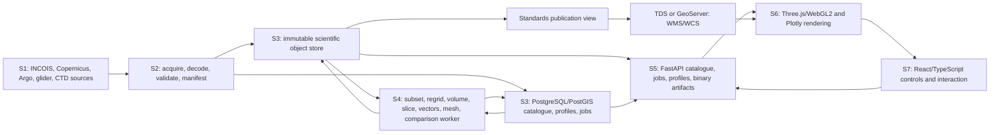

# Technical Investigation for the INCOIS 3D Ocean Data Visualization System

## Research frame and authority

This investigation uses `SRS_Technical_Requirements_Mapping.txt` as the sole requirements authority, `HLSA_INCOIS_3D_Ocean_Data_Visualization_System.md` as the fixed system boundary and responsibility model, and `LLD_INCOIS_3D_Ocean_Data_Visualization_System.md` only as a provisional design to audit. The six-slide project presentation was also inspected. It accurately summarizes the HLSA and adds no binding requirement or technology constraint. None of those source documents was changed.

The fixed responsibility chain is:

`S1 Data Sources -> S2 Data Ingestion -> S3 Storage and Management -> S4 Processing -> S5 Backend and Data Serving -> S6 3D Rendering -> S7 User Interface`

The investigation does not introduce numerical latency, capacity, security, or quality targets that the SRS does not contain. Where a choice depends on real data, browser hardware, or an INCOIS deployment detail that is not available in the workspace, it is explicitly assigned to a prototype test.

## A. Executive technical judgement

The seven-stage architecture is sound and should be retained. The current LLD is directionally useful, but it collapses scientific processing, delivery encoding, and rendering into a single volume-builder path. That would make slices, currents, isosurfaces, and profiles inherit the compromises of an 8-bit display volume. The corrected design keeps one decoded scientific subset as the common truth and fans out into separate, provenance-bearing products for volume, slice, vector, isosurface, and profile views.

The smallest credible student build is:

1. Python ingestion and processing using xarray, NumPy, pandas where tabular work is actually needed, cf-xarray for coordinate discovery, IOOS Compliance Checker for validation, xESMF only when horizontal regridding is required, and scikit-image for server-generated isosurfaces.
2. Immutable source and derived files behind a storage adapter. Local POSIX storage is enough for development; Azure Blob or ADLS, S3-compatible storage, or an INCOIS-managed equivalent can be selected at deployment. Azure Files should not be the sole scientific store.
3. PostgreSQL/PostGIS for catalogue records, extents, instrument/profile identity, job state, and spatial selection. Large model arrays remain in scientific files, not database rows.
4. A small FastAPI service for catalogue, validated visualization requests, profiles, job status, and binary artifact delivery. Expensive regridding, resampling, marching cubes, and volume construction run in a separate worker process and are cached by scientific input version and request.
5. An existing INCOIS THREDDS/LAS publication path where it already satisfies WMS/WCS needs. For newly curated files, THREDDS versus GeoServer remains a measured compatibility choice because their NetCDF and WCS capabilities differ. THREDDS documents WCS 1.0 with regular horizontal axes, while GeoServer's NetCDF reader expects COARDS-style gridded dimensions and its WCS NetCDF output has structured-grid limitations ([THREDDS WCS reference](https://docs.unidata.ucar.edu/tds/current/userguide/wcs_ref.html), [GeoServer NetCDF input](https://docs.geoserver.org/stable/en/user/extensions/netcdf/netcdf/), [GeoServer NetCDF output](https://docs.geoserver.org/latest/en/user/extensions/netcdf-out/index.html)).
6. React with TypeScript for stateful browser UI, Three.js/WebGL2 for the first regular-grid 3D prototype, and Plotly for profiles. Three.js remains conditional on runtime GPU limits, correct local geodetic coordinates, transparent missing values, and measured interaction on target machines. The official Three.js volume example uses `Data3DTexture` with floating-point values, so the renderer does not force an 8-bit scientific payload ([Three.js volume example](https://github.com/mrdoob/three.js/blob/dev/examples/webgl_texture3d.html), [Data3DTexture](https://threejs.org/docs/pages/Data3DTexture.html)).
7. Container images, environment-based configuration, and a simple deployment manifest that can run locally, on an INCOIS container platform, or on Azure. Azure Container Apps and Container Apps Jobs can remain one deployment profile, not an architectural dependency. Microsoft distinguishes continuously running apps from finite manual, scheduled, or event-triggered jobs, which fits the proposed API and worker split ([Azure Container Apps jobs](https://learn.microsoft.com/en-us/azure/container-apps/jobs)).

The principal decisions are:

| Decision | Judgement | Reason |
|---|---|---|
| Fixed S1 to S7 chain | KEEP | It cleanly assigns source, ingestion, storage, processing, serving, rendering, and interaction responsibilities. |
| Native NetCDF as the scientific interchange | KEEP WITH CONDITIONS | Preserve source bytes and CF metadata; validate declared conventions; do not assume every provider is CF-complete or every standards server reads the same file. |
| Azure Files for all raw and curated data | REPLACE | Object storage or a deployment-neutral artifact store better fits immutable, large, read-heavy scientific objects. Use a read-only filesystem publication cache only when a standards server needs it. |
| PostgreSQL/PostGIS | KEEP WITH CONDITIONS | Use it for metadata, profile observations, spatial filtering, and jobs, not for dense four-dimensional model fields. |
| FastAPI | KEEP | It is a compact typed API choice with OpenAPI support, but heavy computation must not live in normal request handlers ([FastAPI](https://fastapi.tiangolo.com/), [background-task caveat](https://fastapi.tiangolo.com/tutorial/background-tasks/)). |
| GeoServer as the automatic WMS/WCS answer | REQUIRES PROTOTYPE TEST | Its mandatory-protocol value is real, but NetCDF layout, dimensions, WCS version, and output behavior must be tested with the chosen files. |
| Three.js/WebGL2 | KEEP WITH CONDITIONS | Strong fit for a focused regular-grid viewer, but volume quality, GPU limits, picking, coordinate precision, and low-end behavior require evidence. |
| React, TypeScript, Plotly | KEEP | Appropriate for linked controls, request state, reusable panels, and scientific profile charts. |
| Heavy S4 logic executed in the API process | REPLACE | It couples latency and failures to HTTP workers and prevents reliable cache reuse. |
| One 8-bit volume as the parent of every view | REPLACE | It discards sign, precision, masks, and physical isovalue meaning. |
| YAML-only extensibility | MODIFY | Configuration can map a known schema, but new grids, instruments, algorithms, and protocols need typed adapters plus tests. |
| Azure-only runtime topology | MODIFY | Keep Azure as a deployable profile while making file access, job execution, and configuration portable. |

## B. Dataset and source reality

### B.1 INCOIS sources and services

INCOIS already operates service patterns that should be reused before building new acquisition or publication infrastructure. Its public data holdings page lists Argo data as real-time and public, CTD/XCTD as delayed-mode holdings, model products including GODAS and ROMS, and some biogeochemical holdings with access restrictions ([INCOIS data holdings](https://incois.gov.in/site/dataholdings.jsp)). Its LAS deployment exposes THREDDS catalogues, which is direct evidence that OPeNDAP and TDS-compatible workflows belong in the first integration prototype rather than being treated as theoretical options ([INCOIS LAS](https://las.incois.gov.in/las/ProductServer.do), [example INCOIS THREDDS catalogue](https://las.incois.gov.in/thredds/catalog/las/id-f8514e39b6/catalog.html?dataset=testDatasetScan%2Fid-f8514e39b6%2Fdata_home_las_datasets_pCO2_INCOIS_ReML.nc.jnl)). INCOIS also exposes an ERDDAP endpoint, which is useful for discovery and subset access even though ERDDAP alone is not evidence of the required WCS path ([INCOIS ERDDAP](https://erddap.incois.gov.in/erddap/index.html)).

The first S1 catalogue should therefore record each INCOIS holding by its actual access method, update mode, licence/access status, and provider identifier. It must not assume all holdings arrive by the same protocol or are publicly redistributable.

### B.2 Model data reality

Copernicus Marine's global physical reanalysis is a representative credible model input. Its product services provide catalogue, subset, and file access, and the product user manual describes a 1/12 degree regular grid, 50 standard depth levels, daily and monthly files, CF-1.4 metadata, and variables including potential temperature, salinity, and eastward and northward currents ([Copernicus product services](https://data.marine.copernicus.eu/product/GLOBAL_MULTIYEAR_PHY_001_030/services), [product user manual](https://documentation.marine.copernicus.eu/PUM/CMEMS-GLO-PUM-001-030.pdf), [product DOI](https://doi.org/10.48670/moi-00021)). The manual also documents packed values through `scale_factor` and `add_offset`, a fill value, a Gregorian time coordinate, and depth positive downward. A full daily file is large enough that browser delivery must always be a spatial, temporal, variable, and resolution subset rather than a complete source file.

Operational model holdings differ in variable names, grids, calendars, fill values, vertical coordinates, and masks. The contract should discover by CF `standard_name`, coordinates, axis, units, and grid mapping, with a reviewed per-source adapter only when metadata is insufficient. Fixed source names such as `temp`, `sal`, `chl`, `lat`, `lon`, `depth`, and `time` are not a general ingestion contract.

### B.3 Argo and BGC-Argo reality

Argo is not a table of anonymous points. A profile is tied to a platform and cycle, has real-time or delayed-mode status, and contains parameter-level values and quality flags. Argo's official guide explains that real-time profile files are followed by delayed-mode values, that core variables include pressure, temperature, and salinity, and that BGC users must inspect parameter-specific data modes rather than relying only on the profile-level mode ([Argo file guide](https://argo.ucsd.edu/data/how-to-use-argo-files/), [Argo GDAC access](https://argo.ucsd.edu/data/data-from-gdacs/), [Argo documentation](https://www.argodatamgt.org/Documentation)). The BGC-Argo guide stresses traceability by WMO identifier, cycle, file update, and snapshot, and explains the mixed real-time, adjusted, and delayed states of individual parameters ([BGC-Argo data guide](https://www.frontiersin.org/journals/marine-science/articles/10.3389/fmars.2019.00502/full)). The Argo data-system paper gives the wider operational and quality-control context ([Argo data system](https://doi.org/10.3389/fmars.2020.00700)).

Consequences for this system:

- Store a profile identity, not just latitude, longitude, depth, and value.
- Retain the source file update/version and per-parameter data mode.
- Keep raw and adjusted values distinct or choose one through an explicit quality policy.
- Carry quality flags through selection, comparison, and display.
- Treat a synthetic BGC profile file as a coordinated set of core and BGC measurements, not as interchangeable rows.
- Preserve direction and cycle/dive/cast identity so the UI can explain what was selected.

### B.4 Glider and CTD reality

OceanGliders defines an OG1 mission-level format aligned with CF trajectory discrete sampling geometry and distinguishes real-time, recovery, and delayed data modes ([OceanGliders OG format](https://github.com/OceanGlidersCommunity/OG-format-user-manual/blob/main/OG_Format.adoc)). Its data assembly procedure shows that vendor raw files are processed through levels before the standardized output is produced, so ingestion needs a provider or vehicle adapter, not just a filename pattern ([OceanGliders DAC procedure](https://github.com/OceanGlidersCommunity/DataAssemblyCenter_SOP/blob/main/MEDS-DFO_DAC.md)).

For a public CTD source, NOAA's World Ocean Database provides profile search and download, including a CF ragged-array representation and per-cast NetCDF options ([World Ocean Database](https://www.ncei.noaa.gov/products/world-ocean-database), [WODSelect](https://www.ncei.noaa.gov/access/world-ocean-database-select/dbsearch.html), [WOD CF ragged array](https://www.ncei.noaa.gov/netcdf-ragged-array-format), [per-cast NetCDF information](https://www.ncei.noaa.gov/access/world-ocean-database-select/netCDF_info.html)). A ragged profile collection and a regular four-dimensional model cube cannot share one array-loading assumption. Both can share catalogue and profile contracts.

### B.5 Source acceptance matrix

| Source class | Minimum acquisition evidence | Minimum identity | Scientific acceptance checks | Initial system use |
|---|---|---|---|---|
| INCOIS model NetCDF or TDS dataset | Stable provider URL/catalogue ID, update marker, access terms | Provider dataset ID plus provider revision | Openable file/dataset, declared conventions, coordinate and variable discovery, units, extent, fill/mask | Primary model view |
| Copernicus model product | Product ID, dataset ID, DOI/manual version, subset request, retrieval timestamp | Product, dataset, service response or file checksum | Same as above, plus packed-value decode and land mask | Representative external model connector and test fixture |
| Argo core/BGC | GDAC path/index row, WMO, cycle, source update | WMO, cycle, direction/profile index, parameter modes | Dimension consistency, positions/times, QC arrays, raw/adjusted policy, pressure/depth units | Markers and profiles |
| Glider | Deployment/mission ID, source mode, provider file revision | Platform, deployment, trajectory/profile index | Format version, coordinates, time monotonicity policy, QC and vertical coordinate | Markers, tracks, profiles |
| CTD | Cruise/station/cast identifiers and source revision | Cruise, station, cast, profile time | Units, coordinates, duplicate level handling, QC, vertical coordinate | Markers and profiles |
| ASCII observation | Immutable original plus documented column schema | Source-specific platform/cast/profile ID | Encoding, delimiter, units, missing values, coordinate range, duplicate policy | Only through an explicit adapter |

## C. Stage-by-stage investigation

### S1. Data Sources

**Responsibilities and requirements.** S1 remains external to the software boundary and supplies the model, observation, biogeochemical, bathymetric/depth, temporal, and spatial coverage required by DIR-001 through DIR-007 and ING-001 through ING-002. It includes INCOIS-held and approved external datasets, not internal storage.

**Inputs and outputs.** The input to the architecture is a provider endpoint, file, catalogue entry, or documented manual upload. S1 outputs retrievable source objects and source metadata. An external provider must never be configured to write directly into the internal `raw/` store.

**Interfaces.** Start with HTTPS file retrieval and OPeNDAP/THREDDS for INCOIS and model products, GDAC HTTPS for Argo, and reviewed upload for local NetCDF or ASCII. Use ERDDAP only for datasets for which its query semantics and provenance can be recorded. Credentials and restricted holdings are deployment concerns, not assumptions in this report.

**Selected technology and reusable assets.** Use provider-specific Python connectors on top of `fsspec`/HTTP and xarray where remote datasets are genuinely compatible. Use `argopy` for Argo discovery/download patterns, but verify the exact fields against official Argo documentation. Study Pangeo Forge's pattern and opener code for repeatable chunk acquisition, without adopting the whole platform for the student build.

**Failure modes.** Provider downtime, changed catalogue identifiers, incomplete downloads, silent provider revision, access restriction, calendar mismatch, corrupt file, or ambiguous ASCII schema. The response is a retryable acquisition record, checksum validation, quarantine state, and no publication until S2 acceptance succeeds.

**Acceptance evidence.** The acquired bytes or immutable remote reference, checksum or provider revision, retrieval time, source URL, access status, and a replayable connector request.

**What not to build.** Do not create a new ocean-data portal, crawler framework, or provider-side upload service. Reuse official distribution paths.

### S2. Data Ingestion

**Responsibilities and requirements.** S2 owns ingestion of NetCDF and ASCII, external-source adapters, CF-aware decoding and validation, canonical metadata, and provenance (ING-001, ING-002, STD-001, EXT-001 through EXT-003). It does not own the durable catalogue or final rendering products.

**Inputs and outputs.** Input is an immutable S1 source object. Output is an acceptance result plus a `DatasetManifest`, a `ProfileIdentity` stream for observations, and optionally a normalized scientific file when normalization is necessary. S2 writes through S3 interfaces, so the stage boundary remains intact.

**Selected technology.** Use xarray for opening and lazy decoding of gridded NetCDF, cf-xarray for semantic coordinate/variable discovery, pandas only for bounded ASCII parsing, and IOOS Compliance Checker for declared CF/ACDD checks. xarray's `decode_cf` masks and scales packed variables, decodes coordinates and time, and helps interpret CF metadata; it is not a conformance validator ([xarray I/O](https://docs.xarray.dev/en/stable/user-guide/io.html), [xarray CF decoding](https://docs.xarray.dev/en/stable/generated/xarray.conventions.decode_cf_variables.html), [cf-xarray](https://github.com/xarray-contrib/cf-xarray), [IOOS Compliance Checker](https://github.com/ioos/compliance-checker)). The current CF release list and conformance rules should be treated as versioned references, not as a claim that every incoming file uses the newest convention ([CF versions](https://cfconventions.org/conventions.html), [CF conformance](https://cfconventions.org/cf-conventions/DOI/conformance.html)).

**Acceptance sequence.** Verify source integrity, open without suppressing errors, capture declared `Conventions`, run the applicable checker, discover axes and variables semantically, decode packed values and time, verify dimension alignment and coordinate ranges, inspect fill/mask behavior, apply source-specific quality policy, generate the manifest, then commit the accepted version through S3. A warning policy may allow non-fatal metadata defects, but the exact warning and decision must be recorded.

**Grid handling.** Record whether a dataset is rectilinear, curvilinear, unstructured, or a CF discrete sampling geometry. UGRID is a relevant convention for unstructured meshes, but it should be activated only when a selected dataset actually needs it ([UGRID conventions](https://ugrid-conventions.github.io/ugrid-conventions/), [UGRID conformance](https://ugrid-conventions.github.io/ugrid-conventions/conformance/)). A curvilinear or unstructured source must not be mislabeled as a regular volume.

**Failure modes.** False success from `decode_cf`, guessed variable names, converted units without provenance, invalid calendar, longitude wrap error, reversed vertical axis, land fill converted to zero, QC lost during row normalization, or partial S3 writes. Use a two-phase state: staged, then accepted and visible.

**Acceptance evidence.** Original checksum, checker output, decoded min/max and missing counts by variable, dimension/coordinate summary, source-to-canonical mapping, sample profile identity, and deterministic manifest hash.

### S3. Storage and Management

**Responsibilities and requirements.** S3 owns immutable source versions, normalized scientific artifacts, derived visualization artifacts, observation/catalogue records, provenance, and discoverability. It supports the data needed by BDA-001, the three STD requirements, and all later stages without redefining their behavior.

**Recommended arrangement.** Use three logical stores behind explicit interfaces:

- `ScientificObjectStore`: immutable source NetCDF/ASCII and versioned derived artifacts. Local POSIX works for development. Blob/object storage is preferred for large read-heavy objects in a cloud or data-centre deployment. Microsoft describes ADLS as object storage for large-scale analytics and distinguishes Blob's large read-heavy workload fit from Azure Files' file-sharing role ([ADLS introduction](https://learn.microsoft.com/en-us/azure/storage/blobs/data-lake-storage-introduction), [NFS storage comparison](https://learn.microsoft.com/en-us/azure/storage/common/nfs-comparison)).
- `CatalogueStore`: PostgreSQL tables for dataset/version, variable descriptors, extents, acquisition/validation reports, artifact keys, and job state.
- `ObservationStore`: PostgreSQL/PostGIS for platform/profile identity, marker geometry, vertical samples, data/QC mode, source version, and model-observation comparison provenance. PostGIS supplies spatial types and index-aware queries; use an appropriate geometry or geography policy and a GiST index for the marker-selection operations ([PostGIS introduction](https://postgis.net/docs/manual-3.7/en/postgis_introduction.html), [spatial indexes](https://postgis.net/documentation/faq/spatial-indexes/), [geometry versus geography](https://postgis.net/documentation/faq/geometry-or-geography/)).

Dense model arrays should not be expanded into relational rows. A catalogue entry points to the immutable scientific source and any derived chunks. Zarr is a valid chunked artifact format, and kerchunk can create reference descriptions over existing files, but neither should be introduced until a benchmark demonstrates a material access problem. Avoid maintaining NetCDF, Zarr, and kerchunk representations by default.

**Standards publication view.** Some standards servers require a local or mounted filesystem layout. If so, create a read-only, reproducible publication view from the immutable store. It is not a second editable source of truth. GeoServer's NetCDF mosaic expects compatible files and auxiliary/index configuration, which is precisely why "the same Azure Files directory for xarray and GeoServer" is not a validated architecture claim ([GeoServer NetCDF input](https://docs.geoserver.org/stable/en/user/extensions/netcdf/netcdf/)).

**Failure modes.** Mutable overwrite under a stable ID, catalogue/object mismatch, orphan artifact, incomplete profile transaction, object-store outage, duplicate source version, publication cache drift, or unbounded derived cache. Use immutable version IDs, database constraints, transactional catalogue visibility, content hashes, cache eviction by reproducibility, and periodic referential checks.

**Acceptance evidence.** Given a dataset version, a test must retrieve its manifest, original object checksum, validation report, observation count, spatial extent, and each derived artifact's complete provenance.

### S4. Processing

**Responsibilities and requirements.** S4 performs scientific subset, decode, coordinate normalization, optional regridding, visualization-specific derivation, and model-observation alignment. It supports BDA-001, MVR-001 through MVR-006, IDO-003, UIC-002 through UIC-006, and STD-001 through STD-003. It returns data products, not UI components.

**Execution model.** Place a pure, testable Python processing library behind two entry paths:

- A synchronous path for bounded metadata, markers, existing profile records, and very small already-indexed subsets.
- A worker path for regridding, volume resampling, vector thinning, marching cubes, cache generation, and comparison batches. The API creates a canonical job request in PostgreSQL, one worker claims it, writes the artifact atomically, and commits the result manifest. This is sufficient for the first build and avoids requiring Redis or RabbitMQ. FastAPI's own documentation advises a separate tool/process for heavy computation rather than treating normal background tasks as a distributed compute mechanism ([FastAPI background tasks](https://fastapi.tiangolo.com/tutorial/background-tasks/)).

**Product branches.** Every branch starts from decoded floating-point scientific values and the original missing mask:

1. `volume`: subset, optional regular-grid transform, explicit resample, transfer-domain statistics, Float32 or loss-bounded Uint16 encoding, missing mask.
2. `slice`: interpolate or select on the scientific grid at the requested physical plane/depth. It is not a cut through an already quantized display texture.
3. `vector`: use signed eastward/northward components and their units, then thin or aggregate with the method recorded. Never derive direction from a scalar magnitude.
4. `isosurface`: apply the requested physical threshold to float values with real grid spacing and mask; return positions, normals, and triangle indices.
5. `profile`: preserve exact platform/profile identity and vertical coordinate, values, QC, timestamp, and source version.
6. `comparison`: sample the model at observation location, depth, and time using an explicitly recorded interpolation method and offsets; keep the observed profile intact.

**Regridding.** xESMF exposes bilinear, nearest, and conservative methods through ESMF and supports rectilinear and curvilinear grids. Selection depends on the quantity and purpose: bilinear for smooth continuous fields, nearest for categorical/QC fields, and conservative methods for quantities whose cell-integrated content must be preserved ([xESMF](https://xesmf.readthedocs.io/en/stable/), [algorithm comparison](https://xesmf.readthedocs.io/en/stable/notebooks/Compare_algorithms.html), [ESMF regridding](https://earthsystemmodeling.org/regrid/)). Regridding weights should be cached by source grid hash, destination grid, mask policy, and method.

**Isosurfaces.** `skimage.measure.marching_cubes` accepts float arrays, a physical level, spacing, and a mask, and its Lewiner implementation provides topological guarantees for the processed grid ([scikit-image marching cubes](https://scikit-image.org/docs/stable/api/skimage.measure.html), [Marching Cubes paper](https://doi.org/10.1145/37402.37422)). Preserve the physical threshold and grid transform in the result manifest.

**Failure modes.** Out-of-range request, incompatible grid, all-missing subset, log scale with non-positive values, too-large product, cancelled stale request, worker failure, or result produced from a superseded dataset version. Each becomes a typed state, not an empty successful response.

**Acceptance evidence.** Golden array tests for decode, mask, interpolation, vector sign, isovalue, spacing, vertical direction, and quantization; deterministic cache keys; provenance comparison; and product-specific visual checks.

### S5. Backend and Data Serving

**Responsibilities and requirements.** S5 owns validated API requests, catalogue/profile responses, job coordination, binary artifact delivery, and standards-server routing. It satisfies BDA-001 and exposes the capabilities needed by S6 and S7. It does not perform heavy scientific work itself.

**Custom application API.** Keep FastAPI and expose a narrow versioned API:

- `GET /api/v1/datasets` and `GET /api/v1/datasets/{version}`
- `GET /api/v1/profiles` for spatial/time/instrument selection
- `GET /api/v1/profiles/{profile_id}` for an exact identity and chosen variables
- `POST /api/v1/visualizations` for a canonical product request
- `GET /api/v1/jobs/{job_id}` and `DELETE /api/v1/jobs/{job_id}`
- `GET /api/v1/artifacts/{artifact_id}/manifest` plus a signed or streamed binary body
- `POST /api/v1/comparisons` for a provenance-bearing model/observation request

FastAPI automatically publishes an OpenAPI schema, which is useful for keeping TypeScript request types and test fixtures aligned ([FastAPI OpenAPI](https://fastapi.tiangolo.com/tutorial/first-steps/)). The manifest is JSON; large numeric arrays are a typed binary body. Avoid huge nested JSON arrays.

**OGC route.** WMS supplies rendered map imagery and WCS supplies multi-dimensional coverage access. The standards requirement should be demonstrated through the selected standards server, not imitated by custom endpoints ([OGC WMS](https://www.ogc.org/standards/wms/), [OGC WCS](https://www.ogc.org/standards/wcs/)). Prefer existing INCOIS THREDDS/LAS publication where it already covers the chosen dataset. For new publication, compare:

| Candidate | Strength | Constraint that must be tested |
|---|---|---|
| THREDDS Data Server | OPeNDAP, WMS, WCS, HTTP and NetCDF-Java/NcML in one ocean-science-oriented server ([TDS guide](https://docs.unidata.ucar.edu/tds/current/userguide/index.html)) | Documented WCS service is 1.0 and requires regular horizontal axes; verify exact file, variable, CRS, subset, and client. |
| GeoServer | Mature WMS and WCS stack, WCS 2.0.1 output path, familiar geospatial operations | NetCDF reader is limited to gridded COARDS-style dimensions and mosaic rules; multidimensional WCS output has structured-grid constraints. |
| ERDDAP | Excellent griddap/tabledap, subsets, OPeNDAP, maps, and data conversion ([ERDDAP information](https://coastwatch.pfeg.noaa.gov/erddap/information.html)) | Do not select it as the sole mandatory-protocol server without direct WCS evidence. It is still valuable for discovery and browser-friendly subsets. |

**Failure modes.** Invalid variable/version combination, stale job, unbounded region, artifact missing, standards server incompatible, range request failure, or disconnected client. Validate against the manifest before submitting S4 work, use canonical error codes, support cancellation, and avoid publishing a result until the binary and manifest are committed.

**Acceptance evidence.** OpenAPI contract tests, binary checksum/length tests, range-request test if used, exact error-state tests, WMS `GetCapabilities` plus image request, WCS `GetCapabilities` plus coverage subset, and a full browser request trace.

### S6. 3D Rendering

**Responsibilities and requirements.** S6 owns volume rendering, depth and slice planes, isosurface display, current vectors, instrument markers, profile selection/picking, and synchronized model/observation visual context (MVR-001 through MVR-006, IDO-001 through IDO-003). It renders products from S5 and never guesses scientific units or axes.

**Selected first implementation.** Keep Three.js/WebGL2 for the first prototype. Use:

- `Data3DTexture` plus a custom ray-marching shader for a regular volume.
- Plane or texture geometry for slice products.
- `BufferGeometry` for server-generated isosurfaces.
- `InstancedMesh` or batched point geometry for instrument markers and vector glyphs.
- `Raycaster` for marker/surface picking, with application IDs preserved in instance attributes.

Three.js documents `InstancedMesh` as reducing draw calls for repeated geometry and exposes ray intersection utilities ([Three.js InstancedMesh](https://threejs.org/docs/pages/InstancedMesh.html), [Three.js Raycaster](https://threejs.org/docs/pages/Raycaster.html)). WebGL2 exposes three-dimensional textures, but hardware limits are implementation-dependent, so the application must query capabilities such as the maximum 3D texture size rather than compile in one assumed cube size ([WebGL 2 specification](https://registry.khronos.org/webgl/specs/latest/2.0/)).

**Alternatives.** vtk.js is the strongest prototype alternative because it has a dedicated volume mapper, transfer functions, float/16-bit data paths, and image marching-cubes filters ([vtk.js volume mapper](https://kitware.github.io/vtk-js/api/Rendering_Core_Volume.html), [vtk.js examples](https://kitware.github.io/vtk-js/examples/index.html)). CesiumJS is stronger when a global globe, terrain, or geodetic camera dominates, and provides reviewed Cartesian and local-frame transformations ([Cesium Cartesian3](https://cesium.com/learn/cesiumjs/ref-doc/Cartesian3.html), [Cesium camera and local frames](https://cesium.com/learn/cesiumjs-learn/cesiumjs-camera/)). deck.gl is useful for large geospatial point overlays and performance patterns, but its PointCloudLayer does not replace a true ocean-volume renderer ([deck.gl PointCloudLayer](https://github.com/visgl/deck.gl/blob/master/docs/api-reference/layers/point-cloud-layer.md), [deck.gl performance](https://github.com/visgl/deck.gl/blob/master/docs/developer-guide/performance.md)).

**Coordinate system.** Convert geographic coordinates to a documented local east-north-up frame around the selected region. Keep depth positive downward in scientific metadata, then map it to negative local up in the scene. Apply vertical exaggeration only as a reversible display transform. This avoids feeding large Earth-centred coordinates directly to a small local volume and makes markers, slices, vectors, and meshes share one transform.

**Rendering correctness.** A missing voxel has zero opacity, not a data value. Transfer functions operate in physical units after decoding scale/offset. Colour maps should be perceptually appropriate and labelled with variable and units. Oceanographic colour-map research shows why rainbow-like maps can create false visual boundaries; cmocean provides domain-focused palettes ([scientific colour-map study](https://doi.org/10.1038/s41467-020-19160-7), [cmocean](https://doi.org/10.5670/oceanog.2016.66)).

**Failure modes.** No WebGL2, volume exceeds GPU limit, shader compile failure, transparent sort artifact, lost context, precision mismatch, NaN propagation, or unpickable dense markers. Provide an unsupported state, lower-resolution request, retry, 2D/profile fallback, and context recovery rather than a frozen canvas.

**Acceptance evidence.** Render known synthetic volumes, missing-value holes, signed vectors, known isosurfaces, coincident markers, and a depth axis at multiple vertical exaggerations. Record GPU, browser, volume shape, encoding, frame time trace, memory estimate, and visual screenshots without inventing a pass threshold in advance.

### S7. User Interface

**Responsibilities and requirements.** S7 owns variable, depth, time, view-mode, palette, value-range, opacity, scale and profile controls; readable feedback; responsive browser layout; and the linked workflow required by UIC-001 through UIC-007, WEB-001 through WEB-004, and IDO-001 through IDO-003.

**Selected technology.** Keep React and TypeScript. React's component and state model suits coordinated controls and panels, and its official documentation supports typed components through TypeScript ([React](https://react.dev/learn), [React with TypeScript](https://react.dev/learn/typescript)). Keep Plotly for profile charts. It supports reversed axes, which lets depth increase downward, and typed numeric arrays where appropriate ([Plotly axes](https://plotly.com/javascript/reference/layout/xaxis/)).

**One coherent interaction.** The default screen has dataset/variable/time controls, a main 3D view, a compact legend and view controls, and a profile panel or drawer. A user selects a dataset version, variable, time, and mode. The UI requests a low-detail product first, then replaces it with the chosen detail when available. Palette, range, opacity, and vertical exaggeration update locally when the loaded payload supports it. A depth, slice, isovalue, time, region, or variable change submits a new request. Time play prefetches the next available result and cancels stale requests. The Fetch API supports cancellation through `AbortController` ([MDN Fetch cancellation](https://developer.mozilla.org/en-US/docs/Web/API/Fetch_API/Using_Fetch)).

Clicking a marker requests the exact profile ID and selected variable. The chart shows value versus pressure/depth with the vertical axis reversed, timestamp, platform/profile identity, units, and QC/data mode. A comparison action requests the corresponding model sample and reports the temporal, horizontal, and vertical alignment method and offsets.

**State model.** Every data panel handles `idle`, `validating`, `queued`, `processing`, `streaming`, `ready`, `empty`, `rejected`, `unsupported`, `cancelled`, and `failed`. A failure says what action failed and offers a valid next action. A new selection invalidates only products whose cache key actually changes.

**Responsive behavior.** On a wide display, controls, 3D view, and profile panel can coexist. On a narrow display, controls and profile become drawers while the canvas retains most of the viewport. Keyboard access, labelled inputs, visible focus, non-colour selection cues, and readable units are part of a credible web application even though the SRS does not define a separate accessibility standard.

**Acceptance evidence.** One end-to-end browser test for every SRS control and view, plus explicit loading, empty, error, cancellation, and narrow-screen tests. Verify that units, time, depth direction, selected dataset version, and profile identity remain visible.

### Complete requirement-to-stage trace

| Requirement | Primary stage | Research disposition |
|---|---|---|
| DIR-001 | S1/S2 | Accept and describe numerical model fields through a versioned dataset manifest. |
| DIR-002 | S1/S2/S4 | Map temperature, salinity, current components, and chlorophyll semantically and preserve units. |
| DIR-003 | S2/S3/S4 | Record grid, depth, and time coordinates; subset them without losing calendar or vertical direction. |
| DIR-004 | S1/S2/S3 | Preserve real-time and delayed modes for Argo and glider inputs. |
| DIR-005 | S1/S2/S3 | Use the common profile contract for Argo, glider, CTD, and BGC sources. |
| DIR-006 | S2/S3 | Retain latitude, longitude, depth/pressure, time, temperature, salinity, and chlorophyll with identity and QC. |
| DIR-007 | S1/S2 | Provide NetCDF and explicit-schema delimited-text adapters. |
| ING-001 | S2 | Parse NetCDF with xarray and validate declared CF rules separately. |
| ING-002 | S2 | Parse delimited text through a bounded, source-specific schema adapter. |
| BDA-001 | S5 | Keep a lightweight catalogue/profile/job/artifact API and delegate heavy work to S4. |
| MVR-001 | S4/S6 | Produce and interactively render typed 3D products. |
| MVR-002 | S4/S6 | Preserve full-water-column coordinates and provide depth-resolved volume views. |
| MVR-003 | S4/S6/S7 | Produce scientific-grid slice products and expose depth navigation. |
| MVR-004 | S4/S6 | Extract a physical-value isosurface and render its indexed mesh. |
| MVR-005 | S4/S5/S6/S7 | Version time products, prefetch/cancel safely, and animate available model steps. |
| MVR-006 | S2/S4/S6 | Render temperature, salinity, and signed current-vector products with units. |
| IDO-001 | S3/S5/S6 | Spatially serve and render geodetically aligned Argo, glider, CTD, and BGC markers. |
| IDO-002 | S6/S7 | Preserve marker IDs through picking so an Argo float or glider is exactly selectable. |
| IDO-003 | S3/S5/S7 | Return and plot exact depth-versus-variable profiles with timestamps and identity. |
| UIC-001 | S7 | Provide a manifest-driven variable selector. |
| UIC-002 | S7 | Provide depth-slice selection bound to physical depth values. |
| UIC-003 | S7 | Provide play, pause, and time-step selection with stale-request cancellation. |
| UIC-004 | S6/S7 | Provide palette and minimum/maximum controls in physical units. |
| UIC-005 | S6/S7 | Provide linear/log selection and reject invalid non-positive log domains. |
| UIC-006 | S6/S7 | Provide per-layer opacity without modifying scientific values. |
| UIC-007 | S6/S7 | Provide reversible vertical exaggeration in the shared scene transform. |
| MOI-001 | S6/S7 | Co-render model products and in-situ markers in one coordinated scene. |
| MOI-002 | S4/S5/S7 | Provide linked selection and provenance-bearing comparison without switching software. |
| MOI-003 | S6/S7 | Keep the selected profile chart alongside the displayed model state. |
| WEB-001 | S5/S6/S7 | Deliver the application through ordinary browser APIs and WebGL2. |
| WEB-002 | S5/S6/S7 | Require no desktop plugin or installed scientific client. |
| WEB-003 | Cross-cutting | Ship ordinary containers and a static web build that can run on INCOIS infrastructure. |
| WEB-004 | S3/S4/S5 | Separate storage, API, worker, cache, and immutable versions so deployment can scale when measured. |
| EXT-001 | S1/S2/D contracts | Add source/variable adapters behind versioned contracts and fixtures. |
| EXT-002 | S1/S2/D contracts | Define a typed sensor-adapter interface rather than a YAML-only claim. |
| EXT-003 | S2/S4/D contracts | Register new model variables or ML-derived products with semantic metadata, algorithm version, and tests. |
| STD-001 | S2/S3 | Validate declared CF conventions and preserve convention/version evidence. |
| STD-002 | S5 | Demonstrate OGC WMS and WCS through a tested standards server. |
| STD-003 | S2/S3/S5 | Preserve interoperable metadata and exercise an external-client standards request. |

## D. Shared data contracts

The current LLD needs explicit contracts at the S2/S3, S3/S4, S4/S5, and S5/S6 boundaries. These are logical contracts; JSON field names can be refined during implementation without changing ownership.

### D.1 Source object

```json
{
  "source_object_id": "immutable-id",
  "source_system": "incois|copernicus|argo-gdac|manual",
  "source_uri": "provider reference",
  "access_protocol": "https|opendap|erddap|upload",
  "provider_dataset_id": "stable provider identifier",
  "provider_revision": "revision, update time, or null",
  "retrieved_at": "RFC3339 timestamp",
  "checksum_algorithm": "sha256",
  "checksum": "hex digest",
  "media_type": "application/x-netcdf|text/plain",
  "object_ref": "internal immutable reference",
  "access_and_licence_note": "reviewed source statement"
}
```

### D.2 Dataset manifest

Required fields are `schema_version`, `dataset_id`, immutable `dataset_version`, source-object references, validation report ID, declared convention versions, feature/grid type, coordinate reference/grid mapping, longitude convention, dimensions, calendar, extents, vertical direction, and a variable list. Each variable records source name, canonical semantic ID, `standard_name` where present, long name, units, data type, fill/missing behavior, packing, coordinates, quality companions, and allowed visualizations. The manifest also records normalization/regridding provenance and the exact scientific object reference.

Canonical semantics are discovered, then mapped. A canonical ID such as `sea_water_temperature` may point to `thetao`, `TEMP_ADJUSTED`, or another source name. The source name is never destroyed.

### D.3 Profile identity and values

```text
ProfileIdentity
  profile_id
  platform_type
  platform_id / WMO
  mission_or_deployment
  cycle_dive_or_cast
  direction_or_profile_index
  profile_time
  longitude, latitude
  vertical_coordinate_type
  profile_data_mode
  per_parameter_data_mode
  source_object_id, source_update

ProfileSeries
  profile_id
  variable_semantic_id, source_variable
  units
  vertical_values[]
  observed_values[]
  quality_flags[]
  adjusted_error[] when present
```

Rows in PostgreSQL may normalize these structures, but the API must reconstruct the identity and aligned arrays without losing the source version or flags.

### D.4 Visualization request

```json
{
  "schema_version": "1",
  "dataset_version": "immutable-version",
  "product": "volume|slice|vectors|isosurface|profile|comparison",
  "variable": "canonical semantic id",
  "time": "selected instant or index",
  "extent": {"west": 0, "south": 0, "east": 0, "north": 0},
  "vertical": {"min": 0, "max": 0, "units": "m", "positive": "down"},
  "slice": {"axis": "depth", "value": 0},
  "isovalue": {"value": 0, "units": "same as variable"},
  "detail": "preview|interactive|source-limited",
  "comparison_profile_id": null
}
```

Fields that do not apply to a product are omitted. S5 validates availability, extent, time, units, and product compatibility before S4 work starts.

### D.5 Visualization artifact manifest

Every binary artifact has: schema version, artifact ID, source dataset/version and checksum, canonical request hash, algorithm name/version/parameters, product kind, variable/source name/units, time, extent, scientific min/max, coordinate frame, grid type, origin/spacing/shape/order or mesh transform, data type, byte order, missing-mask encoding, optional packing scale/offset, regrid source/destination hash and method, estimated quantization bound, binary content length, and binary checksum.

Product-specific fields are:

- volume: scalar array plus mask and grid transform;
- slice: plane geometry/coordinates, scalar array, mask;
- vectors: positions, signed components, component convention, units, thinning method;
- isosurface: physical isovalue, vertices, normals, triangle indices;
- markers: profile IDs, positions, instrument and time summaries;
- comparison: observation identity, model dataset version, interpolation method, temporal/horizontal/vertical offsets, paired values and masks.

### D.6 Job contract

A job records `queued`, `running`, `succeeded`, `failed`, `cancel_requested`, or `cancelled`, the canonical request hash, dataset version, worker/algorithm version, attempt count, created/started/finished times, progress phase, result artifact ID, and a typed error. If the same successful key exists, S5 returns it without new work.

### D.7 Compatibility and versioning

Contracts use additive schema evolution within a major version. Producers write a specific schema; consumers declare accepted versions. A new provider is an S1/S2 adapter that produces the same manifest. A new renderer consumes an existing artifact contract. A new scientific algorithm produces a new algorithm version and therefore a new cache key. This is stronger than claiming extensibility from YAML alone.

## E. GitHub repository shortlist

Repository activity and release observations below were checked on 14 September 2026. A recent push is evidence of activity, not a guarantee of quality or project longevity. Licence conclusions should be confirmed again before redistribution.

| Repository | Classification | Licence/activity observed | Exact assets to inspect or reuse | Fit and caution |
|---|---|---|---|---|
| [pydata/xarray](https://github.com/pydata/xarray) | REUSE | Apache-2.0, active, v2026.07.0 observed | `xarray/conventions.py`, `xarray/backends/api.py`, NetCDF and Zarr backends | Core labelled-array and CF decode layer. It does not replace formal validation. |
| [xarray-contrib/cf-xarray](https://github.com/xarray-contrib/cf-xarray) | REUSE | Apache-2.0, active, v0.11.3 observed | `cf_xarray/accessor.py`, `criteria.py`, custom criteria docs | Semantic discovery by CF attributes. Source adapters still need reviewed fallbacks. |
| [ioos/compliance-checker](https://github.com/ioos/compliance-checker) | REUSE | Apache-2.0, active, v6.1.0 observed | `compliance_checker/cf/cf_base.py`, versioned CF checkers, runner | Produces explicit conformance evidence. Pin checker/rules version in validation reports. |
| [euroargodev/argopy](https://github.com/euroargodev/argopy) | ADAPT | EUPL-1.2, active, v1.4.0 observed | `argopy/fetchers.py`, GDAC and ERDDAP index fetchers | Good acquisition and indexing patterns. Do not substitute its API for Argo's official data contract. |
| [c-proof/pyglider](https://github.com/c-proof/pyglider) | ADAPT | Apache-2.0, active, v0.0.9 observed | `pyglider/slocum.py`, `seaexplorer.py`, example configuration and tests | Useful if the selected glider source is Slocum or SeaExplorer raw data. Otherwise avoid carrying unused vendor logic. |
| [pangeo-forge/pangeo-forge-recipes](https://github.com/pangeo-forge/pangeo-forge-recipes) | STUDY | Apache-2.0, active commits, latest formal release observed as 0.10.8 | `openers.py`, `patterns.py`, `combiners.py`, `writers.py`, OPeNDAP examples | Study repeatable acquisition and provenance patterns. The full feedstock platform is too large for the minimum build. |
| [fsspec/filesystem_spec](https://github.com/fsspec/filesystem_spec) | REUSE | BSD-3-Clause, active | `fsspec/spec.py`, `core.py`, `mapping.py`, caching | Gives deployment-neutral storage interfaces. Backend semantics and atomic writes still need tests. |
| [fsspec/kerchunk](https://github.com/fsspec/kerchunk) | STUDY | MIT, active | `kerchunk/hdf.py`, `netCDF3.py`, `combine.py` | May accelerate cloud access without rewriting data. Use only after compatibility and access benchmarks. |
| [zarr-developers/zarr-python](https://github.com/zarr-developers/zarr-python) | ADAPT | MIT, active, v3.3.0 observed | `src/zarr/core/array.py`, storage and codec APIs | Candidate derived chunk store, not a mandatory duplicate of every accepted NetCDF source. |
| [pangeo-data/xESMF](https://github.com/pangeo-data/xESMF) | REUSE | MIT, active, v0.9.2 observed | `xesmf/frontend.py`, reusable-weight examples | Regridding library when needed. ESMF dependency and conservative-grid bounds require packaging tests. |
| [scikit-image/scikit-image](https://github.com/scikit-image/scikit-image) | REUSE | BSD-3-Clause, active, v0.26.0 observed | `_marching_cubes_lewiner.py`, LUTs, examples | Server-side isosurfaces with spacing and mask. Benchmark memory and mesh size on the real subset. |
| [geoserver/geoserver](https://github.com/geoserver/geoserver) | ADAPT | GPL-2.0, active, 3.0.1 observed | `src/extension/netcdf`, `src/wcs2_0`, `src/wms` | Strong standards server, but isolate as a service and prototype actual NetCDF/WCS behavior before selecting it. |
| [Unidata/tds](https://github.com/Unidata/tds) | ADAPT | BSD-3-Clause, active, v5.9 observed | `tds/.../opendap`, `tds/.../wcs`, catalog/NcML examples | Closest fit to current INCOIS LAS/TDS practice. WCS 1.0 and grid restrictions must match the evaluator/client need. |
| [ERDDAP/erddap](https://github.com/ERDDAP/erddap) | STUDY | Open-source licence in repository, active, v2.31.1 observed | dataset classes under `gov/noaa/pfel/erddap/dataset`, `datasets.xml` examples | Excellent discovery/subset service. Reject as the sole standards component until WCS compliance is directly established. |
| [mrdoob/three.js](https://github.com/mrdoob/three.js) | REUSE | MIT, active, r186 observed | `examples/webgl_texture3d.html`, `VolumeShader.js`, `Data3DTexture.js`, `InstancedMesh.js` | Minimum custom renderer path for regular grids. The team owns shader correctness and ocean coordinate behavior. |
| [Kitware/vtk-js](https://github.com/Kitware/vtk-js) | STUDY | BSD-3-Clause, active, v37.0.0 observed | `Rendering/Core/VolumeMapper`, `Filters/General/ImageMarchingCubes`, volume examples | Strong fallback prototype if Three.js custom volume work becomes the dominant risk. Do not include both engines in the first product. |
| [CesiumGS/cesium](https://github.com/CesiumGS/cesium) | STUDY | Apache-2.0, active, 1.145 observed | `Cartesian3.js`, `Transforms.js`, point primitives, camera | Best when globe scale is essential. It does not remove the need for a custom volume pipeline. |
| [visgl/deck.gl](https://github.com/visgl/deck.gl) | STUDY | MIT, active, v9.4.0 observed | `point-cloud-layer`, grid layers, performance guidance | Reusable ideas for markers and overlays, not a replacement for volume ray casting. |
| [Deltares/xugrid](https://github.com/Deltares/xugrid) | STUDY | MIT, active | UGRID topology, xarray accessors, regridding/examples | Candidate only if the chosen model uses unstructured UGRID. Avoid for the initial regular-grid scope. |
| [ugrid-conventions/ugrid-conventions](https://github.com/ugrid-conventions/ugrid-conventions) | STUDY | MIT, active | specification source, CDL examples, conformance text | Standards reference and fixture source, not application code. |

The minimum implementation should directly depend on fewer projects than this shortlist. A defensible first dependency set is xarray, cf-xarray, Compliance Checker, fsspec, NumPy, pandas for bounded tabular inputs, Postgres/PostGIS client, FastAPI, xESMF only when needed, scikit-image only for isosurfaces, React, Three.js, and Plotly. The remaining repositories are alternatives or design references.

## F. Algorithms and equations

### F.1 CF packed values and missing data

For a stored packed value `q`, the physical decoded value is:

```text
x = q * scale_factor + add_offset
```

The fill/missing mask is identified according to the source metadata before the packed sentinel can be mistaken for a scientific value. Units, calendar, positive vertical direction, and longitude convention remain in the manifest. The system must test this with an actual packed Copernicus field and an actual Argo adjusted variable.

### F.2 Optional integer delivery encoding

If a B-bit unsigned payload reserves one code for missing values, a simple linear encoding can use:

```text
levels = 2^B - 1             # usable numeric codes when one code is reserved
s = (x_max - x_min) / (levels - 1)
q = round((x - x_min) / s)
x_hat = x_min + q * s
maximum rounding error <= s / 2
```

The manifest must carry `x_min`, `s`, reserved missing code, and the measured error over the actual subset. Uint16 is a safer first compact option than Uint8. Float32 avoids delivery quantization. Source and processing arrays remain floating point. A displayed 8-bit texture may be allowed only after an experiment shows it does not invalidate the chosen variable, range control, slice, and isovalue interaction.

### F.3 Horizontal and vertical interpolation

For normalized horizontal coordinates `t` and `u` inside a rectilinear cell, bilinear interpolation is:

```text
f(t,u) = (1-t)(1-u) f00 + t(1-u) f10 + (1-t)u f01 + tu f11
```

Trilinear interpolation applies the same weighting between two vertical planes, producing eight corner terms. Interpolation is valid only when the coordinate geometry and mask policy permit it. Nearest-neighbour selection is preferable for QC flags, categories, and some sparse observations. No interpolation crosses masked land unless a documented algorithm explicitly allows it.

### F.4 Local ocean scene coordinates

For WGS84 longitude `lambda`, latitude `phi`, and ellipsoidal height `h`:

```text
N(phi) = a / sqrt(1 - e^2 sin^2(phi))
X = (N + h) cos(phi) cos(lambda)
Y = (N + h) cos(phi) sin(lambda)
Z = (N(1 - e^2) + h) sin(phi)
```

Subtract the selected regional origin in Earth-centred coordinates and rotate the delta into local east, north, up. Ocean depth is positive down, so a sample at depth `d` uses height relative to sea surface `h = -d`. A scene transform can use:

```text
scene_x = east
scene_y = north
scene_z = -vertical_exaggeration * (depth - reference_depth)
```

The exact axis assignment can change, but every layer must consume the same transform and the UI must label depth in scientific units.

### F.5 Logarithmic normalization

For a positive-valued variable and positive selected limits:

```text
n = (ln(x) - ln(x_min)) / (ln(x_max) - ln(x_min))
```

If the data or selected range includes zero or negative values, reject or disable log scale with a clear UI state. Do not silently clamp signed current components or anomalies into a logarithm.

### F.6 Currents

For eastward component `u` and northward component `v`:

```text
speed = sqrt(u^2 + v^2)
bearing_from_north_clockwise = atan2(u, v)
```

The system must state this direction convention. Vector glyph length may be normalized for visibility, but colour/legend and any reported speed use physical units. Thinning uses a recorded grid stride or aggregation method.

### F.7 Volume compositing

For front-to-back sampling with premultiplied colour:

```text
C_next = C + (1 - A) * alpha_i * colour_i
A_next = A + (1 - A) * alpha_i
alpha_i = 1 - exp(-tau(value_i) * step_length)
```

`tau` is the opacity transfer function in physical-value space. Missing samples use `alpha_i = 0`. Step length and transfer function are display parameters recorded or recoverable from UI state. Levoy's volume-rendering work is the relevant conceptual basis for classification and compositing ([Levoy volume rendering](https://graphics.stanford.edu/papers/volume-cga88/volume.pdf)).

### F.8 Isosurface interpolation

For an edge with endpoint values `v1` and `v2`, positions `p1` and `p2`, and physical isovalue `T`:

```text
p = p1 + ((T - v1) / (v2 - v1)) * (p2 - p1)
```

Skip invalid/masked cells and handle equal endpoint values deterministically. Supply real spacing to marching cubes, then transform the resulting geometry into the common local scene frame. The isosurface request and result retain `T` and its units.

### F.9 Model and observation alignment

For each observed profile level, identify bracketing model time, horizontal cell/neighbours, and vertical levels. Apply the chosen interpolation only when all required values pass the mask policy. Record:

```text
observation profile_id and source version
model dataset_version and variable
time offset
horizontal distance or containing cell
vertical offset or bracket
interpolation method
mask/rejection reason
```

No universal tolerance is invented here. A prototype reports the distributions of these offsets and lets the project authority choose acceptable limits for a named use case.

## G. Decision audit of the current LLD

| Current LLD claim or selection | Verdict | Evidence and correction |
|---|---|---|
| External feeds write directly to internal `raw/` Azure Files | REPLACE | Providers expose HTTPS, GDAC, OPeNDAP, ERDDAP, or files. An S1 connector acquires an immutable source object and writes through S3. External systems do not receive internal write ownership. |
| Azure Files stores both raw and curated scientific data | REPLACE | It creates a cloud-specific shared-filesystem centre and does not by itself solve immutable versions, object checksums, or analysis access. Use a storage adapter and object/POSIX source of truth; create a read-only publication view only where required. |
| S2 writes curated NetCDF, catalogue rows, and observation rows itself | MODIFY | S2 produces manifests and normalized records, but S3 owns persistence and atomic visibility. This retains the HLSA boundary. |
| `xarray.open_dataset(..., decode_cf=True)` is CF validation | REPLACE | It performs decoding and interpretation. Run a versioned Compliance Checker and preserve its report, then apply project semantic checks. |
| Fixed names `lat`, `lon`, `depth`, `time`, `temp`, `sal`, `chl` define normalization | REPLACE | Use CF axes, `standard_name`, units, coordinates, grid mapping, and reviewed source mapping. Preserve original names. |
| PostGIS stores observations | KEEP WITH CONDITIONS | Store profile identity, marker geometry, indexed selection fields, samples, QC/data mode, and provenance. Do not flatten large model cubes into PostGIS. |
| Native NetCDF can be read unchanged by xarray and GeoServer | REQUIRES PROTOTYPE TEST | xarray supports broad scientific structures; GeoServer documents gridded COARDS dimension expectations. Test the exact curated file and its WMS/WCS results. |
| GeoServer is the standards server | REQUIRES PROTOTYPE TEST | Compare existing INCOIS TDS first, then GeoServer for exact WMS/WCS version, grid, subset, output, and operations needs. Select one primary publication path for the build. |
| S4 processing executes inside the FastAPI service | REPLACE | Keep a shared processing library, but run expensive operations in a worker with PostgreSQL job state and immutable artifacts. |
| Volume builder is the source for slices | REPLACE | Slice decoded scientific arrays directly. A volume encoding is one product branch. |
| Volume builder is the source for current vectors | REPLACE | Build vectors from signed `u` and `v` components plus coordinates, units, and thinning policy. |
| Volume builder is the source for isosurfaces | REPLACE | Run marching cubes on the decoded/masked float subset using the physical isovalue and spacing. |
| A normalized regular grid is always available | REQUIRES PROTOTYPE TEST | The first selected model can be regular, but manifests must distinguish rectilinear, curvilinear, unstructured, and DSG data. Unsupported grids fail explicitly or enter a tested regrid path. |
| 8-bit unsigned volume payload is the default scientific representation | REPLACE | Preserve float scientific data; start with Float32 or loss-bounded Uint16 plus mask. Test optional Uint8 display encoding and publish its error. |
| Three.js `Data3DTexture` requires Uint8 | REPLACE | The official example demonstrates `FloatType`. Texture format is a capability and benchmark decision. |
| Three.js/WebGL2 is the browser renderer | KEEP WITH CONDITIONS | Retain for the first regular-grid experiment, with runtime capability query, measured detail levels, shared coordinate transform, missing alpha, and fallback. |
| React and TypeScript drive the UI | KEEP | Strong fit for linked application state and typed API contracts. Keep technical terms out of ordinary operational labels where possible. |
| Plotly renders profile charts | KEEP WITH CONDITIONS | Use physical units, depth/pressure direction, QC/data mode, exact identity, responsive sizing, and linked selection. |
| Azure Container Apps hosts API and workers | MODIFY | Valid optional profile. Package ordinary containers and use portable storage/job interfaces so an INCOIS-managed runtime can host the same services. |
| Azure Static Web Apps hosts the frontend | MODIFY | A static host is sufficient, but the artifact must also work behind a normal INCOIS web server/CDN. |
| Container Apps Jobs automatically solves processing orchestration | KEEP WITH CONDITIONS | It is suitable on Azure, but the application-level job contract and cache remain portable. A single worker process is enough for the student prototype. |
| YAML configuration alone enables new datasets and visualizations | MODIFY | YAML maps declared source/variable rules. New protocols, grid types, QC schemes, or algorithms require typed adapters, schema versions, fixtures, and tests. |
| Browser-native delivery means all computation runs in the browser | REPLACE | Browser-native means no desktop plugin. Scientific subset and heavy derivation can remain server-side; interaction and rendering run in the browser. |
| WMS/WCS responses and custom 3D payloads can be one endpoint | MODIFY | Route standards requests to a conforming server and custom 3D/profile requests to FastAPI. They can share provenance and dataset IDs, not necessarily protocol implementation. |
| One model and all observation types must be fully generalized immediately | MODIFY | Demonstrate one model plus one Argo/BGC path first, then add one glider or CTD adapter using the same profile contract. This proves extensibility without a framework-first build. |

## H. Recommended end-to-end implementation



### H.1 Minimal deployment topology

Run five deployable units:

1. `ingest` command or scheduled container for S1/S2.
2. PostgreSQL/PostGIS for catalogue, profiles, and job state.
3. Scientific object store, local filesystem in development and a configured backend in deployment.
4. `worker` container for S4.
5. `api` container and static `web` build for S5 through S7.

The standards server is a sixth unit only if an existing INCOIS TDS route cannot publish the selected test dataset. Do not operate both THREDDS and GeoServer in the student prototype unless the comparison experiment requires them.

### H.2 End-to-end happy path

1. The ingest command acquires one model file/subset and one Argo profile source, hashes the originals, and records their source identities.
2. S2 opens, decodes, validates, maps semantic variables, and produces manifests plus profile records.
3. S3 atomically publishes the accepted dataset versions.
4. S7 loads catalogue metadata from S5 and submits a volume or other product request.
5. S5 validates it against the manifest, returns a cached artifact or queues a canonical job.
6. S4 reads the immutable scientific version, produces one product branch, writes its binary and manifest, and commits success.
7. S5 returns the manifest and binary; S6 renders it in the common local frame.
8. A marker click retrieves the exact observation profile. The chart and optional model comparison show identity, units, time, QC/data mode, and alignment provenance.

### H.3 Suggested first vertical slice

Use a small spatial and temporal subset of one regular-grid model containing temperature, salinity, and `u/v`, plus several Argo profiles in the same region/time. Implement volume temperature, horizontal depth slice, vectors, instrument markers, one profile chart, and one physical isosurface. This covers all required visualization families without first solving every provider and grid type. Chlorophyll can be demonstrated from a BGC profile or added model product after the shared contracts work.

## I. Reuse versus build

### Reuse directly

- Official source services and formats: INCOIS LAS/TDS/ERDDAP where applicable, Copernicus Marine, Argo GDAC, OceanGliders conventions, WOD.
- xarray, cf-xarray, IOOS Compliance Checker, fsspec, NumPy, Postgres/PostGIS, FastAPI, Three.js, React, TypeScript, Plotly.
- xESMF only for a demonstrated regridding requirement.
- scikit-image marching cubes for server-side meshes.
- The existing INCOIS standards server when it can publish the chosen dataset and meet the WMS/WCS demonstration.

### Adapt narrowly

- One adapter per selected model/source family, with a reviewed source-to-semantic mapping.
- argopy acquisition/index patterns for Argo.
- pyglider only for a selected supported vendor stream.
- A storage adapter over local POSIX and the deployment object store.
- THREDDS NcML/catalogue or GeoServer NetCDF/mosaic configuration for the actual accepted files.
- Three.js volume shader and marker/vector geometry for oceanographic units, masks, transfer functions, and local coordinates.

### Build in this project

- Versioned source, dataset, profile, visualization, artifact, and job contracts.
- The acceptance pipeline and project semantic checks.
- Catalogue/profile schema and exact identity rules.
- Canonical visualization requests and reproducible cache keys.
- Product orchestration that fans out from scientific truth.
- The local geodetic transform shared by every layer.
- Linked UI state, job/error handling, profile selection, and provenance display.
- Integration tests, scientific golden fixtures, and end-to-end evidence.

### Do not build for the first submission

- A new OGC WMS or WCS implementation.
- A generic workflow platform, message broker, Kubernetes operator, or data lake framework.
- A second browser rendering engine in production.
- A universal ingestion framework for every ocean format.
- Automatic repair of arbitrary non-conforming NetCDF.
- A database representation of complete model grids.
- An independent copy of every dataset in NetCDF, Zarr, and kerchunk form.
- An invented authentication, authorization, or security architecture not requested by the SRS.

## J. Ordered prototype experiments

No experiment below invents a performance threshold. Each produces measurements and observable pass/fail evidence. The project authority can set thresholds after seeing representative results.

### J1. Source and identity reality

**Input:** One accessible INCOIS model/TDS dataset, one Copernicus subset, one Argo core or synthetic BGC profile file, and one selected glider or CTD example.

**Action:** Record provider IDs, retrieve immutable examples, hash them, and extract model variable/grid metadata plus complete profile identities and modes/QC.

**Evidence:** Source-object records, checksums, retrieval commands, one model manifest draft, one profile identity per source class, access/licence notes.

**Pass:** Every accepted sample is reproducibly identifiable and no profile is reduced to anonymous coordinates.

**Fail:** Source version cannot be recovered, access terms are unknown, or required identity/QC fields are discarded.

### J2. CF decode versus validation

**Input:** The model NetCDF samples, including a packed variable and missing cells.

**Action:** Open with xarray CF decoding, run a pinned Compliance Checker profile, and run project semantic checks. Compare raw packed values, decoded values, masks, coordinates, time, and units.

**Evidence:** Checker report, source-to-semantic mapping, raw/decoded sample table, missing counts, declared convention version.

**Pass:** Decoding and validation are distinct recorded steps, physical samples match the documented scale/offset, and missing values never become real ocean values.

**Fail:** `decode_cf` is reported as validation, source names are guessed without evidence, or packing/masks change meaning.

### J3. Storage-portability and atomicity

**Input:** One accepted source object, manifest, profile set, and derived test artifact.

**Action:** Run the same storage interface against local POSIX and the intended deployment backend. Interrupt a write, retry an identical version, and verify catalogue visibility.

**Evidence:** Checksums, object references, database transaction log, interruption result, duplicate result, retrieval test.

**Pass:** Incomplete objects are not visible as accepted, identical versions are idempotent, and application code does not contain backend-specific paths outside the adapter.

**Fail:** A partial artifact is published, a retry creates conflicting versions, or the domain layer requires Azure-specific APIs.

### J4. Standards-server compatibility

**Input:** The exact accepted regular-grid NetCDF and its manifest.

**Action:** First test the existing INCOIS TDS route if operationally available. Otherwise configure THREDDS and GeoServer separately for the same scientific dataset or reproducible publication form. Execute WMS capabilities/map and WCS capabilities/subset requests.

**Evidence:** Config files, server versions, `GetCapabilities` responses, exact requests, returned image/coverage, coordinate/value spot checks, configuration effort and errors.

**Pass:** At least one route demonstrably serves required WMS and WCS behavior for the selected dataset without an undocumented manual rewrite.

**Fail:** Only the service landing page works, the coverage axes/values are wrong, or the result depends on an unrecorded file mutation.

### J5. Processing correctness fixture

**Input:** A small synthetic 3D field with known gradient, sign-changing `u/v`, missing block, non-unit spacing, and a known isosurface; plus one real model subset.

**Action:** Produce volume, slice, vector, and isosurface branches separately.

**Evidence:** Numeric expected/actual arrays, mask comparison, vector bearing table, mesh bounds and physical threshold, provenance manifests.

**Pass:** Each product matches its independent expected result and no product reads the quantized output of another branch.

**Fail:** Missing cells become opaque, vector sign is lost, slice differs from the scientific field, or isosurface position ignores spacing/physical value.

### J6. Payload encoding comparison

**Input:** Representative temperature, salinity, current-component, and chlorophyll subsets with masks.

**Action:** Encode Float32, loss-bounded Uint16, and optional Uint8 display payloads. Decode them and compute absolute error, relative error where meaningful, size, transfer-range behavior, and isovalue displacement if the encoded data were used.

**Evidence:** Error distributions, mask preservation, file sizes, screenshots using identical transfer functions, and a decision by variable/use.

**Pass:** The selected default preserves required interactions and publishes encoding/provenance. Scientific derivations still use float source data.

**Fail:** Encoding merges missing/data values, loses signed currents, or changes a selected physical isovalue without disclosure.

### J7. Browser renderer comparison

**Input:** The same representative artifact set and interaction script.

**Action:** Implement the focused Three.js path. Implement a small vtk.js spike only for the highest-risk volume/transfer-function case. Record browser/GPU capabilities, load behavior, interaction traces, screenshots, picking correctness, and development complexity.

**Evidence:** Reproducible builds, capability dumps, measurements, screenshots, correctness checklist, issue list.

**Pass:** One engine renders volume, slice, vectors/markers, and mesh correctly in the shared frame and has a credible low-detail/failure behavior.

**Fail:** The choice is based only on a demo, cannot preserve units/masks/picking, or fails on intended target hardware without a fallback.

### J8. Worker, cache, cancellation, and versioning

**Input:** Repeated identical request, one changed parameter, one intentionally slow operation, and a superseded dataset version.

**Action:** Submit concurrently, cancel one client request, restart a worker, and publish a new dataset version.

**Evidence:** Job rows, worker logs, canonical hashes, artifacts, cancellation states, cache hit/miss trace.

**Pass:** Identical work is deduplicated, a changed scientific parameter produces a new key, worker restart is recoverable, stale versions do not masquerade as current, and abandoned UI requests do not corrupt jobs.

**Fail:** API workers block, duplicate artifacts race, cancelled work publishes incomplete bytes, or cache keys omit dataset/algorithm versions.

### J9. Model-observation alignment

**Input:** Argo profiles overlapping the chosen model in space/time and at least one deliberately non-overlapping profile.

**Action:** Produce paired profiles using the documented time, horizontal, and vertical sampling method. Preserve observations, record offsets, and exercise missing/outside cases.

**Evidence:** Pair table, offsets, cells/brackets, masks/rejections, plot with identity and provenance.

**Pass:** Every paired point is explainable and the non-overlapping case is rejected/empty for a stated reason.

**Fail:** Nearest data is silently used without offsets, observation identity is lost, or extrapolation occurs without policy.

### J10. Complete S1 to S7 demonstration

**Input:** Fresh source version, clean database/object prefix, and an ordinary supported browser.

**Action:** Ingest, validate, publish, request each visualization family, interact with controls, select an instrument, render a profile, and run one comparison. Repeat on a narrow viewport and trigger one failure.

**Evidence:** Command log, validation report, manifests, API trace, WMS/WCS requests, screenshots or recording, requirement checklist for all 39 active IDs.

**Pass:** The fixed stage ownership is visible in evidence, every required visualization/control works on real or explicitly labelled fixture data, errors are understandable, and no source document requirement is contradicted.

**Fail:** A view is only mocked, standards endpoints are asserted rather than exercised, the browser depends on a desktop plugin, or provenance cannot trace a displayed value to a dataset version.

## K. Remaining uncertainties and decision gates

1. **Exact INCOIS production datasets and access.** Public pages show relevant holdings and services, but the project still needs exact catalogue IDs, update policies, access rights, and representative files from the intended INCOIS environment.
2. **WCS version and evaluator behavior.** The SRS says WMS/WCS but does not prescribe version or client operations. This determines whether existing TDS WCS 1.0 is sufficient or GeoServer WCS 2.0.1 is preferable.
3. **Grid types.** The first model may be regular, but other INCOIS models can be curvilinear or unstructured. Select one initial grid and explicitly defer unsupported grids or activate xESMF/xugrid through evidence.
4. **Vertical coordinates.** Standard depth levels are straightforward; sigma/hybrid coordinates require formula terms, bathymetry, and a tested physical-depth conversion.
5. **Chlorophyll route.** It may come from a biogeochemical model, BGC-Argo profiles, or restricted INCOIS holdings. The first demonstrable source and access permission must be named.
6. **Model-observation comparison policy.** There is no authorised maximum time, distance, or depth offset. J9 should report distributions so domain reviewers can set a policy.
7. **Browser target.** The SRS requires a browser-native responsive application but does not identify GPU/browser classes. J7 must establish the supported capability range and fallback.
8. **Payload quality.** No authorised error bound exists. J6 should compare formats before selecting per-variable delivery encoding.
9. **Deployment platform.** Azure is a current LLD candidate, while the SRS requires INCOIS deployability. Container, storage, DNS/TLS, observability, and scheduled-job facilities available at INCOIS need confirmation.
10. **Data licence and redistribution.** Each external product's terms and required attribution must be recorded before caching or serving derived products.
11. **Authentication and security.** The locked SRS does not define access-control behavior. Do not invent it in the architecture. Obtain a separate requirement if restricted holdings or public deployment make it necessary.
12. **Operational scale.** Data volume, concurrency, cache retention, and update cadence are not specified. Measure the vertical slice, then size storage and workers from observed workloads.

## L. Sources

### Workspace authority reviewed

1. `SRS_Technical_Requirements_Mapping.txt`, locked requirements mapping, 39 active requirement IDs.
2. `HLSA_INCOIS_3D_Ocean_Data_Visualization_System.md`, fixed seven-stage responsibility architecture.
3. `LLD_INCOIS_3D_Ocean_Data_Visualization_System.md`, provisional technology and interface design audited in section G.
4. `SIH_26067_INCOIS_3D_Ocean_Visualization.pptx`, six-slide summary inspected for additional constraints; none found.

### Official data and format sources

5. [INCOIS data holdings](https://incois.gov.in/site/dataholdings.jsp)
6. [INCOIS Live Access Server](https://las.incois.gov.in/las/ProductServer.do)
7. [INCOIS THREDDS catalogue example](https://las.incois.gov.in/thredds/catalog/las/id-f8514e39b6/catalog.html?dataset=testDatasetScan%2Fid-f8514e39b6%2Fdata_home_las_datasets_pCO2_INCOIS_ReML.nc.jnl)
8. [INCOIS ERDDAP](https://erddap.incois.gov.in/erddap/index.html)
9. [INCOIS GODAS information](https://iioe-2.incois.gov.in/site/datainfo/modelling/godas.jsp)
10. [Copernicus Marine GLOBAL_MULTIYEAR_PHY_001_030 services](https://data.marine.copernicus.eu/product/GLOBAL_MULTIYEAR_PHY_001_030/services)
11. [Copernicus Marine product user manual](https://documentation.marine.copernicus.eu/PUM/CMEMS-GLO-PUM-001-030.pdf)
12. [Copernicus product DOI](https://doi.org/10.48670/moi-00021)
13. [Argo guide to data files](https://argo.ucsd.edu/data/how-to-use-argo-files/)
14. [Argo GDAC access](https://argo.ucsd.edu/data/data-from-gdacs/)
15. [Argo Data Management documentation](https://www.argodatamgt.org/Documentation)
16. [Argo data-system paper](https://doi.org/10.3389/fmars.2020.00700)
17. [BGC-Argo data guide](https://www.frontiersin.org/journals/marine-science/articles/10.3389/fmars.2019.00502/full)
18. [OceanGliders OG format](https://github.com/OceanGlidersCommunity/OG-format-user-manual/blob/main/OG_Format.adoc)
19. [OceanGliders Data Assembly Centre procedure](https://github.com/OceanGlidersCommunity/DataAssemblyCenter_SOP/blob/main/MEDS-DFO_DAC.md)
20. [NOAA World Ocean Database](https://www.ncei.noaa.gov/products/world-ocean-database)
21. [NOAA WODSelect](https://www.ncei.noaa.gov/access/world-ocean-database-select/dbsearch.html)
22. [NOAA WOD CF ragged-array format](https://www.ncei.noaa.gov/netcdf-ragged-array-format)
23. [NOAA WOD per-cast NetCDF information](https://www.ncei.noaa.gov/access/world-ocean-database-select/netCDF_info.html)

### Standards and server documentation

24. [CF convention versions](https://cfconventions.org/conventions.html)
25. [CF conventions specification](https://cfconventions.org/cf-conventions/DOI/cf-conventions.html)
26. [CF conformance requirements](https://cfconventions.org/cf-conventions/DOI/conformance.html)
27. [UGRID conventions](https://ugrid-conventions.github.io/ugrid-conventions/)
28. [UGRID conformance](https://ugrid-conventions.github.io/ugrid-conventions/conformance/)
29. [OGC Web Map Service standard](https://www.ogc.org/standards/wms/)
30. [OGC Web Coverage Service standard](https://www.ogc.org/standards/wcs/)
31. [THREDDS Data Server user guide](https://docs.unidata.ucar.edu/tds/current/userguide/index.html)
32. [THREDDS WCS reference](https://docs.unidata.ucar.edu/tds/current/userguide/wcs_ref.html)
33. [GeoServer NetCDF input documentation](https://docs.geoserver.org/stable/en/user/extensions/netcdf/netcdf/)
34. [GeoServer NetCDF output documentation](https://docs.geoserver.org/latest/en/user/extensions/netcdf-out/index.html)
35. [ERDDAP information](https://coastwatch.pfeg.noaa.gov/erddap/information.html)

### Scientific and application documentation

36. [xarray I/O guide](https://docs.xarray.dev/en/stable/user-guide/io.html)
37. [xarray and Dask guide](https://docs.xarray.dev/en/stable/user-guide/dask.html)
38. [xarray CF decoding API](https://docs.xarray.dev/en/stable/generated/xarray.conventions.decode_cf_variables.html)
39. [IOOS Compliance Checker](https://github.com/ioos/compliance-checker)
40. [xESMF documentation](https://xesmf.readthedocs.io/en/stable/)
41. [xESMF regridding comparison](https://xesmf.readthedocs.io/en/stable/notebooks/Compare_algorithms.html)
42. [ESMF regridding](https://earthsystemmodeling.org/regrid/)
43. [scikit-image marching cubes](https://scikit-image.org/docs/stable/api/skimage.measure.html)
44. [Marching Cubes paper](https://doi.org/10.1145/37402.37422)
45. [Levoy volume-rendering paper](https://graphics.stanford.edu/papers/volume-cga88/volume.pdf)
46. [Scientific colour-map study](https://doi.org/10.1038/s41467-020-19160-7)
47. [cmocean paper](https://doi.org/10.5670/oceanog.2016.66)
48. [PostGIS introduction](https://postgis.net/docs/manual-3.7/en/postgis_introduction.html)
49. [PostGIS spatial indexes](https://postgis.net/documentation/faq/spatial-indexes/)
50. [PostGIS geometry versus geography](https://postgis.net/documentation/faq/geometry-or-geography/)
51. [Azure Data Lake Storage introduction](https://learn.microsoft.com/en-us/azure/storage/blobs/data-lake-storage-introduction)
52. [Azure NFS storage comparison](https://learn.microsoft.com/en-us/azure/storage/common/nfs-comparison)
53. [Azure Container Apps jobs](https://learn.microsoft.com/en-us/azure/container-apps/jobs)
54. [FastAPI](https://fastapi.tiangolo.com/)
55. [FastAPI background tasks](https://fastapi.tiangolo.com/tutorial/background-tasks/)
56. [Three.js volume example](https://github.com/mrdoob/three.js/blob/dev/examples/webgl_texture3d.html)
57. [Three.js Data3DTexture](https://threejs.org/docs/pages/Data3DTexture.html)
58. [Three.js InstancedMesh](https://threejs.org/docs/pages/InstancedMesh.html)
59. [Three.js Raycaster](https://threejs.org/docs/pages/Raycaster.html)
60. [WebGL 2 specification](https://registry.khronos.org/webgl/specs/latest/2.0/)
61. [vtk.js volume mapper](https://kitware.github.io/vtk-js/api/Rendering_Core_Volume.html)
62. [vtk.js examples](https://kitware.github.io/vtk-js/examples/index.html)
63. [CesiumJS Cartesian3](https://cesium.com/learn/cesiumjs/ref-doc/Cartesian3.html)
64. [CesiumJS camera and local frames](https://cesium.com/learn/cesiumjs-learn/cesiumjs-camera/)
65. [deck.gl PointCloudLayer](https://github.com/visgl/deck.gl/blob/master/docs/api-reference/layers/point-cloud-layer.md)
66. [deck.gl performance guide](https://github.com/visgl/deck.gl/blob/master/docs/developer-guide/performance.md)
67. [React quick start](https://react.dev/learn)
68. [React with TypeScript](https://react.dev/learn/typescript)
69. [Plotly JavaScript axes](https://plotly.com/javascript/reference/layout/xaxis/)
70. [MDN Fetch API and cancellation](https://developer.mozilla.org/en-US/docs/Web/API/Fetch_API/Using_Fetch)

### Repositories additionally shortlisted

71. [cf-xarray](https://github.com/xarray-contrib/cf-xarray)
72. [argopy](https://github.com/euroargodev/argopy)
73. [pyglider](https://github.com/c-proof/pyglider)
74. [Pangeo Forge Recipes](https://github.com/pangeo-forge/pangeo-forge-recipes)
75. [fsspec](https://github.com/fsspec/filesystem_spec)
76. [kerchunk](https://github.com/fsspec/kerchunk)
77. [zarr-python](https://github.com/zarr-developers/zarr-python)
78. [xESMF repository](https://github.com/pangeo-data/xESMF)
79. [scikit-image repository](https://github.com/scikit-image/scikit-image)
80. [GeoServer repository](https://github.com/geoserver/geoserver)
81. [THREDDS Data Server repository](https://github.com/Unidata/tds)
82. [ERDDAP repository](https://github.com/ERDDAP/erddap)
83. [Three.js repository](https://github.com/mrdoob/three.js)
84. [vtk.js repository](https://github.com/Kitware/vtk-js)
85. [CesiumJS repository](https://github.com/CesiumGS/cesium)
86. [deck.gl repository](https://github.com/visgl/deck.gl)
87. [xugrid](https://github.com/Deltares/xugrid)
88. [UGRID conventions repository](https://github.com/ugrid-conventions/ugrid-conventions)
