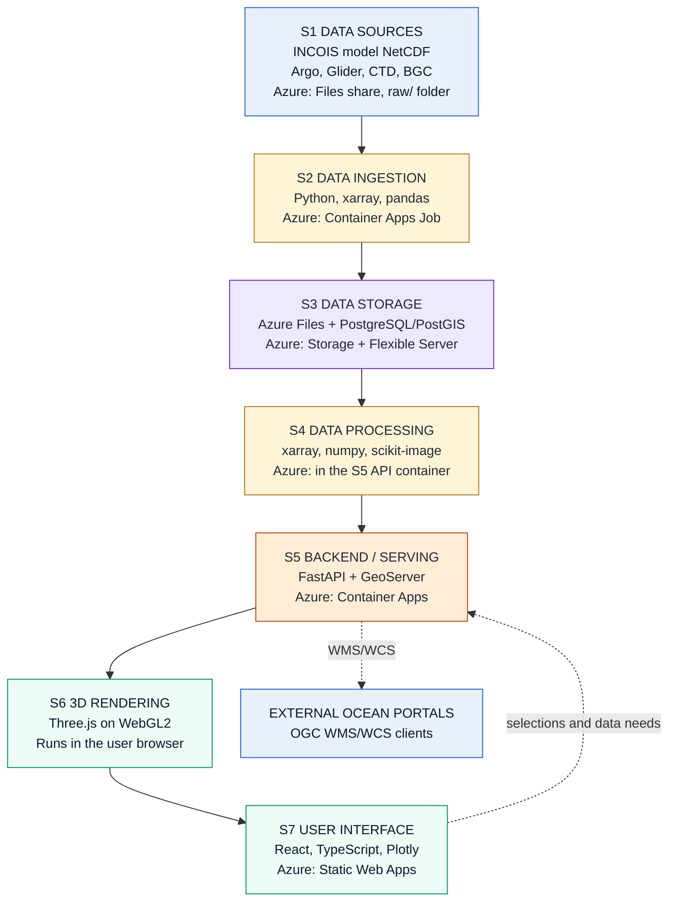
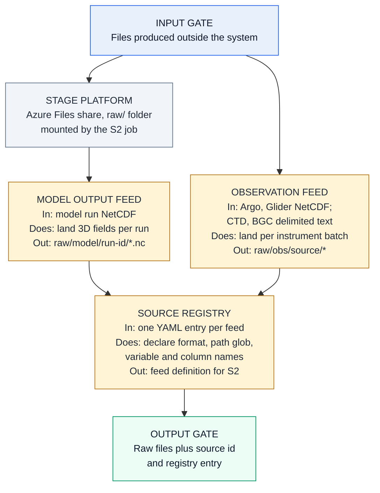
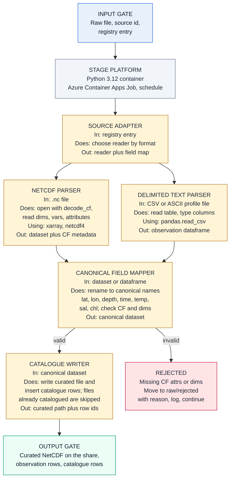
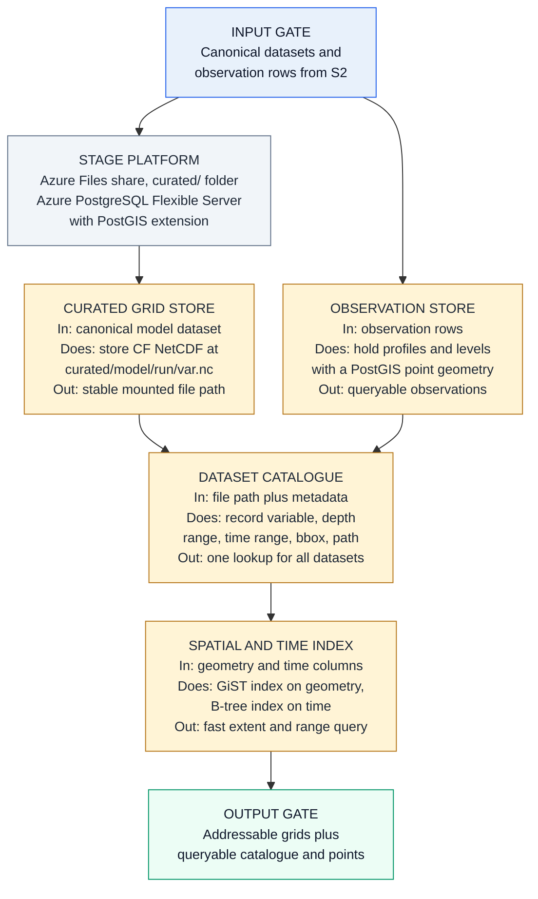
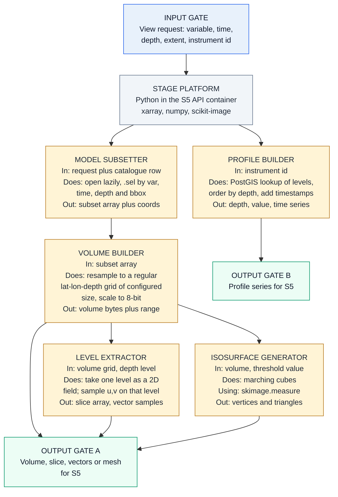
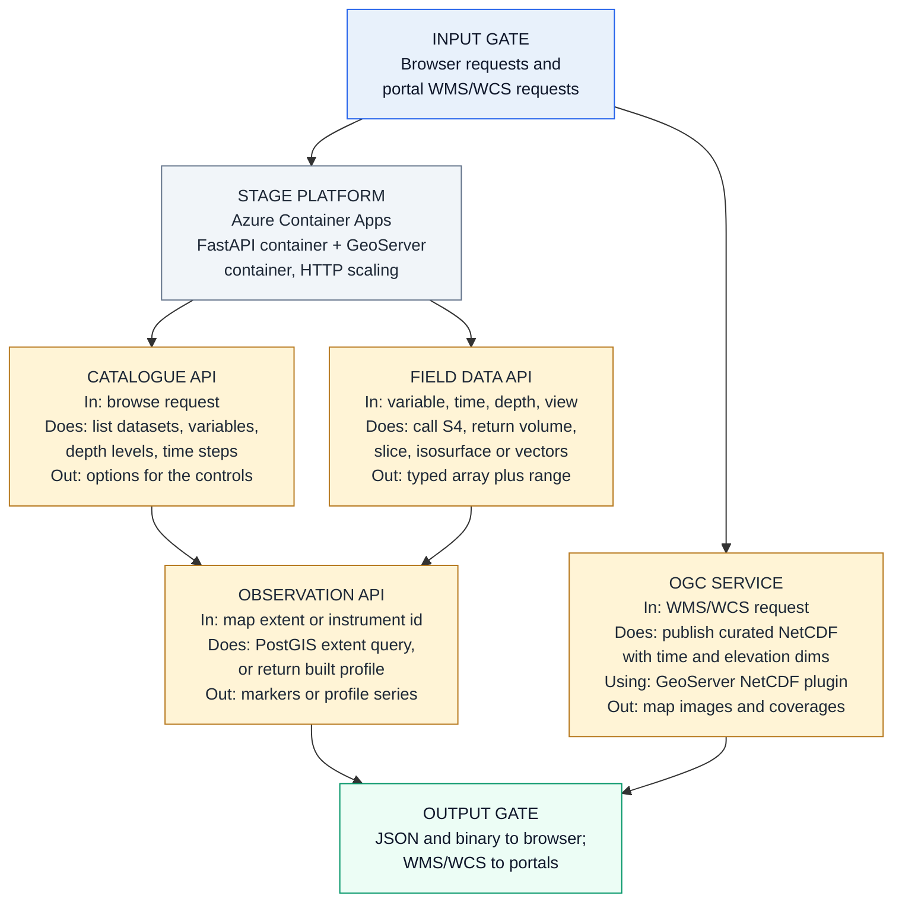
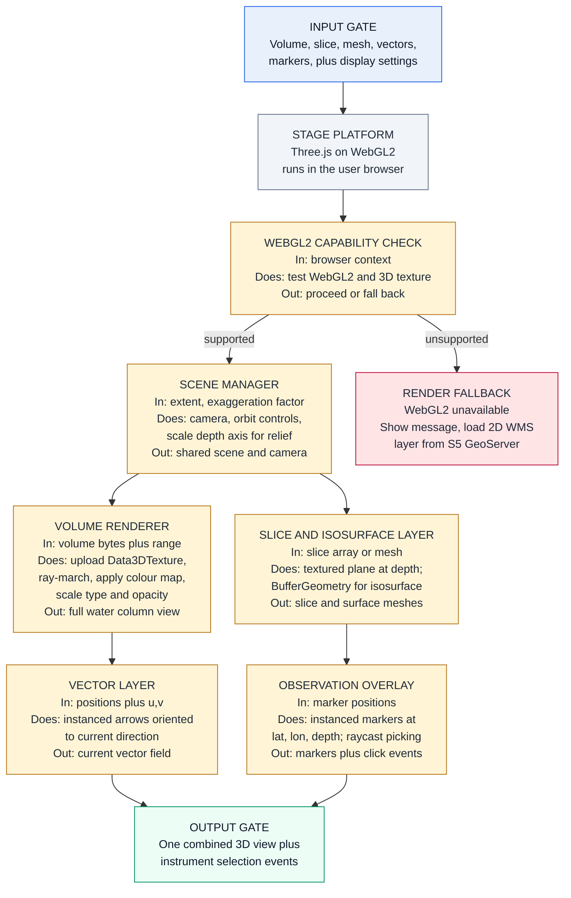
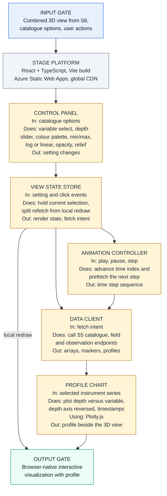

## Low-Level Design and Solution Document

INCOIS 3D Ocean Data Visualization System
Problem Statement ID: 26067
Requirements authority: SRS_Technical_Requirements_Mapping.txt
Architecture authority: HLSA_INCOIS_3D_Ocean_Data_Visualization_System.md
Purpose: define the actual solution modules inside each pipeline stage, how each module works, which technology implements it, and what it hands to the next stage.
Audience: student development team building the system end to end.

The seven-stage pipeline is fixed by the HLSA and is preserved here. This document adds module-level solution detail and selected technology. It does not change any requirement or stage boundary.

### 1. Overall selected solution

Ingestion and processing are written in Python because xarray decodes CF-compliant NetCDF directly and pandas reads the delimited observation formats. Curated grids live as files on one Azure Files share, mounted into both the API and GeoServer containers, because GeoServer reads NetCDF from a filesystem path and Container Apps can mount only Azure Files. Searchable metadata and observations live in PostgreSQL with PostGIS. FastAPI serves the browser, GeoServer serves OGC clients, and the browser renders with Three.js on WebGL2. Everything runs as containers, so the same images redeploy on INCOIS infrastructure.

### 2. S1 Data Sources

Stage purpose: define exactly which files enter the system and where they land.

Selected stage solution: INCOIS model runs and instrument feeds write files into one Azure Files share under a fixed path convention, so every later stage sees the same ordinary filesystem. Nothing is transformed here. A Source Registry file, held in the code repository, is the one place that declares every known feed, so adding a source later is a configuration change rather than a code change.

### 3. S2 Data Ingestion

Stage purpose: turn raw source files into validated, canonically named datasets and catalogue rows.

Selected stage solution: one Python container runs on a schedule as an Azure Container Apps Job. The Source Adapter reads the registry entry and dispatches to the NetCDF parser or the text parser. xarray opens NetCDF with CF decoding enabled, which resolves time units and packed values automatically. The Field Mapper renames source variables to the canonical set the rest of the system uses. Anything failing the CF and dimension check is moved aside with a reason rather than entering the curated store.

### 4. S3 Data Storage / Management

Stage purpose: keep curated data addressable by variable, depth, time and area.

Selected stage solution: gridded model data stays in its native CF NetCDF form as files on the Azure Files share, because xarray and GeoServer both read that format directly from a mounted path and no conversion or second copy is needed. Point observations go into PostgreSQL, where PostGIS gives a geometry column and a spatial index so marker queries by map extent are fast. The catalogue is the join between the two: it records which variable, depth range, time range and bounding box each curated file covers.

### 5. S4 Data Processing

Stage purpose: produce exactly the array, mesh or series that one requested view needs.

Selected stage solution: processing runs on demand inside the API container rather than as a separate service, which removes a deployment and keeps the request path short. The Model Subsetter is the common front door: it opens the curated file lazily and selects by variable, time, depth and bounding box, so only the requested block is read. The Volume Builder serves the full water column, resampling onto a target grid whose size is a deployment setting rather than the model's native resolution: a native grid across every depth level is far larger than one browser request should carry, and time animation asks for one volume per step. The Level Extractor serves one depth level, returning a scalar field for slices and sampled u,v pairs for current vectors, since both describe the same chosen level. Profiles are point data, so they come from the observation store on their own path.

### 6. S5 Backend / Data Serving

Stage purpose: expose prepared data to the browser and publish standards-based services to external portals.

Selected stage solution: FastAPI gives typed request validation and generated OpenAPI documentation, which matters for a student team because the frontend contract is readable without extra work. Three API modules cover the three things the browser asks for: what exists, field data for a view, and observations. GeoServer runs as a second container with the same share mounted read-only and points its NetCDF data store at the same curated files, so WMS and WCS are served without duplicating data.

### 7. S6 3D Rendering / Visualization

Stage purpose: draw the model field and the instrument markers together in one interactive 3D scene.

Selected stage solution: Three.js on WebGL2 is selected because volumetric rendering needs a real 3D texture, which WebGL2 provides and WebGL1 does not. The volume arrives as a byte array, is uploaded once as a Data3DTexture, and a fragment shader ray-marches it, applying the colour map, range and opacity from the controls. Slice, isosurface, vector and marker layers share the same scene and camera, which is what makes model and observation co-visualization a single view rather than two panels. A capability check runs first so an unsupported browser gets a clear message and a 2D WMS fallback instead of a blank canvas.

### 8. S7 User Interface / Interaction

Stage purpose: give the user the controls, and show the profile chart beside the 3D view.

Selected stage solution: React with TypeScript holds all current selections in one view state store, which is the single source of truth. Controls write to it, and both the renderer and the data client read from it, so a variable change and a colour change follow the same path. The store also decides which change needs new data from S5 and which is a local redraw: palette, scale type, opacity and exaggeration stay in the browser, while variable, depth and time step fetch. Plotly draws the depth-versus-variable profile with a reversed depth axis, and it sits next to the scene so model and observation are compared without leaving the page.

### 9. Cross-cutting solution decisions

| Concern | Where it is solved | How it is solved |
|---|---|---|
| CF Conventions | S2 NetCDF Parser; S5 OGC Service | xarray opens with `decode_cf` enabled, so time units and packed values resolve on read; GeoServer reads the same CF `grid_mapping` attribute for projection |
| OGC WMS/WCS | S5 OGC Service | GeoServer NetCDF data store points at the curated container and publishes time and elevation dimensions as WMS layers and WCS coverages |
| Scalability | S2, S3, S5 | Container Apps Jobs raise parallelism for backlog; Container Apps scales API replicas on HTTP load; share capacity is a provisioning choice rather than a code change. No numeric target is set, because the SRS states none |
| Extensibility | S2 Source Registry | A new float type, sensor, model variable or ML-derived product is added as one registry entry naming its format, path and column map; parsers and canonical names are unchanged |
| Browser and platform independence | S6, S7 | Static Web Apps serves plain HTML, CSS and JavaScript over a global CDN with free SSL; rendering uses the browser's own WebGL2, so nothing is installed on the client |
| Azure deployment and INCOIS portability | All stages | Every server-side part is a container image or a standard service. On INCOIS hardware, FastAPI and GeoServer run as the same containers, the Azure Files share is replaced by any POSIX or NFS mount behind the same path convention, PostgreSQL with PostGIS installs directly, and Static Web Apps is replaced by any static web server |

### 10. Decision record

Each row is a decision that shaped the design, the force behind it, what it costs, and the signal that should make the team reopen it. Status is Accepted for all seven; none is pending.

| Decision | Why | Consequence | Revisit when |
|---|---|---|---|
| D1. Curated grids live on an Azure Files share, not ADLS Gen2 | GeoServer reads NetCDF from a filesystem path, and Container Apps mounts Azure Files but explicitly not Blob Storage. On ADLS Gen2 the OGC requirement could not be served at all | One storage system instead of two, and both containers see ordinary paths. Share capacity becomes a provisioning decision rather than an elastic one | Grid volume outgrows one share, or OGC moves to a host that can mount blob storage |
| D2. Data stays as native CF NetCDF, with no derived or tiled format | xarray and GeoServer both read CF NetCDF directly, so ingestion needs no conversion step and there is a single copy of the truth | No format code to write or keep in sync, but every view is computed from the source file at request time with no precomputed shortcut | Repeated requests for the same variable and time make request-time computation the bottleneck |
| D3. Grids as files, observations in PostgreSQL with PostGIS | Gridded arrays and point observations have opposite access patterns: slice by coordinate versus filter by map extent | Marker queries get a real spatial index and grids are not forced into rows, at the cost of operating two stores | Observation volume needs partitioning, or profiles start being served from files |
| D4. S4 processing runs inside the S5 API container | One fewer deployment for a small team, and a view request stays a single hop | Marching cubes and volume resampling share a process and a scaling signal with light catalogue lookups, so one heavy request affects scaling for everything | Isosurface or volume requests start delaying catalogue and observation responses |
| D5. GeoServer serves OGC rather than WMS/WCS being built into FastAPI | WMS and WCS are large specifications, and GeoServer's NetCDF store already exposes time and elevation dimensions | A second container and its configuration to learn, in exchange for not implementing two OGC specifications | Only a narrow, fixed subset of WMS is ever actually used |
| D6. Three.js on WebGL2 for rendering | Volume rendering needs a 3D texture, which WebGL2 provides through Data3DTexture and WebGL1 does not. The SRS named Three.js among its options without selecting one | Browsers without WebGL2 cannot render the volume, which is why S6 carries a capability check and a 2D WMS fallback | A globe-shaped view matters more than volumetric depth, which is where Cesium.js would be reconsidered |
| D7. A Source Registry entry is the extensibility mechanism | EXT-001 asks for new sources and variables with minimal code change, and a declarative entry per feed leaves parsers and canonical names untouched | Adding a source becomes configuration, but the registry turns into a contract that every later stage depends on | A new sensor needs a reader that no existing parser covers |

### 11. Requirement coverage

| SRS IDs | Stage and module |
|---|---|
| DIR-001 to DIR-003 | S2 NetCDF Parser; S3 Curated Grid Store and Dataset Catalogue |
| DIR-004 to DIR-006 | S2 Source Adapter, Delimited Text Parser, Canonical Field Mapper; S3 Observation Store |
| DIR-007, ING-001, ING-002 | S2 NetCDF Parser and Delimited Text Parser |
| STD-001 | S2 NetCDF Parser, CF decoding on read |
| BDA-001 | S5 Catalogue API, Field Data API, Observation API |
| STD-002, STD-003 | S5 OGC Service on GeoServer |
| MVR-001, MVR-002 | S4 Volume Builder; S6 Volume Renderer |
| MVR-003 | S4 Level Extractor; S6 Slice and Isosurface Layer |
| MVR-004 | S4 Isosurface Generator; S6 Slice and Isosurface Layer |
| MVR-005 | S4 Model Subsetter; S7 Animation Controller |
| MVR-006 | S4 Level Extractor, u and v sampling; S6 Vector Layer |
| IDO-001, IDO-002 | S6 Observation Overlay, instanced markers with raycast picking |
| IDO-003 | S4 Profile Builder; S5 Observation API; S7 Profile Chart |
| UIC-001 to UIC-003 | S7 Control Panel and Animation Controller; S4 Level Extractor; S5 Catalogue API |
| UIC-004 to UIC-006 | S7 Control Panel; S6 Volume Renderer shader uniforms |
| UIC-007 | S7 Control Panel; S6 Scene Manager depth-axis scale |
| MOI-001 to MOI-003 | S6 Scene Manager and Observation Overlay in one scene; S7 Profile Chart beside the view |
| WEB-001, WEB-002 | S6 browser WebGL2; S7 Static Web Apps delivery |
| WEB-003 | All server-side stages containerised; see cross-cutting row on portability |
| WEB-004 | S2 Job parallelism; S3 share capacity; S5 Container Apps replicas |
| EXT-001 to EXT-003 | S2 Source Registry entry per new source, sensor, variable or ML product |

All 39 active SRS IDs are covered. No requirement ID has been invented.

### 12. Practical build order

1. Create the Azure Files share with raw/, curated/ and rejected/ folders, and the PostgreSQL Flexible Server with PostGIS enabled. Land one real model NetCDF and one Argo file by hand.
2. Build the S2 ingestion container: Source Registry, both parsers, Canonical Field Mapper, Catalogue Writer. Run it locally until one model run and one instrument batch appear in the curated store and the catalogue.
3. Build the S5 FastAPI service with the Catalogue API and Observation API only, reading the tables from step 2. Confirm the generated OpenAPI page lists them.
4. Add S4 Model Subsetter and Volume Builder, then expose them through the Field Data API. At this point one variable at one time step can be fetched as a volume.
5. Build the S6 scene: capability check, Scene Manager, Volume Renderer. Getting one volume on screen is the highest-risk step, so do it before any other view.
6. Add the Level Extractor and Isosurface Generator with their S6 layers, then the Observation Overlay with click picking.
7. Build S7 controls, view state store and Plotly profile chart, then deploy: Container Apps Job for S2, Container Apps for S5 and GeoServer, Static Web Apps for S7.

### 13. Technology basis

Official documentation used to validate the selected technologies.

- xarray, NetCDF reading with CF decoding, lazy loading and coordinate selection: https://docs.xarray.dev/en/stable/user-guide/io.html
- three.js Data3DTexture, 3D textures for volume rendering: https://threejs.org/docs/#api/en/textures/Data3DTexture
- GeoServer NetCDF data store, time and elevation dimensions, CF grid mapping: https://docs.geoserver.org/stable/en/user/extensions/netcdf/netcdf.html
- GeoServer NetCDF output format for WCS 2.0.1 coverages: https://docs.geoserver.org/stable/en/user/extensions/netcdf-out/index.html
- FastAPI features, Pydantic validation and generated OpenAPI docs: https://fastapi.tiangolo.com/features/
- Azure Container Apps Jobs, manual, schedule and event triggers for finite tasks: https://learn.microsoft.com/en-us/azure/container-apps/jobs
- Azure Static Web Apps, React hosting, global distribution, free SSL and custom domains: https://learn.microsoft.com/en-us/azure/static-web-apps/overview
- Azure Container Apps storage mounts, which support Azure Files but explicitly not Blob Storage, and therefore decide where curated NetCDF must live: https://learn.microsoft.com/en-us/azure/container-apps/storage-mounts
- PostGIS availability on Azure Database for PostgreSQL flexible server: https://learn.microsoft.com/en-us/azure/postgresql/extensions/concepts-extensions-versions
