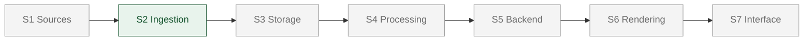

# Where the project stands

One page. If it disagrees with anything else in the repository, trust the
code and fix this.

Last updated: 19 September 2026, commit `a75495d`.

---

## The seven stages



| Stage | State | Where |
|---|---|---|
| S1 Sources | External. Not ours to build. | — |
| **S2 Ingestion** | **Built and tested.** | `ingestion/` |
| S3 Storage | **Not started.** S2 hands off to a development sink. | — |
| S4 Processing | Not started | — |
| S5 Backend | Not started | — |
| S6 Rendering | Not started | — |
| S7 Interface | Not started. S2 has its own operator UI; that is not S7. | — |

---

## What actually runs today

```bash
.venv/bin/python -m uvicorn ingestion.web:app --port 8000
```

A four-step import workflow — source, dataset, variables, review — against
INCOIS ERDDAP. It discovers the server's published catalogue (15 gridded
datasets), subsets server-side, decodes, classifies the dataset's shape,
validates it against nine convention checks, and hands a `CanonicalPackage`
across `StoragePort`.

**Where that package goes:** a development sink that writes it to disk for
inspection. Nothing reads it. Every import currently evaporates. This is the
single largest gap.

---

## Requirement coverage

Honest as of this commit. 39 requirement IDs exist in the SRS; these are the
ones S2 touches.

| Requirement | State | Why |
|---|---|---|
| DIR-001, 002, 003 | **Covered** | Gridded model fields with depth, grid and time, from ERDDAP |
| DIR-004 Argo / Glider observations | **NOT covered** | See below |
| DIR-005 Argo, Glider, CTD, BGC | **NOT covered** | See below |
| DIR-006 observation attributes | **NOT covered** | See below |
| DIR-007 NetCDF *and* delimited text | **Half covered** | NetCDF yes, text no |
| ING-001 NetCDF parsing | **Covered** | `adapters/erddap.py` + xarray |
| ING-002 delimited-text parsing | **NOT covered** | See below |
| STD-001 CF conventions | **Covered** | `conventions.py`, nine checks |
| EXT-001 new sources with minimal change | **Covered** | Adapter + one registry line; proven in `tests/test_ports.py` |

### The observation gap

The only live source is INCOIS ERDDAP, and the adapter retrieves through
**griddap** — gridded model data only. The local file adapters that read
Argo, Glider, CTD and BGC observations are archived in
`archive/local-sources/`.

So the project currently has **no route to observation data of any kind**.
That is five requirements, not one.

Closing it means one of:

1. Restore the local adapters (`archive/local-sources/README.md` has the steps).
2. Write a **tabledap** adapter — ERDDAP serves observations that way, and it
   reuses most of the existing ERDDAP code.
3. Write the OPeNDAP/THREDDS adapter the technical investigation asks for.

---

## Which document governs what

| Document | Authority | State |
|---|---|---|
| `docs/project/SRS_Technical_Requirements_Mapping.txt` | **Requirements. Locked.** | Authoritative |
| `docs/architecture/HLSA_*.md` | Stage pipeline and ownership. Locked. | Authoritative |
| `docs/architecture/LLD_*.md` | Technology selection | **Marked INCOMPLETE by its own header** |
| `docs/history/*Technical_Investigation.md` | Research: repo shortlist, algorithms, topology | Reference, not binding |
| `ingestion/README.md` | **What S2 actually is** | Current |
| `ingestion/docs/conflicts-with-earlier-documents.md` | Where code departs from the documents, and why | Current — **9 entries** |
| `ingestion/docs/S2_implementation_plan.md` | First design attempt | **Superseded.** Do not follow |
| `AGENTS.md` | Shared rules for anyone working here | Current |

**The rule when they disagree:** current instruction beats document. Record
the divergence in `conflicts-with-earlier-documents.md`; do not edit the
locked documents to match the code.

---

## Where things live

```
docs/            SRS, HLSA, LLD, investigation, this page
ingestion/       S2 — the only built stage
  domain/        ImportSelection, CanonicalPackage, ValidationResult, ImportJob
  ports.py       SourcePort, StoragePort — the two boundaries
  service.py     the workflow; no source-specific logic
  adapters/      erddap.py, and the table that resolves a source id
  canonical.py   coordinate roles, geometry classification
  conventions.py the nine checks
  storage/       development sink (NOT storage)
  web.py static/ HTTP layer and the operator UI
  tests/         61 tests, none needing a network
archive/         local file adapters, set aside with restoration notes
data/raw/        sample data, committed
data/acquired/   downloads, gitignored
```

---

## Known limits

- **S3 does not exist.** The handoff is proven architecturally, not as real
  persistence.
- **Single instance only.** The job store is in memory; a second replica
  would 404 status polls.
- **Imports run synchronously.** The lifecycle model supports background
  execution; nothing uses it yet, so the progress view cannot show live
  stages.
- **No authentication.** Intended to be solved by platform auth at deploy,
  not by code here.
- **Not deployed.** Local only.

---

## Next

1. **S3, thin.** Object store plus catalogue. Unblocks everything downstream
   and stops imports evaporating.
2. **Decide the observation gap** — tabledap, OPeNDAP, or restore the local
   adapters.
3. Deploy, with platform auth on.
