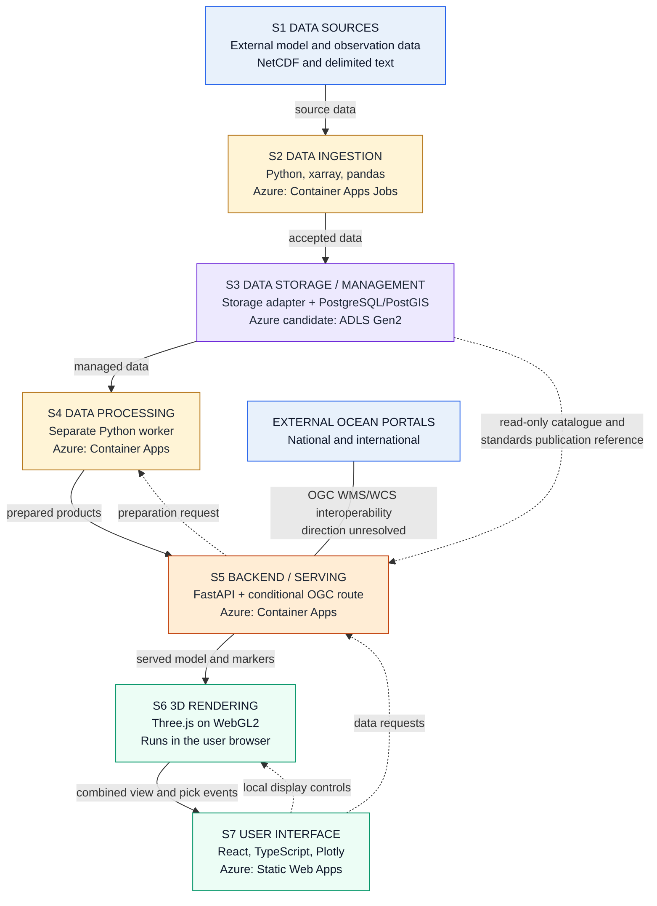
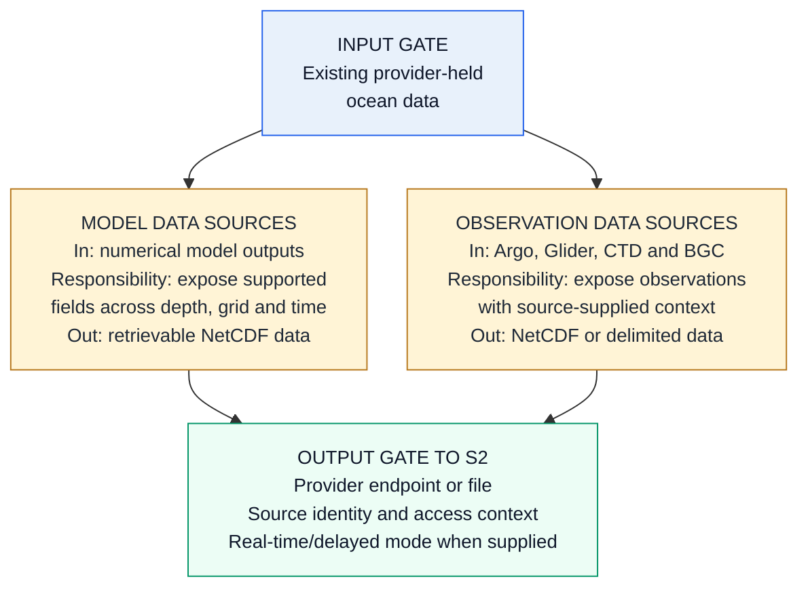
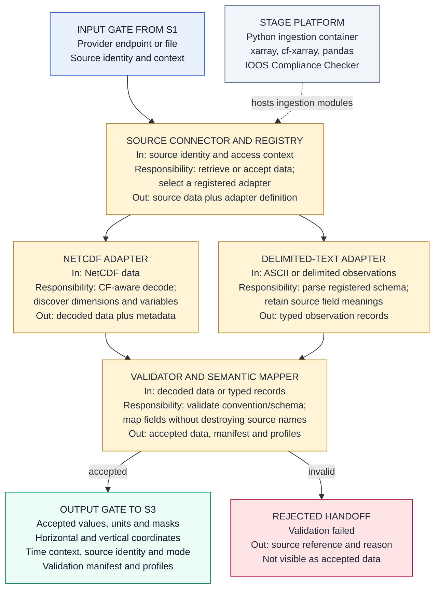
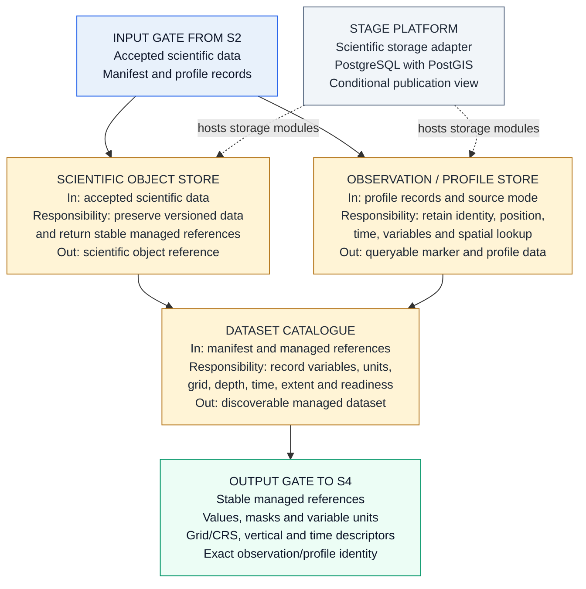
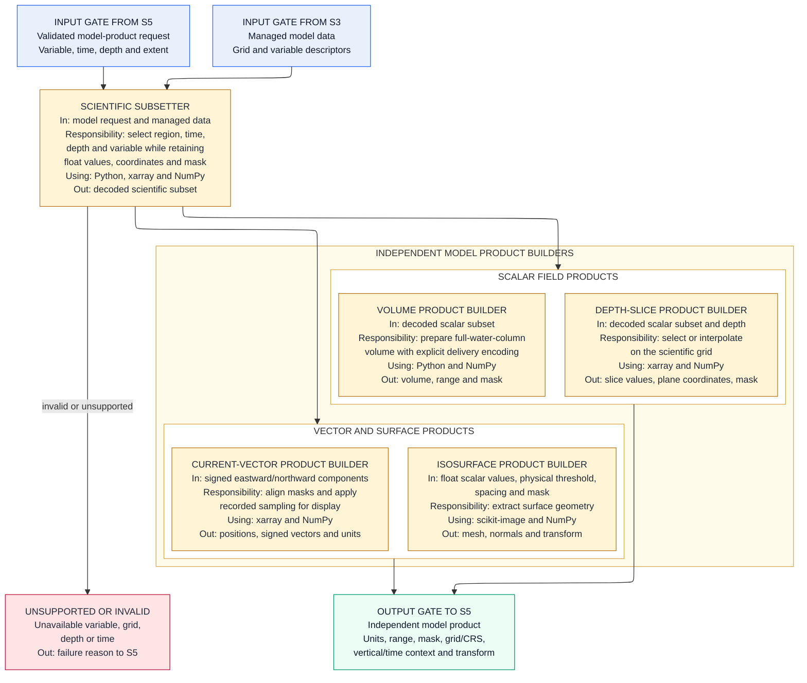
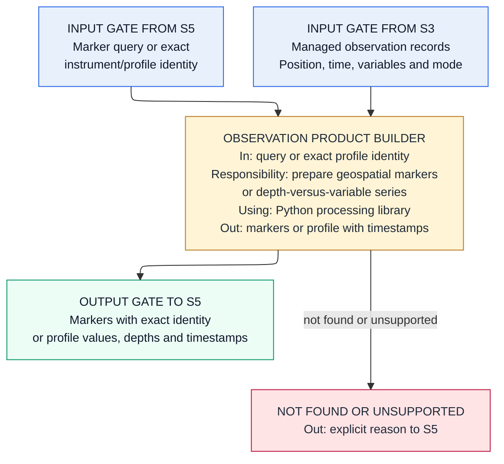
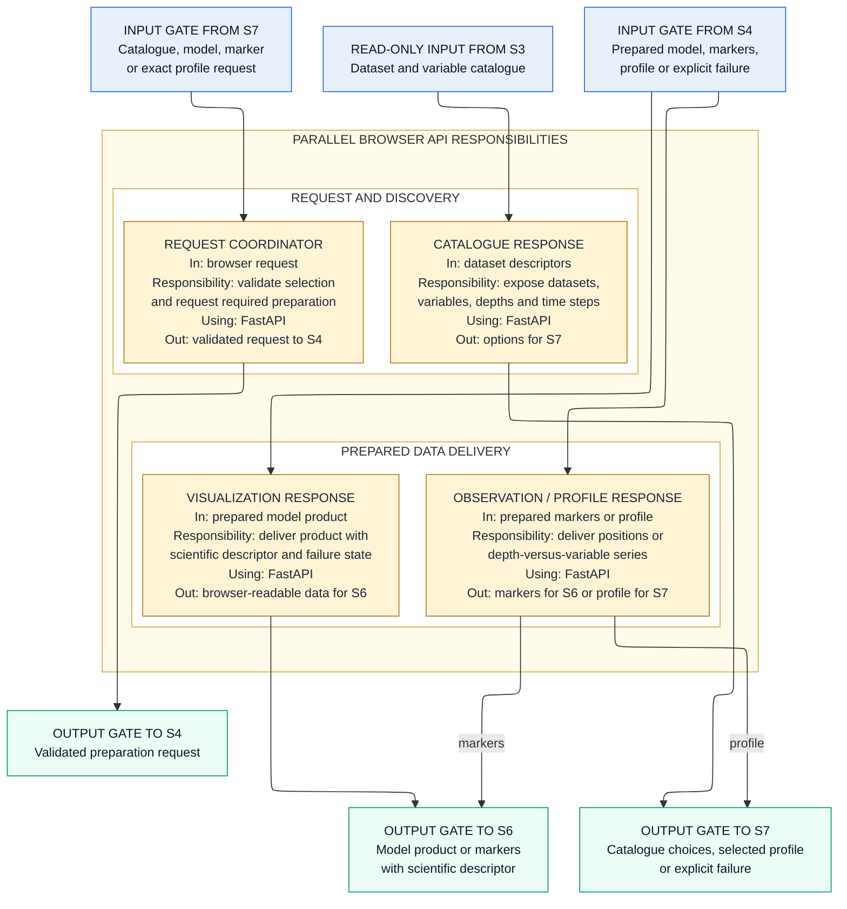
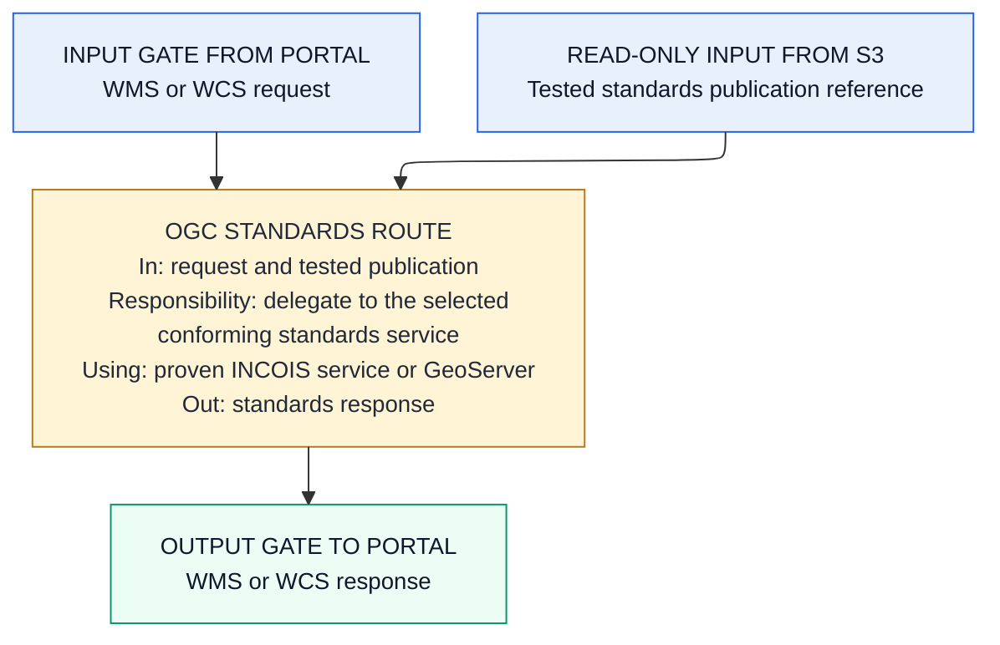
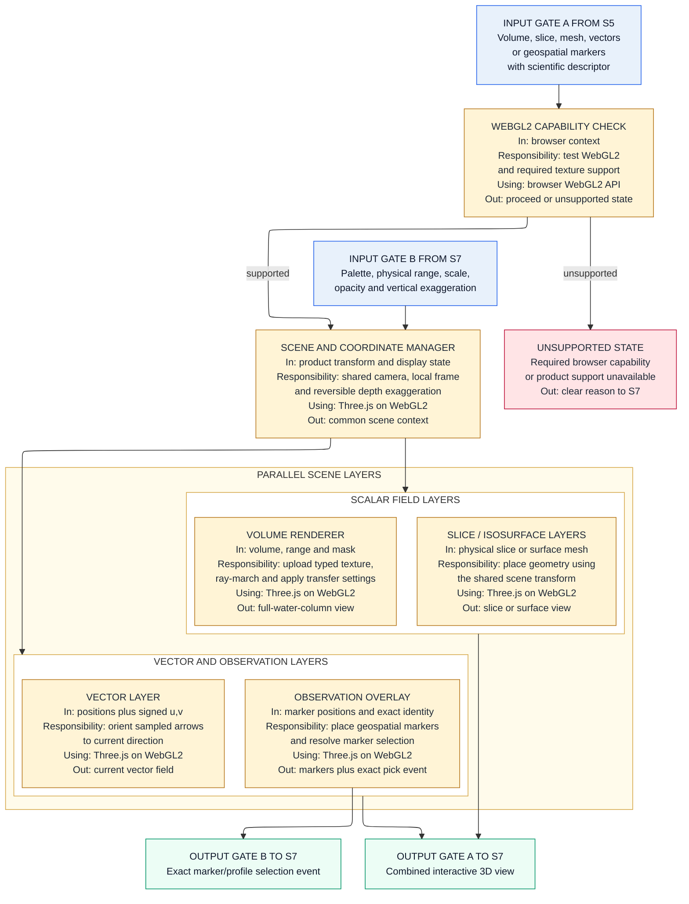
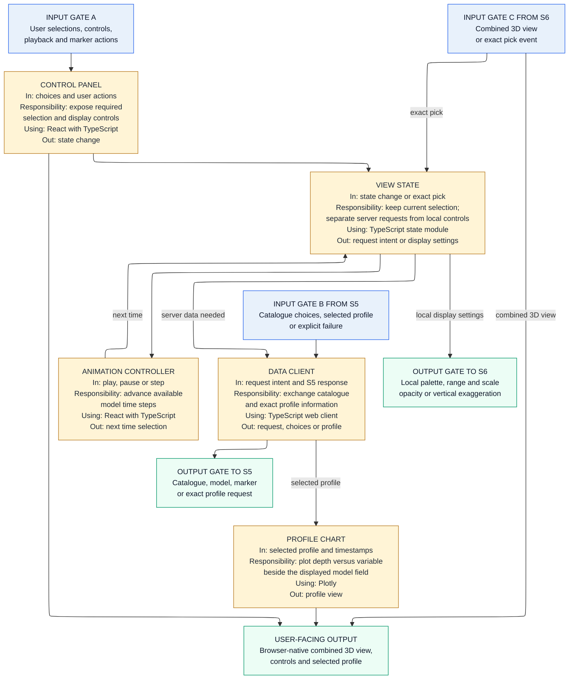

## Low-Level Design and Solution Document

INCOIS 3D Ocean Data Visualization System
Problem Statement ID: 26067
Requirements authority: SRS_Technical_Requirements_Mapping.txt
Architecture authority: HLSA_INCOIS_3D_Ocean_Data_Visualization_System.md
Purpose: define the actual solution modules inside each pipeline stage, how each module works, which technology implements it, and what it hands to the next stage.
Audience: student development team building the system end to end.
Status: INCOMPLETE — under active revision. Not an approved basis for implementation.

The seven-stage pipeline is fixed by the HLSA and is preserved here. This document adds module-level solution detail and selected technology. It does not change any requirement or stage boundary.

### 1. Overall selected solution

Ingestion and processing use Python, xarray and pandas. NetCDF interpretation uses CF-aware decoding and a separate conformance check. Managed scientific data is accessed through a storage adapter, while searchable catalogue and profile information uses PostgreSQL with PostGIS. Expensive visualization preparation runs in a separate Python worker so FastAPI remains a lightweight data-serving boundary. The standards route will reuse an existing INCOIS service or GeoServer only after the selected NetCDF is proven through WMS and WCS requests. The browser uses Three.js on WebGL2 for rendering and React with TypeScript and Plotly for interaction and profiles.

The selected Azure profile uses Container Apps Jobs for finite ingestion runs, separate Container Apps for the processing worker and FastAPI, Static Web Apps for the browser bundle, PostgreSQL Flexible Server with PostGIS, and ADLS Gen2 as the scientific-store candidate. Azure Files is used only if the selected standards server requires a mounted read-only publication view. The final storage backend and standards server remain explicit decision gates until the INCOIS environment and representative dataset are confirmed.

### 2. S1 Data Sources

Stage purpose: identify the external data and source context available to the system.

Selected stage solution: S1 remains outside the system boundary. It supplies retrievable model datasets and observation records through provider endpoints, files or documented uploads. It performs no internal acquisition, transformation or storage. Provider identity, access method and source-supplied time or observation-mode context cross the boundary with the data. Internal connector and registry responsibilities begin in S2.

### 3. S2 Data Ingestion

Stage purpose: acquire or accept supported source data, parse it, validate it and prepare an accepted handoff to S3.

Selected stage solution: a Python ingestion container can run manually, on a schedule or from an approved source trigger. A Source Connector uses the registry to retrieve or accept data and selects a registered NetCDF or delimited-text adapter. xarray decodes packed values, time and coordinates; cf-xarray assists semantic discovery; and an IOOS Compliance Checker run plus project semantic checks validates NetCDF separately from decoding. Delimited text is validated against its registered source schema. The mapper preserves original names while identifying temperature, salinity, chlorophyll, eastward and northward current components, coordinates, units and exact observation/profile identity. S2 performs no durable catalogue or curated-store write itself.

### 4. S3 Data Storage / Management

Stage purpose: own durable scientific data, catalogue visibility and observation/profile records for downstream use.

Selected stage solution: accepted scientific data is held through a deployment-neutral Scientific Object Store interface. PostgreSQL stores dataset, variable and provenance catalogue information; PostGIS supports spatial lookup of instruments and profiles. Native accepted NetCDF remains preserved. For Azure, Blob/ADLS is the scientific-store candidate. A read-only Azure Files publication view is created only if the selected standards server requires mounted files. The final backend remains conditional on INCOIS infrastructure.

### 5. S4 Data Processing

Stage purpose: prepare an independent, scientifically valid product for the requested model or observation view.

Selected stage solution: S5 validates a visualization or profile request and sends the preparation request to S4. A shared Python processing library reads the managed dataset or profile information from S3. Bounded metadata and profile preparation may execute synchronously, while expensive volume resampling and isosurface work runs in a separate worker process. The Scientific Subsetter preserves decoded floating-point values, signed current components, coordinates, units and the missing-data mask. Volume, slice, vector and isosurface builders are independent branches; none consumes the quantized output of another branch. Regridding occurs only when the selected source grid requires a tested transformation.

#### Model product preparation

#### Observation and profile preparation

### 6. S5 Backend / Data Serving

Stage purpose: expose prepared data to the browser and publish standards-based services to external portals.

Selected stage solution: FastAPI validates browser requests and coordinates preparation through S4. It returns catalogue choices and selected profiles to S7, while model products and geospatial markers go to S6. S5 reads S3 only for catalogue metadata and the standards publication reference; browser visualization products still pass through S4. These are parallel serving responsibilities, not a processing sequence. The OGC route is separate from the browser API. Existing INCOIS THREDDS and GeoServer remain candidates until one is proven to serve the representative NetCDF correctly through both WMS and WCS; the LLD does not implement those standards itself.

#### Browser request and serving path

#### Portal standards path

### 7. S6 3D Rendering / Visualization

Stage purpose: draw the model field and the instrument markers together in one interactive 3D scene.

Selected stage solution: Three.js on WebGL2 is selected for the first rectilinear-grid prototype. A capability check verifies the required browser support before rendering. The Scene Manager converts every product and marker through one documented local coordinate transform, retains physical units and applies vertical exaggeration only as a reversible display transform. Volume, slice, isosurface, vector and observation layers are parallel scene layers. The volume payload may use a tested typed encoding with an explicit mask; it is not assumed to be 8-bit. An unsupported browser or product receives a clear unsupported state rather than a blank canvas.

### 8. S7 User Interface / Interaction

Stage purpose: give the user the controls, and show the profile chart beside the 3D view.

Selected stage solution: React with TypeScript holds the current user selection and display state. Changes to dataset, variable, depth or time create a data request to S5. Palette, value range, linear or logarithmic scale, opacity and vertical exaggeration are sent directly to S6 as local display controls. A pick event from S6 carries the exact instrument/profile identity; S7 requests that profile from S5 and Plotly displays depth versus the selected variable with timestamps beside the 3D scene.

### 9. Cross-cutting solution decisions

| Concern | Where it is solved | How it is solved |
|---|---|---|
| CF Conventions | S2 NetCDF Adapter and Validator | xarray performs CF-aware decoding; cf-xarray assists semantic discovery; a conformance checker and project checks separately validate required coordinates, units, masks and metadata. CF is not claimed for delimited text. |
| OGC WMS/WCS | S5 conditional standards route | Reuse a conforming INCOIS service where available; otherwise prove GeoServer with the representative NetCDF through both WMS and WCS before selection. |
| Scalability | S2, S3, S4 and S5 | Keep finite ingestion and expensive processing outside the lightweight API, use independently runnable containers, and keep scientific storage behind an adapter. No numeric capacity target is invented. |
| Extensibility | S2 and affected S4 to S7 modules | Known source schemas use registry configuration. A genuinely new format, sensor product or render product uses a registered typed adapter, builder and renderer where needed, without changing unrelated modules. |
| Browser and platform independence | S6 and S7 | Deliver a static HTML, CSS and JavaScript application; execute rendering in a capable browser; show an explicit unsupported state when required WebGL2 capability is absent. |
| Azure deployment and INCOIS portability | Server-side stages and delivery | Package the API, ingestion and processing units as OCI containers, deliver the frontend as static files, and isolate cloud storage behind an adapter. Final storage and hosting are confirmed against INCOIS infrastructure. |

### 10. Decision record

Status distinguishes selected logical design from choices that still require evidence.

| Decision | Status | Reason and boundary |
|---|---|---|
| D1. Access scientific data through a storage adapter; use Blob/ADLS in the Azure profile | Conditional | The logical boundary is fixed. The final backend depends on INCOIS facilities and the selected OGC service. |
| D2. Preserve accepted native NetCDF and build independent delivery products | Accepted logical design | Scientific source values remain recoverable; delivery encoding is tested per product and cannot become the source for another product. |
| D3. Keep scientific arrays in object/file storage and searchable catalogue/profile data in PostgreSQL/PostGIS | Accepted | These data types have different access needs; the storage adapter preserves deployment portability. |
| D4. Run expensive S4 preparation in a worker separate from FastAPI | Accepted | Heavy volume or isosurface work must not consume the lightweight API execution boundary. The job transport is an implementation detail. |
| D5. Reuse an existing conforming INCOIS service or use GeoServer for OGC WMS/WCS | Prototype gate | Select only after both WMS and WCS work with the representative NetCDF. The LLD does not implement either standard. |
| D6. Use Three.js on WebGL2 for the first rectilinear-grid renderer | Conditional | Selection depends on the representative grid and browser capability test; unsupported capability must be shown clearly. |
| D7. Use a registry for known schemas and typed extension modules for new behavior | Accepted | Configuration handles known shapes; a new parser, product or renderer is added only where the extension actually requires it. |

### 11. Requirement coverage

The owner is fixed by the HLSA. Supporting modules implement handoffs without taking ownership from that stage.

| SRS IDs | HLSA owner | Supporting design response |
|---|---|---|
| DIR-001 to DIR-007 | S2 | Source Connector, format adapters, Validator and Semantic Mapper; S3 preserves accepted data and S4 consumes it. |
| ING-001 to ING-002 | S2 | Registered NetCDF and delimited-text adapters perform automated parsing. |
| STD-001 | S2 and cross-cutting | CF-aware decode plus a distinct NetCDF conformance check. |
| BDA-001 | S5 | FastAPI Request Coordinator and parallel catalogue, visualization and observation/profile responses. |
| MVR-001 to MVR-002 | S6 | S4 prepares an independent volume product; S5 serves it; S6 renders the full-water-column view. |
| MVR-003 | S6 | S4 prepares a depth slice and S6 places the slice in the shared scene. |
| MVR-004 | S6 | S4 extracts a mesh from float values and a physical threshold; S6 renders it. |
| MVR-005 | S6 | S7 controls available time steps; S5 obtains each product; S6 replaces the rendered time state. |
| MVR-006 | S6 | S4 retains signed current components and S6 renders vectors alongside supported scalar fields. |
| IDO-001 | S6 | S3 retains observation position and identity; S4 prepares markers; S6 places them through the common transform. |
| IDO-002 to IDO-003 | S7 | S6 returns an exact pick identity; S7 requests and displays the matching Plotly profile with timestamps. |
| UIC-001 to UIC-007 | S7 | Control Panel and View State own the controls; S5 supplies requested data and S6 applies local display settings. |
| MOI-001 | S6 | Model and observation layers share one scene and coordinate transform. |
| MOI-002 to MOI-003 | S7 | The combined scene and selected profile are presented on the same browser page. |
| WEB-001 to WEB-002 | S7 and cross-cutting | Static browser application with no client installation; S6 performs browser-native rendering. |
| WEB-003 to WEB-004 | Cross-cutting | OCI containers, static frontend, storage adapter and separate scalable execution boundaries; no unsupported capacity target. |
| EXT-001 | S2 ingestion aspect and cross-cutting | Registry configuration handles known sources and variables; typed adapters handle genuinely new formats. |
| EXT-002 to EXT-003 | Cross-cutting | Registered adapters, product builders and renderer modules extend only the affected stages. |
| STD-002 to STD-003 | Cross-cutting, served through S5 | A tested conforming service provides WMS/WCS interoperability; service and direction remain evidence-based decisions. |

All 39 active SRS IDs are covered. No requirement ID has been invented.

### 12. Architecture validation order

1. Prove S2 acceptance and rejection with the representative HYCOM model files and genuine Argo, Glider, CTD and BGC fixtures, including real-time and delayed-mode context where supplied.
2. Prove that S3 preserves scientific values and exact profile identity and returns stable managed references without moving ingestion ownership into storage.
3. Prove each S4 product independently from decoded floating-point data, including signed currents, masks, units, coordinates, time and transform metadata.
4. Prove the S7 to S5 to S4 to S5 response loop, then prove both WMS and WCS before selecting the standards service.
5. Prove that S6 aligns model fields and markers in one transform and that every S7 control or exact marker pick reaches the correct destination.
6. Recheck all 39 SRS IDs against observable evidence from the complete browser workflow.

### 13. Technology basis

Official documentation used to validate the selected technologies.

- xarray, NetCDF reading with CF decoding, lazy loading and coordinate selection: https://docs.xarray.dev/en/stable/user-guide/io.html
- cf-xarray, interpretation of CF metadata and coordinate semantics: https://cf-xarray.readthedocs.io/en/latest/
- IOOS Compliance Checker, automated checks for CF and related conventions: https://ioos.github.io/compliance-checker/
- three.js Data3DTexture, 3D textures for volume rendering: https://threejs.org/docs/pages/Data3DTexture.html
- GeoServer NetCDF data store, time and elevation dimensions, CF grid mapping: https://docs.geoserver.org/main/en/user/extensions/netcdf/netcdf/
- GeoServer NetCDF output format for WCS 2.0.1 coverages: https://docs.geoserver.org/main/en/user/extensions/netcdf-out/index.html
- FastAPI features, Pydantic validation and generated OpenAPI docs: https://fastapi.tiangolo.com/features/
- Azure Container Apps Jobs, manual, schedule and event triggers for finite tasks: https://learn.microsoft.com/en-us/azure/container-apps/jobs
- Azure Static Web Apps, React hosting, global distribution, free SSL and custom domains: https://learn.microsoft.com/en-us/azure/static-web-apps/overview
- Azure Data Lake Storage Gen2 and Blob multi-protocol access for the Azure scientific-store candidate: https://learn.microsoft.com/en-us/azure/storage/blobs/data-lake-storage-multi-protocol-access
- Azure Container Apps storage mounts, used only if a selected standards service needs a mounted publication view: https://learn.microsoft.com/en-us/azure/container-apps/storage-mounts
- PostGIS availability on Azure Database for PostgreSQL flexible server: https://learn.microsoft.com/en-us/azure/postgresql/extensions/concepts-extensions-versions
