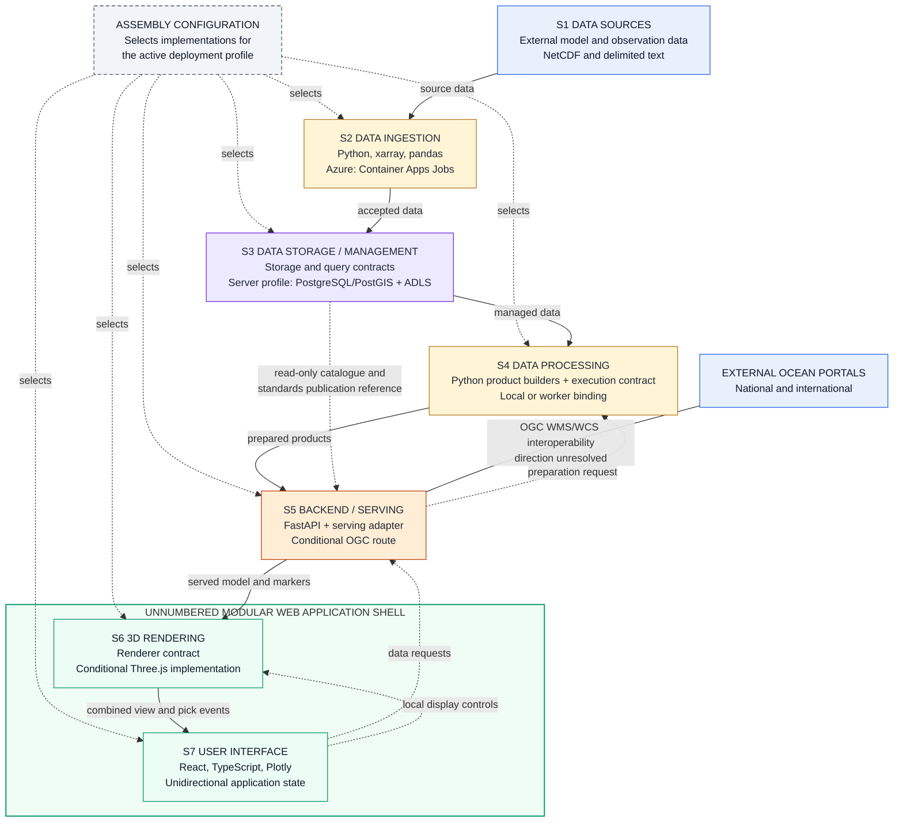
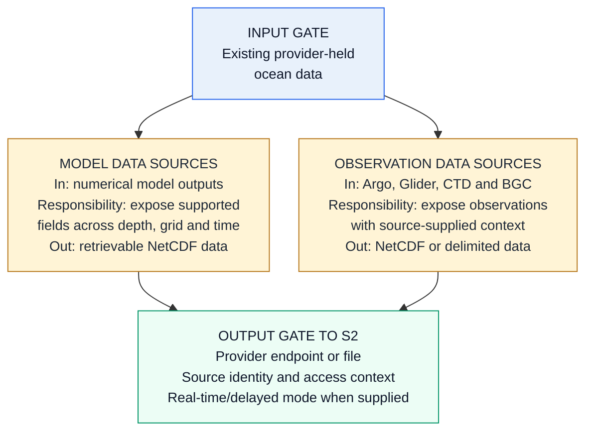
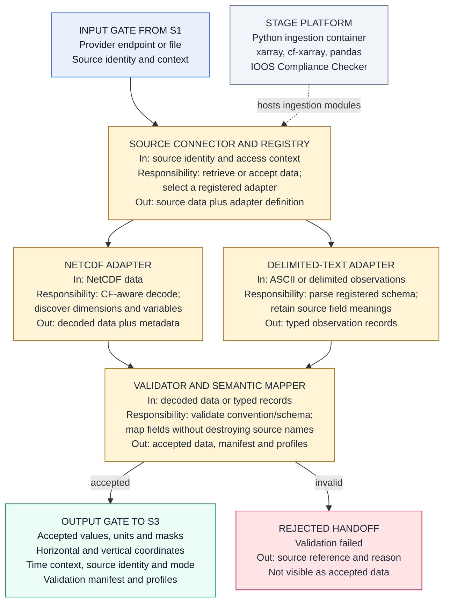
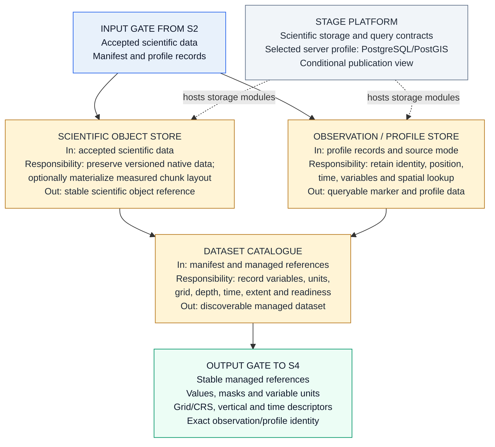
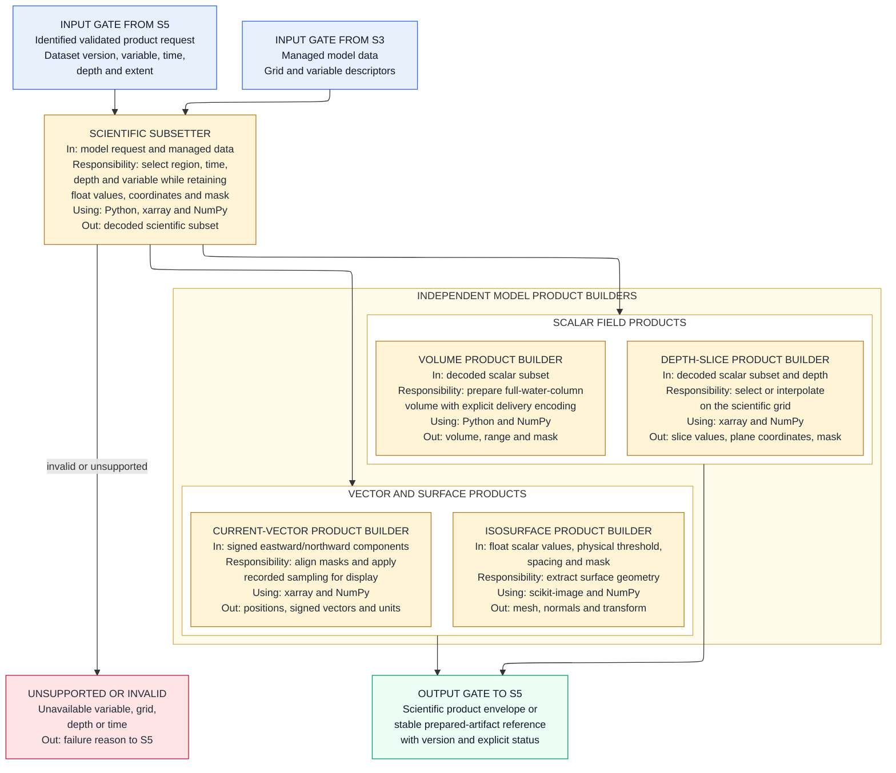
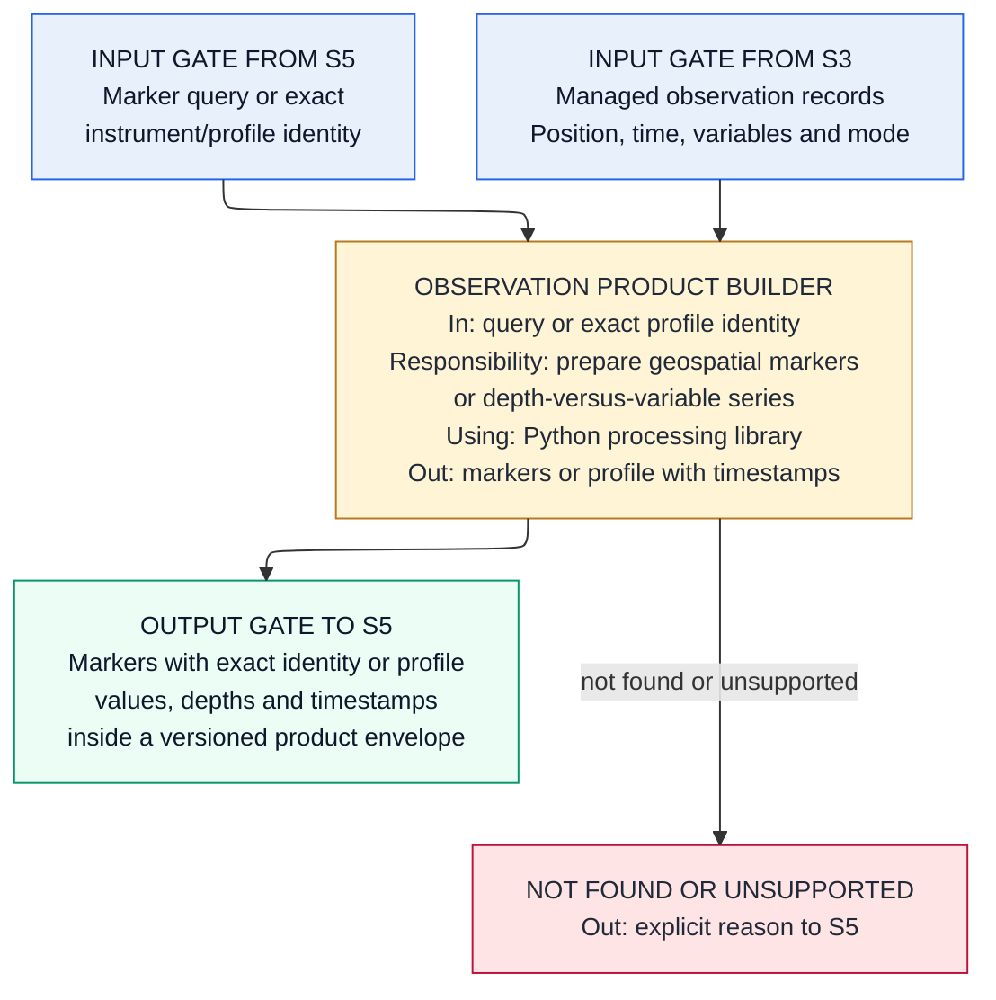
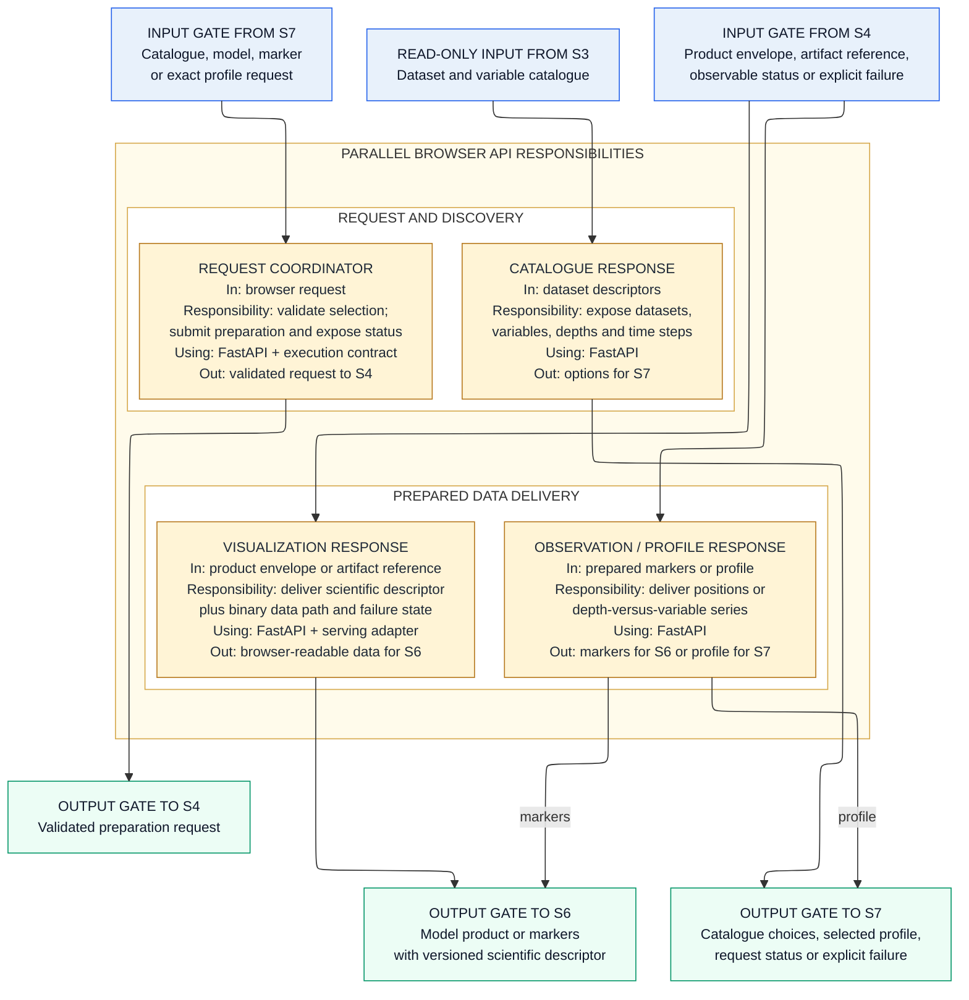
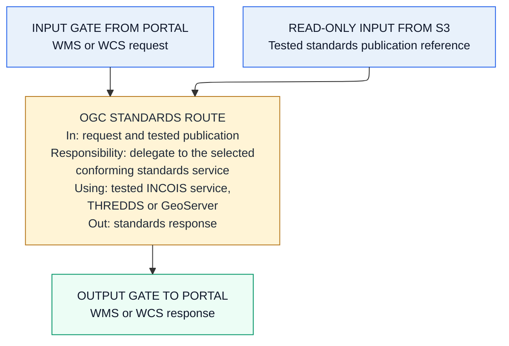
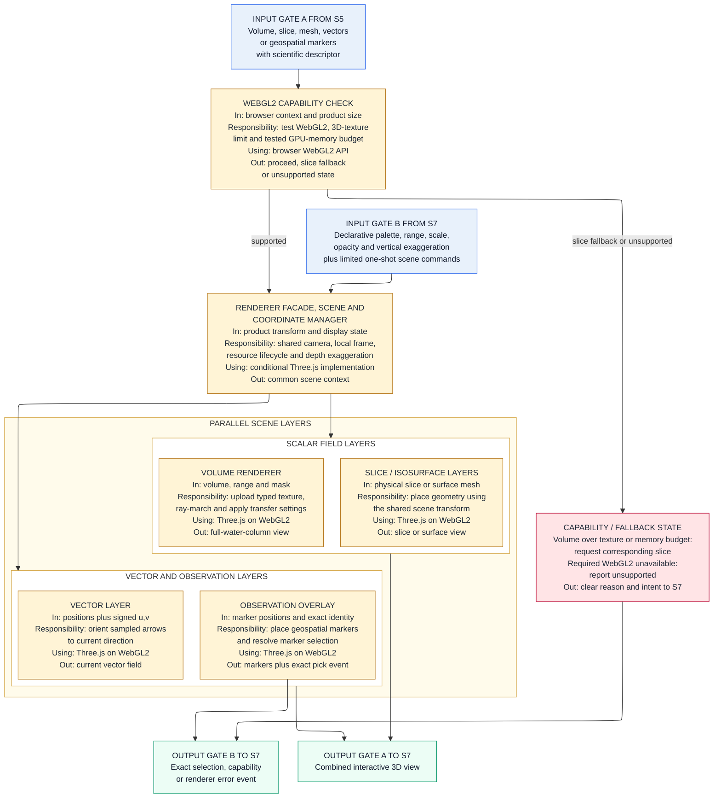
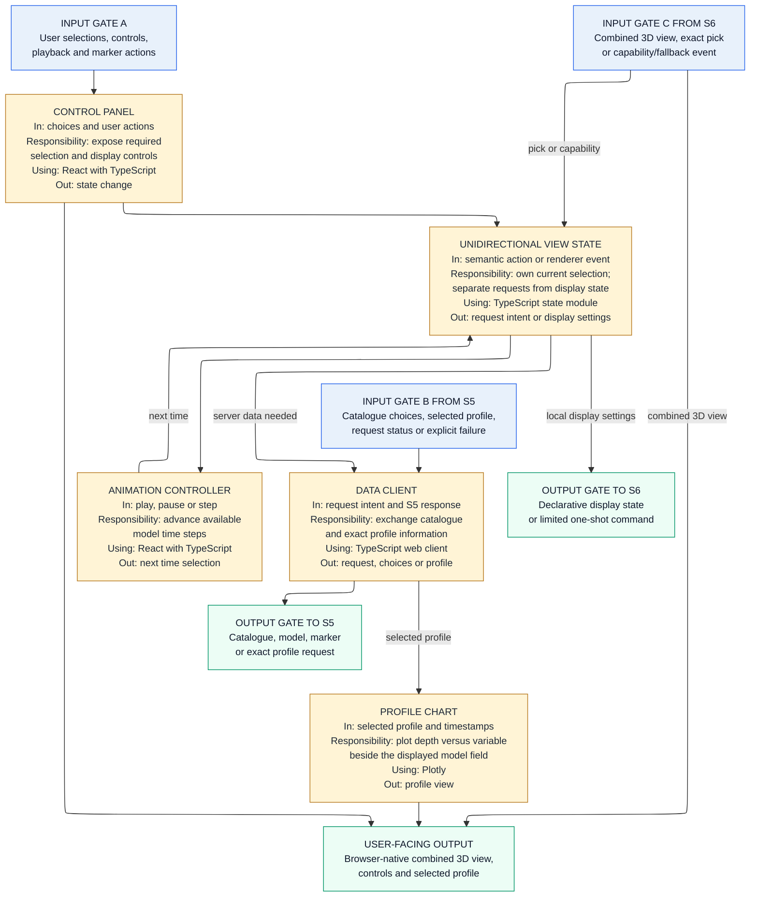

## Low-Level Design and Solution Document

INCOIS 3D Ocean Data Visualization System
Problem Statement ID: 26067
Requirements authority: SRS_Technical_Requirements_Mapping.txt
Architecture authority: HLSA_INCOIS_3D_Ocean_Data_Visualization_System.md
Purpose: define the actual solution modules inside each pipeline stage, how each module works, which technology implements it, and what it hands to the next stage.
Audience: student development team building the system end to end.
Status: INCOMPLETE — under active revision. Not an approved basis for implementation.

The seven-stage pipeline is fixed by the HLSA and is preserved here. This document adds module-level solution detail and selected technology. It does not change any requirement or stage boundary.

### 1. Overall selected solution

Each internal stage is a logical responsibility behind a stable boundary contract. One composition point reads deployment configuration and selects the source adapters, storage implementation, processing executor, service entry and delivery adapters, browser data client, UI feature assembly and renderer implementation. Stage logic depends on those contracts rather than provider SDKs, store paths, queue messages, HTTP framework objects or renderer objects. A local deployment may bind the contracts in one process or on one machine; a server deployment may bind the same contracts across containers and managed services without changing the scientific or interaction behavior.

Ingestion and processing use Python, xarray and pandas. NetCDF interpretation uses CF-aware decoding and a separate conformance check. Project-generated normalized NetCDF targets the released CF-1.13 convention and is labelled as such only after matching conformance validation; accepted source data retains its declared convention and is not relabelled. Managed scientific data is accessed through storage and query contracts, while the selected server profile uses PostgreSQL with PostGIS for searchable catalogue and profile information. Expensive visualization preparation can run through a separate Python worker executor so FastAPI remains a lightweight data-serving boundary. The standards route prefers an existing conforming INCOIS service; otherwise THREDDS and GeoServer remain comparison candidates until the representative NetCDF is proven through both WMS and WCS requests. The browser uses a renderer-facing contract whose first conditional implementation is Three.js on WebGL2; vtk.js is a focused comparison path if scientific volume rendering becomes the dominant implementation risk. React with TypeScript and Plotly provide the application shell, interaction and profiles.

The selected Azure profile uses Container Apps Jobs for finite ingestion runs, separate Container Apps for the processing worker and FastAPI, Static Web Apps for the browser bundle, PostgreSQL Flexible Server with PostGIS, and ADLS Gen2 as the scientific-store candidate. Azure Files is used only if the selected standards server requires a mounted read-only publication view. The final storage backend and standards server remain explicit decision gates until the INCOIS environment and representative dataset are confirmed.

#### 1.1 Replaceable stage contracts

Replaceability means that an implementation can be exchanged only when the replacement preserves the same responsibility, scientific semantics, capabilities and observable contract. It does not mean arbitrary modules can be combined without compatibility checks. Each replacement must declare its capabilities and pass the same contract tests as the implementation it replaces.

| Boundary | Stable meaning | Implementations that may vary without changing adjacent stage logic |
|---|---|---|
| S1 to S2 | Discover, inspect and retrieve source data with declared subsetting capabilities | ERDDAP, OPeNDAP, registered file or future provider adapters behind the existing source contract |
| S2 to S3 | Transfer one complete validated canonical package and receive a stable storage receipt | Development sink, local durable implementation or server storage implementation behind the existing storage contract |
| S3 to S4 and S5 | Read scientific arrays by managed reference and query catalogue, marker or exact profile information | Local file/object storage or server object storage; selected catalogue/profile implementation behind read/query contracts |
| S5 to S4 and back | Submit one validated preparation request and receive a product, status or explicit failure | In-process executor, local worker process or remote worker transport |
| S5 to browser | Deliver catalogue/profile metadata and a scientific product envelope or stable bulk-data reference | Local HTTP delivery, server API streaming or server object delivery selected by the serving adapter |
| S7 to S6 and back | Apply declarative display state and receive exact pick, capability and error events | Conditional Three.js renderer first; another renderer only through the same renderer-facing contract |
| S5 and S6 to S7 | Convert catalogue, profile, status and renderer events into semantic UI state and actions | Selected React/Plotly shell first; another UI implementation only if it preserves the same service and renderer contracts |

Only the composition point may select concrete implementations. Core workflow modules do not branch on cloud provider, deployment profile, storage product, worker transport or rendering engine. An in-process binding may pass native objects for efficiency; a cross-process binding may serialize or stream them, but both must preserve the same semantic contract. Bulk scientific bytes travel through a data path, while requests, descriptors, status and failures travel through a control path.

#### 1.2 Deployment profiles

Deployment topology changes where components run, not what a stage owns or what its contract means.

| Profile | Binding of the same logical stages |
|---|---|
| Local development | S2 to S5 may run in one process or as local processes; local implementations satisfy storage, query and execution contracts; the browser uses the same S5 to S7 contracts as a server deployment. |
| Single server | OCI-packaged ingestion, processing and API units may share one host while using durable storage and job implementations selected by configuration. |
| Scale-out server or cloud | S2 ingestion jobs, S4 workers and S5 API instances scale independently; remote object, catalogue and job-transport implementations replace local bindings; the static S6/S7 application remains unchanged. |

The Azure profile is one scale-out binding, not a dependency of the logical design. An INCOIS-hosted profile may choose different infrastructure implementations if they satisfy the same contracts and capability checks.

### 2. S1 Data Sources

Stage purpose: identify the external data and source context available to the system.

Selected stage solution: S1 remains outside the system boundary. It supplies retrievable model datasets and observation records through provider endpoints, files or documented uploads. It performs no internal acquisition, transformation or storage. Provider identity, access method and source-supplied time or observation-mode context cross the boundary with the data. Internal connector and registry responsibilities begin in S2.

### 3. S2 Data Ingestion

Stage purpose: acquire or accept supported source data, parse it, validate it and prepare an accepted handoff to S3.

Selected stage solution: a Python ingestion container can run manually, on a schedule or from an approved source trigger. A Source Connector uses a configuration-assembled registry to retrieve or accept data and selects a registered NetCDF or delimited-text adapter through the common source contract. Provider clients and protocol details remain inside their adapter; the application service contains no provider conditionals. xarray decodes packed values, time and coordinates; cf-xarray assists semantic discovery; and an IOOS Compliance Checker run plus project semantic checks validates NetCDF separately from decoding. Delimited text is validated against its registered source schema. The mapper preserves original names while identifying temperature, salinity, chlorophyll, eastward and northward current components, coordinates, units and exact observation/profile identity. Incoming data retains its own declared convention. If the system emits a normalized NetCDF publication product, that product targets CF-1.13 and must pass the matching conformance profile before carrying `CF-1.13` in its `Conventions` attribute. S2 performs no durable catalogue or curated-store write itself and hands the accepted package only through the storage contract.

### 4. S3 Data Storage / Management

Stage purpose: own durable scientific data, catalogue visibility and observation/profile records for downstream use.

Selected stage solution: accepted scientific data is held through deployment-neutral scientific-storage and query contracts. Native accepted NetCDF remains preserved. A storage implementation may additionally materialize a chunked multidimensional representation for repeated subset, processing and visualization access. Zarr v2 is the first visualization-derivative candidate because it provides chunked multidimensional storage with an OGC Community Standard. Zarr v3 with its sharding codec is a secondary comparison candidate if measured small-chunk object counts or request overhead make sharding relevant. Neither Zarr version, sharding nor any chunk shape is selected until representative regional, depth, time and volume workloads are measured. Chunk layout, object paths and provider APIs do not escape S3. Searchable catalogue and observation/profile records remain logically distinct from dense model arrays; the selected server profile uses PostgreSQL for dataset, variable and provenance information and PostGIS for spatial lookup. For Azure, Blob/ADLS is the scientific-store candidate. A read-only Azure Files publication view is created only if the selected standards server requires mounted files. The final backend, chunking policy and publication view remain conditional on INCOIS infrastructure and measured access patterns.

### 5. S4 Data Processing

Stage purpose: prepare an independent, scientifically valid product for the requested model or observation view.

Selected stage solution: S5 validates a visualization or profile request and sends the same preparation contract to an execution adapter. A local binding may call the shared Python processing library in-process; a worker binding may carry the request to a separate process or server worker. Execution location and job transport do not change the product semantics. Bounded metadata and profile preparation may execute synchronously, while expensive volume resampling and isosurface work uses the worker binding so the API remains responsive. Each accepted request has an identity, input dataset version, parameters and observable status; an executor reports whether obsolete work can be cancelled or only superseded. Its result is a scientific product envelope, a stable prepared-artifact reference or an explicit failure. The Scientific Subsetter reads S3 through managed references and preserves decoded floating-point values, signed current components, coordinates, units and the missing-data mask. Volume, slice, vector and isosurface builders are independent branches; none consumes the quantized output of another branch. Regridding occurs only when the selected source grid requires a tested transformation.

Every scientific product envelope carries the product kind, dataset and variable identity, dimensions, units, physical range, missing-value mask information, grid or CRS, vertical convention, time identity, coordinate transform, encoding and product version. The renderer consumes this contract and never infers scientific meaning from byte layout alone.

#### Model product preparation

#### Observation and profile preparation

### 6. S5 Backend / Data Serving

Stage purpose: expose prepared data to the browser and publish standards-based services to external portals.

Selected stage solution: a transport-neutral request coordinator owns S5 behavior, with FastAPI as the selected HTTP entry adapter. It validates browser requests and coordinates preparation through the configured S4 execution adapter. Its control path returns catalogue choices, selected profiles, request status and explicit failures. Its data path delivers prepared model products and geospatial markers as a browser-readable scientific product envelope, binary stream or stable bulk-data reference selected by the serving adapter. Large scientific arrays are not converted into renderer-specific objects or forced through JSON. S5 reads S3 only through catalogue/profile query contracts and the standards publication reference; browser visualization products still pass through S4. These are parallel serving responsibilities, not a processing sequence. The OGC route is separate from the browser API. Reuse of an existing conforming INCOIS service is preferred; otherwise THREDDS and GeoServer remain comparison candidates until one is proven to serve the representative NetCDF correctly through both WMS and WCS. The LLD does not implement those standards itself, and the browser visualization API does not use WMS or WCS as its internal volume-delivery protocol.

#### Browser request and serving path

#### Portal standards path

### 7. S6 3D Rendering / Visualization

Stage purpose: draw the model field and the instrument markers together in one interactive 3D scene.

Selected stage solution: S6 exposes a renderer-facing contract to the browser shell; Three.js on WebGL2 is the conditional first implementation for the rectilinear-grid prototype. A small vtk.js comparison prototype is required only if custom Three.js volume ray-casting, slicing or transfer-function work becomes the dominant risk. Zarr-Cesium is a separate prototype candidate only for Zarr-backed geographic depth slices and current-vector layers through the same renderer contract. Its documented cube path renders slice primitives, so it is not evidence for the required full-volume or isosurface paths. The first product does not ship multiple engines. S7 does not import renderer scene, material, texture or buffer objects. It supplies declarative display state and limited one-shot scene commands through the contract. The renderer implementation owns capability checks, scene objects, GPU resource creation and disposal, frame rendering and picking. The Scene and Coordinate Manager converts every product and marker through one documented local coordinate transform, retains physical units and applies vertical exaggeration only as a reversible display transform. Volume, slice, isosurface, vector and observation layers are parallel scene layers. The volume payload may use a tested typed encoding with an explicit mask; it is not assumed to be 8-bit. S6 checks the runtime 3D-texture limit and a tested GPU-memory budget before accepting a volume. If WebGL2 is available but the volume exceeds either limit, S6 emits a slice-fallback capability event; S7 then requests the corresponding S4 slice through S5 and identifies slice mode to the user. If the required rendering capability itself is absent, S6 reports an unsupported state. No capability failure produces a blank canvas. A different rendering engine may replace Three.js only by satisfying the same product, state, command and event contract.

### 8. S7 User Interface / Interaction

Stage purpose: give the user the controls, and show the profile chart beside the 3D view.

Selected stage solution: React with TypeScript is the selected implementation of an unnumbered modular web application shell around S6 and S7. Feature modules dispatch semantic actions into unidirectional application state; reducers or equivalent pure state transitions own the resulting selection and display state, while data-fetching side effects remain in the configured data client. Changes to dataset, variable, depth or time create a data request to S5. A slice-fallback capability event from S6 creates a slice-product request through the same S5 path and a visible slice-mode state; it does not make S7 perform processing or bypass S5. Persistent palette, value range, linear or logarithmic scale, opacity and vertical exaggeration are sent to S6 as declarative display state. One-shot commands are reserved for actions such as camera reset or explicit scene capture and are not used to mirror persistent state. A pick event from S6 carries the exact instrument/profile identity; S7 requests that profile from S5 and Plotly displays depth versus the selected variable with timestamps beside the 3D scene. UI feature modules do not depend directly on FastAPI transport details or the concrete rendering engine. Another UI framework would replace the S7 implementation as a whole rather than leak a second state model into the same shell.

### 9. Cross-cutting solution decisions

| Concern | Where it is solved | How it is solved |
|---|---|---|
| CF Conventions | S2 NetCDF Adapter and Validator | xarray performs CF-aware decoding; cf-xarray assists semantic discovery; a conformance checker and project checks separately validate required coordinates, units, masks and metadata. CF is not claimed for delimited text. |
| OGC WMS/WCS | S5 conditional standards route | Reuse a conforming INCOIS service where available; otherwise prove GeoServer with the representative NetCDF through both WMS and WCS before selection. |
| Scalability | S2, S3, S4 and S5 | Keep finite ingestion and expensive processing outside the lightweight API, allow cheap bounded work through a local executor, scale worker and API bindings independently, and keep scientific storage behind contracts. No numeric capacity target is invented. |
| Extensibility | S2 and affected S3 to S7 modules | Known source schemas use registry configuration. A genuinely new format, storage backend, execution transport, serving path, sensor product or renderer uses the typed extension point at the affected boundary without changing unrelated stages. |
| Stage replaceability | S2 to S7 boundaries | One composition point selects implementations. Stages depend on stable semantic contracts and capability declarations, not concrete providers. Replacements must pass shared contract tests. |
| Scientific product integrity | S4 to S6 | Every prepared product carries identity, dimensions, units, range, mask, grid/CRS, vertical/time context, transform, encoding and version; rendering never infers these from byte layout. |
| Control and bulk-data separation | S4, S5 and S6 | Requests, status, descriptors and failures use the control path; large scientific bytes use a binary stream or stable artifact reference selected by the serving adapter. |
| Browser and platform independence | S6 and S7 | Deliver a static HTML, CSS and JavaScript application; execute rendering in a capable browser; show an explicit unsupported state when required WebGL2 capability is absent. |
| Local-to-server portability | S2 to S7 and composition | Bind the same contracts in-process or locally for development, or across independently scalable server units. Deployment profile changes topology and transport, not stage behavior. |
| Azure deployment and INCOIS portability | Server-side stages and delivery | Treat Azure as one scale-out profile: package API, ingestion and processing units as OCI containers, deliver the frontend as static files, and isolate cloud services behind adapters. Final storage and hosting are confirmed against INCOIS infrastructure. |

### 10. Decision record

Status distinguishes selected logical design from choices that still require evidence.

| Decision | Status | Reason and boundary |
|---|---|---|
| D1. Access scientific data through storage and query contracts; use Blob/ADLS in the Azure profile | Conditional | The logical boundaries are fixed. Final backend and chunk layout depend on INCOIS facilities, measured access patterns and the selected OGC service. |
| D2. Preserve accepted native NetCDF and build independent delivery products | Accepted logical design | Scientific source values remain recoverable; delivery encoding is tested per product and cannot become the source for another product. |
| D3. Separate scientific arrays from searchable catalogue/profile storage; use PostgreSQL/PostGIS in the selected server profile | Accepted logical design | These data types have different access needs. Query contracts preserve deployment portability without weakening exact profile identity or spatial lookup. |
| D4. Put S4 execution behind one contract with local and worker bindings | Accepted | Cheap bounded work may run locally; heavy volume or isosurface work must not consume the lightweight API execution boundary. Job transport remains replaceable. |
| D5. Reuse an existing conforming INCOIS service; otherwise compare THREDDS and GeoServer for OGC WMS/WCS | Prototype gate | Select one service only after both WMS and WCS work with the representative NetCDF. The application does not implement either standard, and its visualization API remains separate. |
| D6. Put S6 behind a renderer-facing contract; use Three.js on WebGL2 first and compare alternatives only on bounded risk paths | Conditional | Selection depends on the representative grid, payload, scientific-volume development effort and browser capability tests. vtk.js is limited to the highest-risk volume path; Zarr-Cesium is limited to Zarr-backed geographic slice and current-vector paths and does not prove full-volume or isosurface support. UI modules cannot depend on renderer objects, a volume that exceeds the tested runtime GPU limits falls back through the normal request path to a slice, unsupported capability is shown clearly, and the first product uses one engine. |
| D7. Use a registry for known schemas and typed extension modules for new behavior | Accepted | Configuration handles known shapes; a new parser, storage binding, product, transport or renderer is added only where the extension actually requires it. |
| D8. Select all replaceable implementations at one composition point | Accepted | Local, single-server and scale-out profiles bind the same stage contracts. Provider and deployment conditionals are prohibited from core workflows. |
| D9. Separate control messages from bulk scientific-data delivery | Accepted logical design | Small requests, descriptors and status remain lightweight while large products can stream or travel by stable reference without coupling the API to one store or renderer. |
| D10. Evaluate Zarr v2 first and Zarr v3 sharding second as chunked visualization derivatives without replacing accepted NetCDF | Prototype gate | Keep Zarr v2 as the standards-based first candidate. Add Zarr v3 sharding to the comparison only when object count or request overhead is material. Select neither format, sharding policy nor chunk geometry without measured regional, depth, time and volume evidence. |
| D11. Target CF-1.13 for project-generated normalized NetCDF | Accepted for generated products | CF-1.13 is the released baseline. Incoming data retains its declared convention, and generated output may claim `CF-1.13` only after matching conformance validation. Draft CF releases are not production targets. |

### 11. Requirement coverage

The owner is fixed by the HLSA. Supporting modules implement handoffs without taking ownership from that stage.

| SRS IDs | HLSA owner | Supporting design response |
|---|---|---|
| DIR-001 to DIR-007 | S2 | Source Connector, format adapters, Validator and Semantic Mapper; S3 preserves accepted data and S4 consumes it. |
| ING-001 to ING-002 | S2 | Registered NetCDF and delimited-text adapters perform automated parsing. |
| STD-001 | S2 and cross-cutting | CF-aware decode plus a distinct NetCDF conformance check. |
| BDA-001 | S5 | FastAPI Request Coordinator and parallel catalogue, visualization and observation/profile responses. |
| MVR-001 to MVR-002 | S6 | S4 prepares an independent volume product; S5 serves it; S6 renders the full-water-column view. |
| MVR-003 | S6 | S4 prepares a depth slice and S6 places the slice in the shared scene. |
| MVR-004 | S6 | S4 extracts a mesh from float values and a physical threshold; S6 renders it. |
| MVR-005 | S6 | S7 controls available time steps; S5 obtains each product; S6 replaces the rendered time state. |
| MVR-006 | S6 | S4 retains signed current components and S6 renders vectors alongside supported scalar fields. |
| IDO-001 | S6 | S3 retains observation position and identity; S4 prepares markers; S6 places them through the common transform. |
| IDO-002 to IDO-003 | S7 | S6 returns an exact pick identity; S7 requests and displays the matching Plotly profile with timestamps. |
| UIC-001 to UIC-007 | S7 | Control Panel and View State own the controls; S5 supplies requested data and S6 applies local display settings. |
| MOI-001 | S6 | Model and observation layers share one scene and coordinate transform. |
| MOI-002 to MOI-003 | S7 | The combined scene and selected profile are presented on the same browser page. |
| WEB-001 to WEB-002 | S7 and cross-cutting | Static browser application with no client installation; S6 performs browser-native rendering. |
| WEB-003 to WEB-004 | Cross-cutting | OCI containers, static frontend, storage adapter and separate scalable execution boundaries; no unsupported capacity target. |
| EXT-001 | S2 ingestion aspect and cross-cutting | Registry configuration handles known sources and variables; typed adapters handle genuinely new formats. |
| EXT-002 to EXT-003 | Cross-cutting | Registered adapters, product builders and renderer modules extend only the affected stages. |
| STD-002 to STD-003 | Cross-cutting, served through S5 | A tested conforming service provides WMS/WCS interoperability; service and direction remain evidence-based decisions. |

All 39 active SRS IDs are covered. No requirement ID has been invented.

### 12. Architecture validation order

1. Prove S2 acceptance and rejection with the representative HYCOM model files and genuine Argo, Glider, CTD and BGC fixtures, including real-time and delayed-mode context where supplied.
2. Prove that S3 preserves scientific values and exact profile identity and returns stable managed references without moving ingestion ownership into storage; compare native NetCDF with Zarr v2 and, when object count or request overhead is material, Zarr v3 sharding. Benchmark chunk layouts against regional, depth, time and volume access before selection.
3. Prove each S4 product independently from decoded floating-point data, including signed currents, masks, units, coordinates, time and transform metadata; run the same request through local and worker executor bindings and compare the scientific product envelope.
4. Prove the S7 to S5 to S4 to S5 response loop, including request identity, observable status, cancellation or supersession, explicit failure and both inline and referenced product delivery where supported.
5. Prove both WMS and WCS on the representative NetCDF before selecting an existing INCOIS service, THREDDS or GeoServer; operate only the selected service in the first product.
6. Prove that S6 aligns model fields and markers in one transform, owns and releases its GPU resources, checks runtime 3D-texture and tested GPU-memory limits, requests a slice fallback through S7 and S5 when a volume exceeds those limits, reports unavailable WebGL2 explicitly, and sends exact pick events without exposing renderer objects to S7. Use Three.js first; run a focused vtk.js comparison only if the scientific-volume path remains the dominant risk. Evaluate Zarr-Cesium only for the Zarr-backed geographic slice or current-vector path, against the same product and renderer contracts; that comparison does not close MVR-001, MVR-002 or MVR-004.
7. For each replaceable boundary, run shared contract tests against the local binding and at least one fake or server-profile binding without changing adjacent-stage workflow code.
8. Recheck all 39 SRS IDs against observable evidence from the complete browser workflow.

### 13. Technology basis

Official documentation used to validate selected technologies and the implementation patterns compared during design. A comparison source does not by itself select an additional dependency.

- xarray, NetCDF reading with CF decoding, lazy loading and coordinate selection: https://docs.xarray.dev/en/stable/user-guide/io.html
- xarray backend entry points, typed plugin registration and lazy backend arrays: https://docs.xarray.dev/en/stable/internals/how-to-add-new-backend.html
- CF Conventions releases and conformance documents; CF-1.13 is the released baseline and CF-1.14 is a working draft: https://cfconventions.org/conventions.html
- cf-xarray, interpretation of CF metadata and coordinate semantics: https://cf-xarray.readthedocs.io/en/latest/
- IOOS Compliance Checker, automated checks for CF and related conventions: https://ioos.github.io/compliance-checker/
- Dask array chunking, workload alignment and storage-chunk alignment: https://docs.dask.org/en/stable/array-chunks.html
- OGC Zarr Storage Specification 2.0 Community Standard, the first chunked visualization-derivative candidate: https://www.ogc.org/standards/zarr-storage-specification/
- Zarr v3 core specification and indexed sharding codec, secondary comparison candidates rather than an OGC or CF compliance claim: https://zarr-specs.readthedocs.io/en/latest/v3/core/ and https://zarr-specs.readthedocs.io/en/latest/v3/codecs/sharding-indexed/
- ERDDAP griddap, grid subsetting and multiple response representations: https://erddap.gml.noaa.gov/erddap/griddap/documentation.html
- THREDDS Data Server, catalogue, subsetting, OPeNDAP, WMS and WCS service separation: https://www.unidata.ucar.edu/software/tds
- Xpublish, FastAPI-based dataset serving with configurable routers and plugins: https://xpublish.readthedocs.io/en/latest/api/generated/xpublish.Rest.html
- three.js Data3DTexture, 3D textures for volume rendering: https://threejs.org/docs/pages/Data3DTexture.html
- vtk.js volume rendering and scientific-visualization examples, used only for the focused comparison gate: https://kitware.github.io/vtk-js/
- Zarr-Cesium, direct Zarr-backed Cesium slice and current-vector providers; comparison evidence for those paths only, not full-volume ray marching or isosurface extraction: https://noc-oi.github.io/zarr-cesium/docs/
- deck.gl layer lifecycle, renderer-owned initialization, update, picking and finalization: https://deck.gl/docs/developer-guide/custom-layers/layer-lifecycle
- ParaView client, data-server and render-server separation for local and distributed visualization: https://docs.paraview.org/en/v5.11.2/Tutorials/SelfDirectedTutorial/visualizingLargeModels.html
- Kepler.gl, modular Redux-managed application state with side effects outside reducers: https://docs.kepler.gl/
- GeoServer NetCDF data store, time and elevation dimensions, CF grid mapping: https://docs.geoserver.org/main/en/user/extensions/netcdf/netcdf/
- GeoServer NetCDF output format for WCS 2.0.1 coverages: https://docs.geoserver.org/main/en/user/extensions/netcdf-out/index.html
- FastAPI features, Pydantic validation and generated OpenAPI docs: https://fastapi.tiangolo.com/features/
- Azure Container Apps Jobs, manual, schedule and event triggers for finite tasks: https://learn.microsoft.com/en-us/azure/container-apps/jobs
- Azure Static Web Apps, React hosting, global distribution, free SSL and custom domains: https://learn.microsoft.com/en-us/azure/static-web-apps/overview
- Azure Data Lake Storage Gen2 and Blob multi-protocol access for the Azure scientific-store candidate: https://learn.microsoft.com/en-us/azure/storage/blobs/data-lake-storage-multi-protocol-access
- Azure Container Apps storage mounts, used only if a selected standards service needs a mounted publication view: https://learn.microsoft.com/en-us/azure/container-apps/storage-mounts
- PostGIS availability on Azure Database for PostgreSQL flexible server: https://learn.microsoft.com/en-us/azure/postgresql/extensions/concepts-extensions-versions
