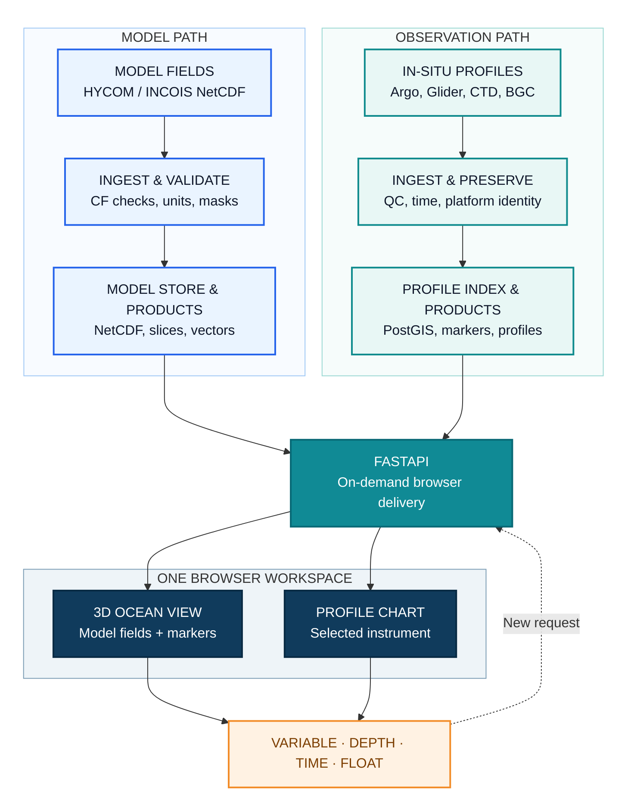

```mermaid
flowchart TB
    subgraph PATHS[" "]
        direction LR

        subgraph MODEL["MODEL PATH"]
            direction TB
            M1["MODEL FIELDS<br/>HYCOM / INCOIS NetCDF"]
            M2["INGEST & VALIDATE<br/>CF checks, units, masks"]
            M3["MODEL STORE & PRODUCTS<br/>NetCDF, slices, vectors"]
            M1 --> M2 --> M3
        end

        subgraph OBS["OBSERVATION PATH"]
            direction TB
            O1["IN-SITU PROFILES<br/>Argo, Glider, CTD, BGC"]
            O2["INGEST & PRESERVE<br/>QC, time, platform identity"]
            O3["PROFILE INDEX & PRODUCTS<br/>PostGIS, markers, profiles"]
            O1 --> O2 --> O3
        end
    end

    M3 --> API["FASTAPI<br/>On-demand browser delivery"]
    O3 --> API

    subgraph BROWSER["ONE BROWSER WORKSPACE"]
        direction LR
        VIEW["3D OCEAN VIEW<br/>Model fields + markers"]
        PROFILE["PROFILE CHART<br/>Selected instrument"]
    end

    API --> VIEW
    API --> PROFILE
    VIEW --> CONTROL["VARIABLE · DEPTH · TIME · FLOAT"]
    PROFILE --> CONTROL
    CONTROL -. "New request" .-> API

    classDef model fill:#EAF4FF,stroke:#2563EB,color:#0F172A,stroke-width:2px;
    classDef observation fill:#E8F7F5,stroke:#0F8B8D,color:#0F172A,stroke-width:2px;
    classDef api fill:#108A95,stroke:#086875,color:#FFFFFF,stroke-width:2px;
    classDef browser fill:#103B5C,stroke:#082A43,color:#FFFFFF,stroke-width:2px;
    classDef control fill:#FFF2E3,stroke:#F28C28,color:#7C3E00,stroke-width:2px;

    class M1,M2,M3 model;
    class O1,O2,O3 observation;
    class API api;
    class VIEW,PROFILE browser;
    class CONTROL control;

    style PATHS fill:transparent,stroke:transparent
    style MODEL fill:#F8FBFF,stroke:#9FC8F5,stroke-width:1px
    style OBS fill:#F6FCFB,stroke:#9AD8D2,stroke-width:1px
    style BROWSER fill:#EEF4F8,stroke:#7C9DB5,stroke-width:1px
```
