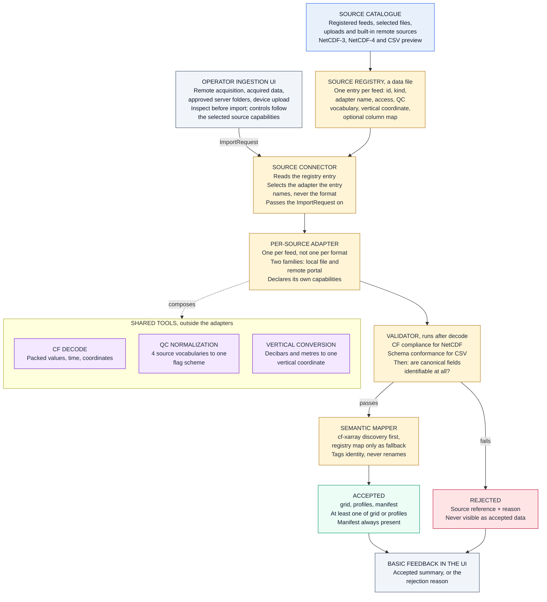

## S2 Implementation Plan

How the S2 stage defined in `../../docs/architecture/` is proposed to be built.
This is an implementation note, not a design authority. The locked SRS and HLSA
govern. The LLD remains under active revision.

Status: the core path is built and passing. See `../README.md`.

### The flow



### The core path, built first

```text
source  →  import  →  parse  →  xarray.Dataset
```

The first thing built is this spine and only this spine:

1. connect to a local file or a remote source
2. fetch the subset the `ImportRequest` asks for
3. decode it correctly
4. validate basic structure
5. convert it into a usable `xarray.Dataset`
6. report success or rejection

Everything else in this document layers onto the spine once it runs end to end.

Not exercised by the core path, and deliberately so:

| Not yet | Why it is absent rather than dropped |
|---|---|
| QC normalization | The first gridded feed carries no QC flags |
| Vertical conversion | The first gridded feed is already in metres |
| Profile records | Gridded feeds produce none, so `profiles` stays `None` |
| Full CF conformance and semantic identity | The core path validates structure only. A missing `units` attribute counts as structure, so the INCOIS reject case is still provable at the checkpoint |
| The selection UI | Built as a minimal page plus a CLI; both emit the same `ImportRequest` |

None of these leave the design. The S2 to S3 contract below still stands, and the
LLD still names a manifest and profiles in the S2 output gate. They are absent
from the core path because a gridded feed does not need them, which is what makes
a gridded feed the right thing to build against first.

### Dispatch is by registry entry, not by format

The connector does not ask what format a file is and branch on the answer. The
registry entry names the adapter, and the connector runs that adapter. Format is
one property of a feed among several, and it is not the one that varies most:
the seven feeds differ on four independent axes — file format, internal
structure (grid, profile, trajectory, flat table), QC vocabulary and vertical
coordinate. Branching on format alone collapses four axes onto one and pushes
the other three into conditionals inside a shared parser.

One adapter per feed keeps those axes separate. What the axes have in common
lives in the shared tools; what is genuinely peculiar to a source lives in that
source's adapter and nowhere else.

### Two adapter families

The registry names one adapter per feed, and every adapter belongs to one of two
families:

- **Local / offline file adapters** — the data is already on disk. The adapter
  reads it and applies any requested subsetting after the read.
- **Remote portal / source adapters** — the data sits behind a provider
  endpoint. The adapter retrieves it, and can push subsetting down into the
  provider query rather than fetching everything and discarding most of it.

The family describes how a source is *acquired*, not how it is *parsed*. It is
not a second dispatch axis: the connector still selects a single adapter by the
name in the registry entry, and family is a property of that adapter rather than
a branch in the connector.

The practical difference is where subsetting happens, which is why capabilities
are declared per adapter instead of assumed. A source offered both on disk and
through a portal is covered by an adapter in each family, as two registry
entries.

### Shared tools and what adapters may contain

Three concerns recur across feeds and are therefore implemented once, outside
the adapters:

- **CF decode** — packed values, time, coordinates.
- **QC normalization** — the four source vocabularies onto one flag scheme.
- **Vertical-coordinate conversion** — decibars and metres onto one coordinate.

An adapter composes these. It declares which it needs and in what order, and it
contains only source-specific logic: how that feed is laid out, what its quirks
are, and how to reach the point where the shared tools apply. An adapter that
starts to grow general-purpose decoding is a signal that the work belongs in a
shared tool instead.

### Adapter capabilities

Each adapter declares what it is able to do, so that nothing above it has to
guess:

- variable selection
- spatial subsetting
- time subsetting
- depth subsetting

Capabilities belong to the adapter, not to the registry entry. Two adapters over
the same kind of data can differ, and a remote adapter will usually support more
subsetting than a local one because the provider performs the work.

### The ImportRequest

Every runtime choice about how much data to bring in travels in one object, the
`ImportRequest`, which the connector passes to the selected adapter:

- the feed
- selected variables
- time range
- depth range
- spatial bounds, where the adapter supports them

**Adapters must not hard-code how much data is imported.** Extent, volume and
variable selection arrive in the `ImportRequest` and nowhere else. An adapter
holding a fixed time window or a fixed variable list is a defect, not a
shortcut.

This is also the deferral seam. The manual run, the scheduled run and the
approved source trigger the LLD names all produce the same `ImportRequest`, and
so does the UI below. Anything built later to replace or extend that UI has
exactly one object to emit, and nothing beneath it changes.

### The operator source-selection UI

Source selection is exposed through an operator workspace. It keeps acquisition,
existing acquired files, server browsing, and device upload visibly separate,
then joins them at one inspect, select, subset, validate, and review workflow.

It must support:

- acquiring from the configured live INCOIS source
- reviewing previous acquisitions and their provenance
- browsing administrator-approved server folders
- choosing a device file through the operating-system picker
- choosing the source and its adapter
- selecting available variables
- specifying a time range
- specifying a depth range
- specifying spatial bounds where supported
- triggering the import
- showing validation success or a concrete rejection reason

Controls are rendered from inspected metadata and declared capabilities. All
control groups remain visible; unsupported controls are disabled with an
explanation so the operator does not have to guess where they went.

### Deferred in this phase

Explicitly out of scope, to be revisited only once the ingestion workflow runs
end to end:

- advanced map-based spatial selection
- progress visualizations
- estimated download size
- visual configuration builders

### The result

Parsing returns one of two values. Rejection is a return value, not an
exception — the LLD treats it as a normal outcome with a reason, not a failure
of the stage.

- **Accepted** — carries the three slots below.
- **Rejected** — carries a source reference and the reason. Never reaches S3 as
  data.

### The S2 to S3 contract

| Slot | Type | When present |
|---|---|---|
| `grid` | `xarray.Dataset` or `None` | Gridded feeds, and profile feeds that carry bulk arrays |
| `profiles` | Profile records or `None` | Point-observation feeds |
| `manifest` | Validation manifest | Always |

An `Accepted` must contain at least one of `grid` or `profiles`. Both empty is a
bug, not an empty success, and the type should refuse to be constructed that
way. The manifest is always present because S3's Dataset Catalogue is fed on
every accepted run regardless of which of the other two slots is populated.

### The manifest preserves what normalization would otherwise erase

Normalizing QC flags and vertical coordinates discards the source's own
vocabulary. The manifest keeps it, so provenance survives the stage:

- original variable names as they appeared in the source
- source attributes and units as found
- the QC vocabulary the feed used, and how its flags were mapped
- the vertical coordinate as found, and what it was converted to
- validation outcome and which checks ran

Nothing about the source's own terms is lost — it moves from the data into the
manifest.

### Why cf-xarray does the heavy lifting

The same physical quantity arrives under a different name in every feed. Mapping
those by hand is seven mappings today and a new one per feed forever. But they
already agree on the CF attribute:

| Feed | Variable name | `standard_name` |
|---|---|---|
| HYCOM | `water_temp` | `sea_water_temperature` |
| GO-SHIP CTD | `ctd_temperature` | `sea_water_temperature` |
| Argo floats | `TEMP` | `sea_water_temperature` |
| Glider | `temperature` | `sea_water_temperature` |

Discover by `standard_name` and the four mappings collapse to zero. The registry
column map is then only a fallback for feeds that lack the attribute — which is
exactly the INCOIS value-added file, whose missing `units` is why it fails
validation in the first place.

### What the fixtures already prove

The sample set was assembled to be awkward on purpose:

- two NetCDF generations, classic and HDF5
- four QC vocabularies: Argo `_ADJUSTED`, BGC `chla_adjusted`, glider QARTOD,
  GO-SHIP WOCE `_qc`
- two vertical coordinates: metres and decibars
- CF-packed Int16 needing `scale_factor` decoding
- one feed that must be rejected, for real reasons, not a synthetic fixture

### Prior art this follows

- **argopy** — one `DataFetcher` over ERDDAP, GDAC and Argovis backends,
  returning consistent `xarray.Dataset` output. The closest working analogue.
- **Canonical Data Model** (Hohpe & Woolf) — N adapters onto one accepted form
  rather than N-squared translators. Seven feeds point-to-point would be 42.
- **Intake** — declarative catalog plus format drivers, which is the Source
  Registry as data rather than code.

### Build order

Steps 1 to 4 are the core path above. Steps 5 to 7 are what proves the design
generalises beyond it.

1. **Clean virtualenv.** `xarray`, `pandas`, `netCDF4` and `cf-xarray` are not
   installed, and system numpy 1.26 conflicts with what pip resolves.
2. **Define the contract types** — `ImportRequest`, `Accepted`, `Rejected` and
   the three slots, before anything is written against them.
3. **Shared tools** — CF decode, QC normalization, vertical conversion.
4. **One gridded adapter** — proves the gridded path and the `grid` slot.
5. **Argo adapter** — differs from the first on all four axes, which is what
   makes it the real test of whether the shared tools are shared correctly.
   Deliberately second, not later: three gridded adapters in a row would produce
   an abstraction shaped only around gridded NetCDF.
6. **The rejection case** — the INCOIS value-added file, against the validator.
7. **Remaining feeds.** These should be cheap by this point. If they are not,
   the abstraction is wrong and that is the signal to revisit it.

### Open before coding

- S3 has to agree to the three-slot contract above. The LLD names the contents
  of the accepted handoff but not its form, so the shape is proposed here and
  not yet settled between the two stages.
